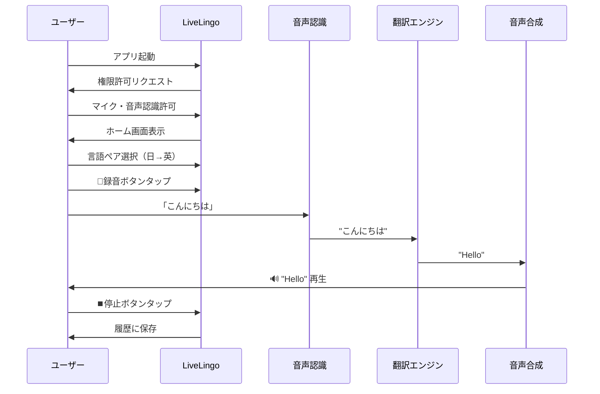
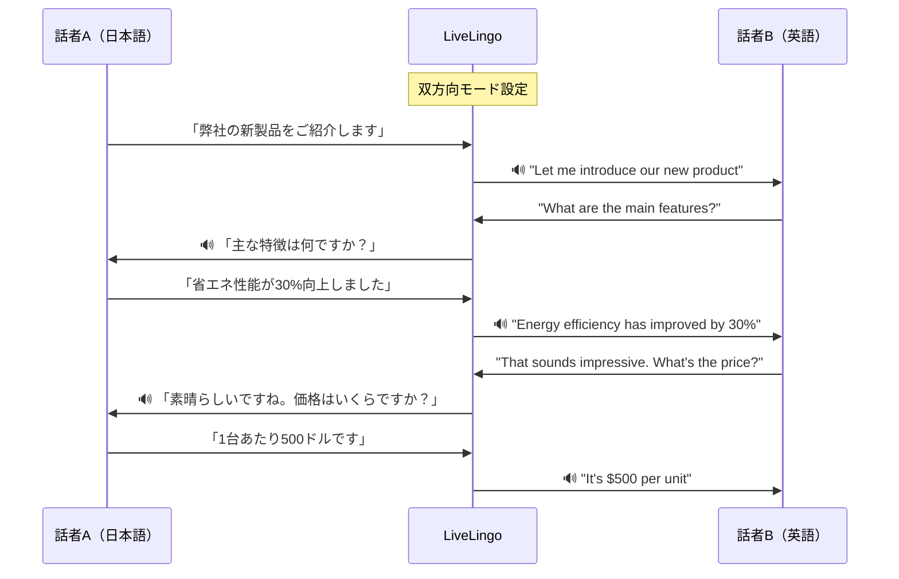
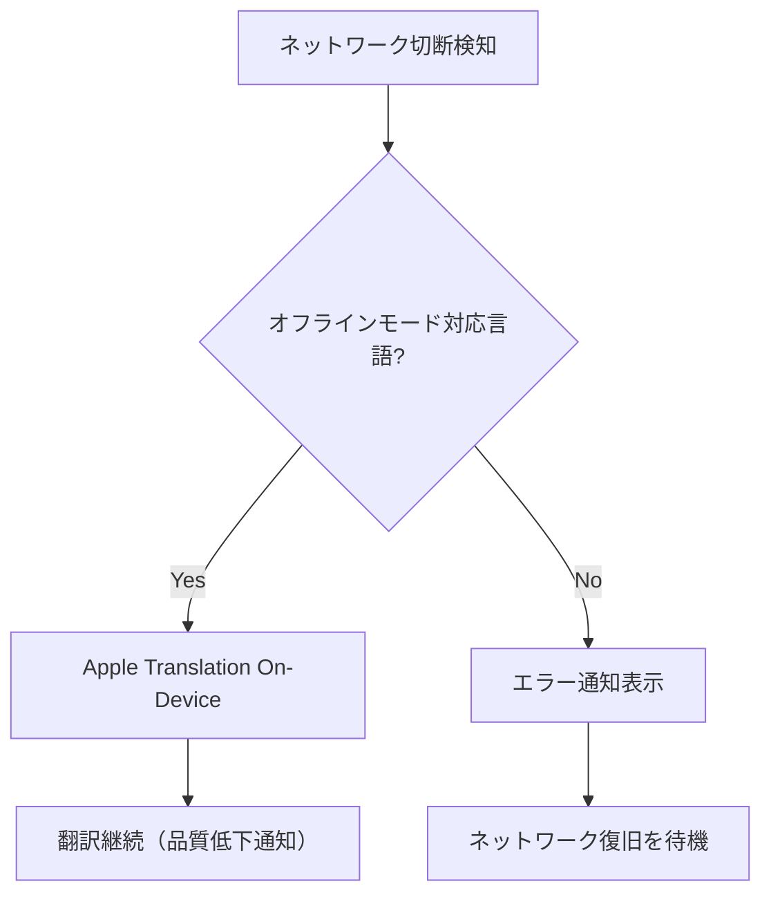
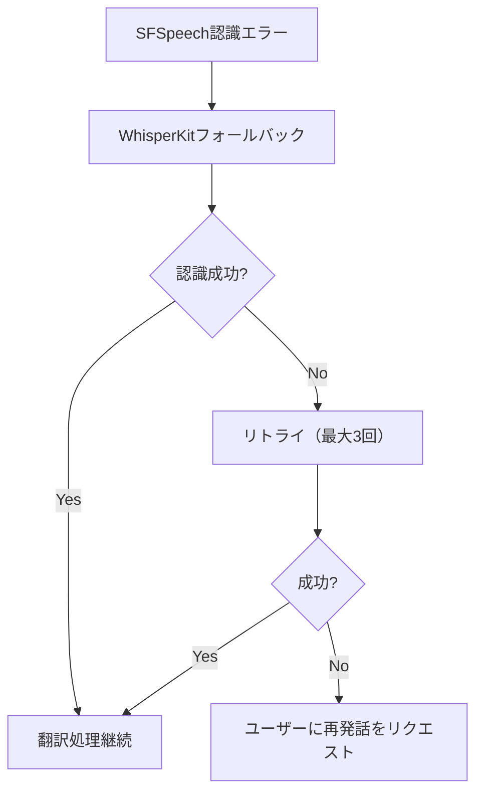
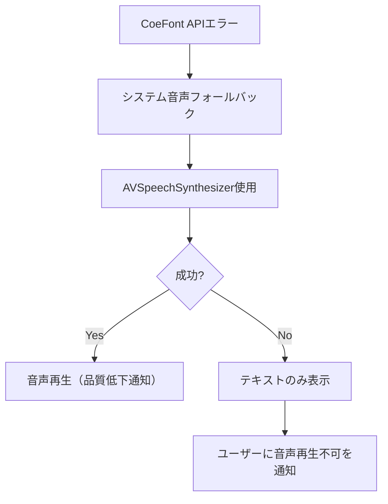

# LiveLingo デモンストレーションシナリオ

**Version 1.0.0**
**Last Updated: 2024-12-25**

---

## 目次

- [Demo-001: 基本操作デモ](#demo-001-基本操作デモ)
- [Demo-002: ビジネス商談デモ](#demo-002-ビジネス商談デモ)
- [Demo-003: 旅行会話デモ](#demo-003-旅行会話デモ)
- [Demo-004: 技術プレゼンテーションデモ](#demo-004-技術プレゼンテーションデモ)
- [Demo-005: エラー回復デモ](#demo-005-エラー回復デモ)

---

# Demo-001: 基本操作デモ

## 概要

**目的**: LiveLingoの基本的な使い方を実演
**所要時間**: 5分
**対象者**: 初めてのユーザー

## シナリオフロー



## ステップ詳細

### Step 1: アプリ起動（0:00-0:30）

**操作手順**:
1. ホーム画面からLiveLingoアイコンをタップ
2. 初回起動時、権限許可ダイアログが表示

**確認ポイント**:
- [ ] アプリが2秒以内に起動すること
- [ ] 権限ダイアログが正しく表示されること

**ナレーション例**:
> 「LiveLingoを起動します。初回起動時にはマイクと音声認識の権限を許可してください。」

### Step 2: 権限許可（0:30-1:00）

**操作手順**:
1. 「マイクへのアクセスを許可」→「許可」をタップ
2. 「音声認識を許可」→「許可」をタップ

**確認ポイント**:
- [ ] 両方の権限が許可されること
- [ ] ホーム画面が表示されること

**画面遷移**:
```
┌─────────────────────────────────┐
│     マイクへのアクセスを        │
│        許可しますか？           │
│                                 │
│    [許可しない]  [許可]         │
└─────────────────────────────────┘
          ↓ 許可タップ
┌─────────────────────────────────┐
│         LiveLingo               │
│    [日本語 🇯🇵] ⇄ [English 🇺🇸]  │
│           🎤                    │
│        録音開始                 │
└─────────────────────────────────┘
```

### Step 3: 言語ペア選択（1:00-1:30）

**操作手順**:
1. 翻訳元言語ボタン（左）をタップ
2. 「日本語」を選択
3. 翻訳先言語ボタン（右）をタップ
4. 「English (US)」を選択

**デモ発話用言語ペア**:
| 翻訳元 | 翻訳先 |
|--------|--------|
| 日本語 🇯🇵 | English 🇺🇸 |

**ナレーション例**:
> 「言語ペアを選択します。今回は日本語から英語への翻訳を設定します。」

### Step 4: 録音開始（1:30-2:00）

**操作手順**:
1. 中央の🎤録音ボタンをタップ
2. ボタンが赤く変化することを確認
3. 通訳画面に遷移

**確認ポイント**:
- [ ] 録音インジケータが表示されること
- [ ] オーディオ波形が表示されること

**画面遷移**:
```
┌─────────────────────────────────┐
│  ← 戻る      通訳中      ⚙️    │
├─────────────────────────────────┤
│                                 │
│    🔴 録音中...                 │
│                                 │
│    ~~~~~~~~~~~~~ (波形)         │
│                                 │
├─────────────────────────────────┤
│    ⏸️  🎤  ⏹️                   │
└─────────────────────────────────┘
```

### Step 5: 発話と翻訳（2:00-3:30）

**サンプル発話**:

| # | 日本語（発話） | 英語（期待結果） |
|---|---------------|-----------------|
| 1 | こんにちは | Hello |
| 2 | よろしくお願いします | Nice to meet you |
| 3 | 今日はいい天気ですね | It's a nice day today |

**操作手順**:
1. マイクに向かって「こんにちは」と発話
2. 画面に認識テキストが表示されることを確認
3. 翻訳結果「Hello」が表示されることを確認
4. AI音声で「Hello」が再生されることを確認

**リアルタイム処理フロー**:
```
マイク入力 (32ms)
    ↓
音声認識 (200-300ms)
    ↓ 「こんにちは」
翻訳処理 (300-500ms)
    ↓ "Hello"
音声合成 (100-200ms)
    ↓
音声再生
━━━━━━━━━━━━━━━━━━━
総遅延: 約1秒
```

**確認ポイント**:
- [ ] 音声認識精度が95%以上であること
- [ ] 総遅延が1秒以内であること
- [ ] 音声が自然に再生されること

### Step 6: セッション終了（3:30-4:00）

**操作手順**:
1. ⏹️停止ボタンをタップ
2. 履歴に保存されることを確認
3. ホーム画面に戻る

**確認ポイント**:
- [ ] 会話履歴が保存されること
- [ ] 履歴から再生可能なこと

### Step 7: 結果確認（4:00-5:00）

**操作手順**:
1. 「最近の会話」セクションを確認
2. 保存された会話をタップ
3. 詳細画面で原文・訳文を確認

**ナレーション例**:
> 「以上が基本的な使い方です。わずか5ステップで、リアルタイム通訳を開始できます。」

---

# Demo-002: ビジネス商談デモ

## 概要

**目的**: 日英双方向通訳の実演
**所要時間**: 10分
**対象者**: ビジネスユーザー

## シナリオ設定

**シチュエーション**: 日本企業と米国企業の商談
- **話者A（日本人）**: 製品マネージャー
- **話者B（アメリカ人）**: バイヤー
- **言語**: 日本語 ⇄ 英語

## シナリオフロー



## ステップ詳細

### Step 1: 双方向モード設定（0:00-1:00）

**操作手順**:
1. 設定 → 通訳モード → 「2人モード」を有効化
2. 話者Aの言語: 日本語
3. 話者Bの言語: English (US)
4. 話者識別: 自動

**設定画面**:
```
┌─────────────────────────────────┐
│  双方向通訳設定                 │
├─────────────────────────────────┤
│                                 │
│  話者A: [日本語 🇯🇵]            │
│  話者B: [English 🇺🇸]          │
│                                 │
│  話者識別: [● 自動] / 手動      │
│                                 │
│  デバイス配置: [● 中央]         │
│                                 │
└─────────────────────────────────┘
```

### Step 2: 商談シミュレーション（1:00-8:00）

**会話サンプルデータ**:

| ターン | 話者 | 発話（原文） | 翻訳結果 |
|--------|------|-------------|----------|
| 1 | A (日) | 本日はお越しいただきありがとうございます。 | Thank you for coming today. |
| 2 | B (英) | Thank you for having us. We're excited to learn about your products. | お招きいただきありがとうございます。御社の製品について楽しみにしております。 |
| 3 | A (日) | 弊社の新製品「EcoMax 3000」をご紹介いたします。 | Let me introduce our new product "EcoMax 3000". |
| 4 | B (英) | What are the key features that differentiate it from competitors? | 競合他社と差別化する主な特徴は何ですか？ |
| 5 | A (日) | 最大の特徴は、エネルギー効率が従来モデルより30%向上していることです。 | The main feature is that energy efficiency has improved by 30% compared to the previous model. |
| 6 | B (英) | That's impressive. What's the expected retail price? | 素晴らしいですね。想定小売価格はいくらですか？ |
| 7 | A (日) | 1台あたり500ドルを予定しております。大量購入の場合は割引もございます。 | We're planning $500 per unit. We also offer discounts for bulk purchases. |
| 8 | B (英) | We're interested in ordering 1,000 units. Can you offer a better price? | 1,000台の注文を検討しています。より良い価格を提示できますか？ |
| 9 | A (日) | 1,000台以上のご注文でしたら、1台あたり450ドルでご提供できます。 | For orders of 1,000 units or more, we can offer $450 per unit. |
| 10 | B (英) | That sounds like a good deal. Let's proceed with the paperwork. | 良い条件ですね。契約手続きを進めましょう。 |

### Step 3: 文脈保持の確認（8:00-9:00）

**確認ポイント**:
- [ ] 「it」「that」などの代名詞が正しく解決されること
- [ ] 会話の文脈が保持されていること
- [ ] 商品名「EcoMax 3000」が一貫して翻訳されること

**文脈保持の例**:
```
ターン3: 「EcoMax 3000」を紹介
ターン5: 「最大の特徴は...」→ 文脈から製品の特徴と理解
ターン6: "That's impressive" → 「それ」が省エネ性能を指すと理解
```

### Step 4: セッション終了（9:00-10:00）

**操作手順**:
1. 会話終了後、⏹️停止ボタンをタップ
2. 履歴を確認（話者ごとに色分け表示）
3. PDFエクスポート機能を実演

**ナレーション例**:
> 「このように、LiveLingoは双方向のビジネス会話をリアルタイムで通訳できます。文脈を保持することで、自然な会話の流れを維持します。」

---

# Demo-003: 旅行会話デモ

## 概要

**目的**: 多言語切替機能の実演
**所要時間**: 8分
**対象者**: 旅行者

## シナリオ設定

**シチュエーション**: 東アジア周遊旅行
- **旅行者**: 日本人
- **訪問国**: 日本 → アメリカ → 中国 → 韓国

## シナリオフロー

### シーン1: ホテルチェックイン（日→英）

```
場所: ニューヨークのホテル
```

| # | 日本語（発話） | 英語（翻訳） |
|---|---------------|-------------|
| 1 | チェックインをお願いします | I'd like to check in, please |
| 2 | 予約は山田太郎の名前です | The reservation is under Taro Yamada |
| 3 | Wi-Fiのパスワードを教えてください | Could you tell me the Wi-Fi password? |
| 4 | 朝食は何時からですか？ | What time does breakfast start? |
| 5 | ありがとうございます | Thank you |

### シーン2: レストラン注文（日→中）

```
場所: 上海のレストラン
```

**言語切替手順**:
1. ⇄ボタンをタップ
2. 翻訳先言語を「中国語（簡体）」に変更

| # | 日本語（発話） | 中国語（翻訳） |
|---|---------------|---------------|
| 1 | メニューを見せてください | 请给我看菜单 |
| 2 | おすすめは何ですか？ | 有什么推荐的吗？ |
| 3 | 辛くないものをお願いします | 请给我不辣的 |
| 4 | お会計をお願いします | 请结账 |
| 5 | 美味しかったです | 很好吃 |

### シーン3: 道案内依頼（日→韓）

```
場所: ソウルの街中
```

**言語切替手順**:
1. 翻訳先言語を「韓国語」に変更

| # | 日本語（発話） | 韓国語（翻訳） |
|---|---------------|---------------|
| 1 | すみません、道を教えてください | 실례합니다, 길을 알려주세요 |
| 2 | 地下鉄の駅はどこですか？ | 지하철역이 어디예요? |
| 3 | ここから歩いてどのくらいですか？ | 여기서 걸어서 얼마나 걸려요? |
| 4 | ありがとうございます | 감사합니다 |

### オフラインモード確認

**操作手順**:
1. 機内モードを有効化
2. オフライン対応言語（英語・日本語・中国語・韓国語）を確認
3. オフラインでの翻訳を実演

**確認ポイント**:
- [ ] オフラインインジケータが表示されること
- [ ] Apple Translationへのフォールバックが動作すること
- [ ] 基本的な翻訳が可能なこと

---

# Demo-004: 技術プレゼンテーションデモ

## 概要

**目的**: 専門用語辞書機能の実演
**所要時間**: 8分
**対象者**: 技術者、エンジニア

## シナリオ設定

**シチュエーション**: 技術カンファレンスでのプレゼンテーション
- **発表者**: 日本人エンジニア
- **聴衆**: 国際的な参加者
- **言語**: 日本語 → 英語

## 専門用語辞書

### Step 1: 辞書登録（0:00-2:00）

**操作手順**:
1. 設定 → 辞書管理 → 新規作成
2. 以下の用語を登録

**登録用語**:

| 日本語 | 英語（カスタム翻訳） |
|--------|---------------------|
| マイクロサービス | microservices architecture |
| API連携 | API integration |
| コンテナ化 | containerization |
| CI/CD | continuous integration and continuous deployment |
| クラウドネイティブ | cloud-native |
| イミュータブル | immutable infrastructure |
| オブザーバビリティ | observability |
| カナリアリリース | canary release |

### Step 2: プレゼンテーションモード設定（2:00-3:00）

**操作手順**:
1. 設定 → 通訳モード → 「プレゼンテーションモード」を有効化
2. 辞書を有効化
3. 連続翻訳モードをON

### Step 3: 技術プレゼンテーション（3:00-7:00）

**サンプル発話**:

| # | 日本語（発話） | 英語（辞書適用翻訳） |
|---|---------------|---------------------|
| 1 | 本日は弊社のマイクロサービスアーキテクチャについてお話しします。 | Today, I will talk about our microservices architecture. |
| 2 | 従来のモノリシックアーキテクチャから、マイクロサービスへの移行を行いました。 | We migrated from a traditional monolithic architecture to microservices architecture. |
| 3 | 各サービスはコンテナ化され、Kubernetes上で動作しています。 | Each service is containerized and runs on Kubernetes. |
| 4 | CI/CDパイプラインにより、1日に複数回のデプロイが可能になりました。 | With continuous integration and continuous deployment pipeline, we can deploy multiple times a day. |
| 5 | オブザーバビリティを確保するため、ログ、メトリクス、トレースを統合しています。 | To ensure observability, we integrate logs, metrics, and traces. |
| 6 | 新機能はカナリアリリースで段階的に展開しています。 | New features are rolled out gradually using canary release. |

### Step 4: 辞書適用確認（7:00-8:00）

**確認ポイント**:
- [ ] 登録した専門用語が一貫して翻訳されること
- [ ] 「マイクロサービス」が常に「microservices architecture」に翻訳されること
- [ ] 文脈に応じた自然な翻訳が維持されること

**ナレーション例**:
> 「専門用語辞書を使用することで、技術用語の一貫した翻訳が可能になります。これにより、専門的なプレゼンテーションでも正確な通訳を実現できます。」

---

# Demo-005: エラー回復デモ

## 概要

**目的**: エラー発生時のフォールバック動作の実演
**所要時間**: 7分
**対象者**: 技術者、サポート担当者

## シナリオ設定

**シチュエーション**: 様々なエラー状況でのアプリ動作確認

## エラーシナリオ

### シナリオA: ネットワーク切断（0:00-2:00）

**操作手順**:
1. 通常の翻訳を開始
2. 機内モードを有効化（ネットワーク切断をシミュレート）
3. 発話を継続

**期待動作**:


**確認ポイント**:
- [ ] 「オフラインモード」インジケータが表示されること
- [ ] Apple Translationへのフォールバックが動作すること
- [ ] ユーザーに品質低下の通知が表示されること

### シナリオB: STTエラー（2:00-4:00）

**操作手順**:
1. ノイズの多い環境で発話
2. 認識エラーが発生

**期待動作**:


**確認ポイント**:
- [ ] WhisperKitへのフォールバックが透過的に動作すること
- [ ] リトライ動作が適切に行われること
- [ ] 最終的に失敗した場合、ユーザーに通知されること

### シナリオC: 翻訳APIエラー（4:00-5:30）

**操作手順**:
1. APIレート制限をシミュレート

**期待動作**:
```mermaid
flowchart TB
    A[APIエラー 429] --> B[エクスポネンシャルバックオフ]
    B --> C[リトライ 1回目 (1秒待機)]
    C --> D{成功?}
    D -->|No| E[リトライ 2回目 (2秒待機)]
    D -->|Yes| F[翻訳結果返却]
    E --> G{成功?}
    G -->|No| H[代替プロバイダーへフォールバック]
    G -->|Yes| F
    H --> I[Apple Translation試行]
    I --> F
```

**確認ポイント**:
- [ ] 適切なバックオフが行われること
- [ ] 代替プロバイダーへのフォールバックが動作すること
- [ ] ユーザー体験への影響が最小限であること

### シナリオD: TTS エラー（5:30-7:00）

**操作手順**:
1. CoeFont APIエラーをシミュレート

**期待動作**:


**確認ポイント**:
- [ ] システム音声へのフォールバックが動作すること
- [ ] 音声再生不可の場合、テキストが表示されること
- [ ] ユーザーに適切な通知が行われること

### 正常復帰確認

**操作手順**:
1. ネットワークを復旧（機内モードOFF）
2. 通常モードに自動復帰することを確認

**確認ポイント**:
- [ ] 自動的に通常モードに復帰すること
- [ ] 高精度翻訳が再開されること
- [ ] 「オンラインモード」通知が表示されること

---

## デモンストレーション準備チェックリスト

### 機材準備

- [ ] iPhone 12以降（推奨）
- [ ] 外部マイク（オプション：AirPods Pro）
- [ ] 安定したWi-Fi環境
- [ ] プレゼン用ディスプレイ（画面ミラーリング用）

### アプリ設定

- [ ] 最新バージョンにアップデート
- [ ] Gemini APIキー設定済み
- [ ] CoeFont APIキー設定済み（オプション）
- [ ] 必要な言語パックをダウンロード済み
- [ ] 専門用語辞書を事前登録（Demo-004用）

### 環境確認

- [ ] ネットワーク接続確認
- [ ] バッテリー残量確認（80%以上推奨）
- [ ] 静かな環境を確保
- [ ] バックアップ端末の準備

---

## 変更履歴

| バージョン | 日付 | 変更内容 |
|-----------|------|---------|
| 1.0.0 | 2024-12-25 | 初版作成 |

---

**LiveLingo** - 言語の壁を超えて、世界と繋がる

*Copyright (C) 2024 LiveLingo Team. All rights reserved.*
