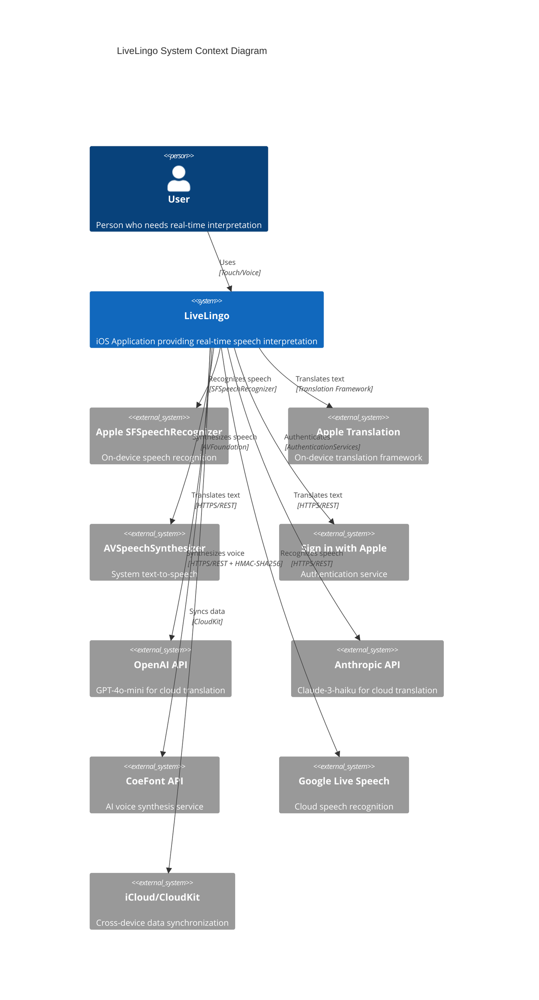
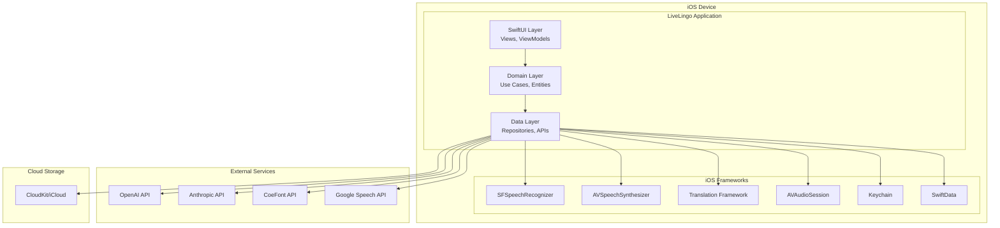
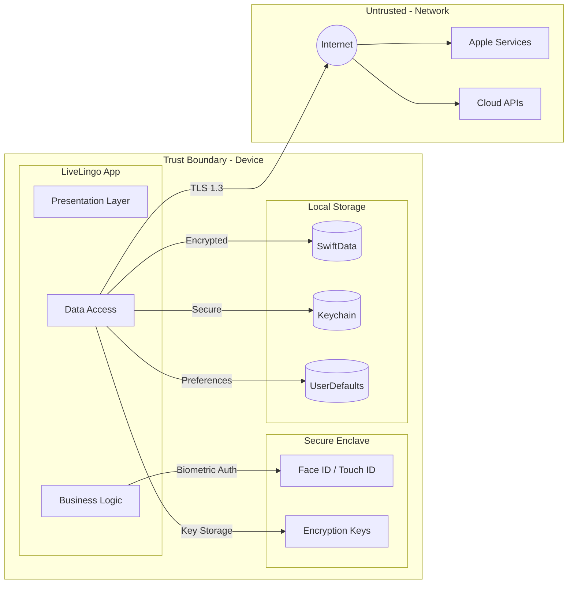
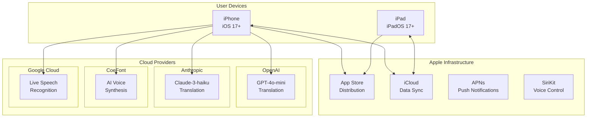
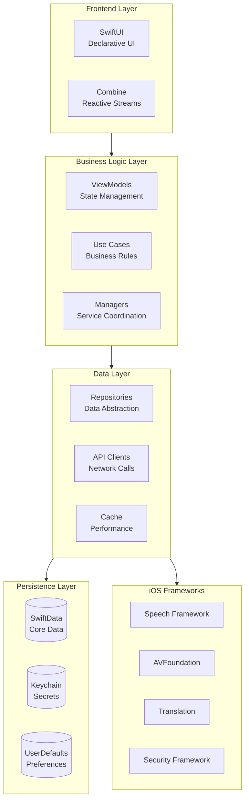
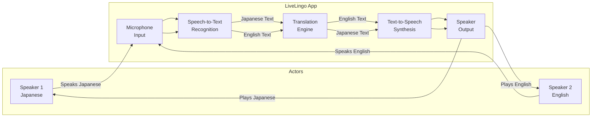

# LiveLingo - System Overview Architecture

## C4 Context Diagram

High-level view of the LiveLingo system and its external actors.

---

## C4 Container Diagram

Application containers and their responsibilities.

---

## System Boundary Diagram

---

## Deployment View

---

## Technology Stack Overview

---

## Actor Interactions

---

## Version History

| Version | Date | Changes | Author |
|---------|------|---------|--------|
| 1.0.0 | 2024-12-24 | Initial creation | AI Agent |
