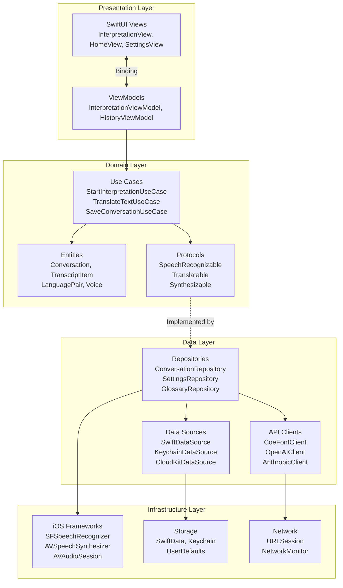
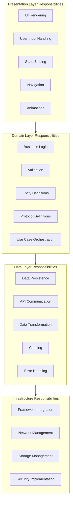
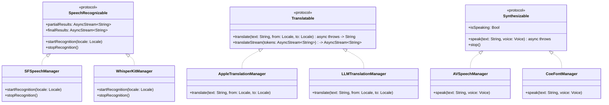
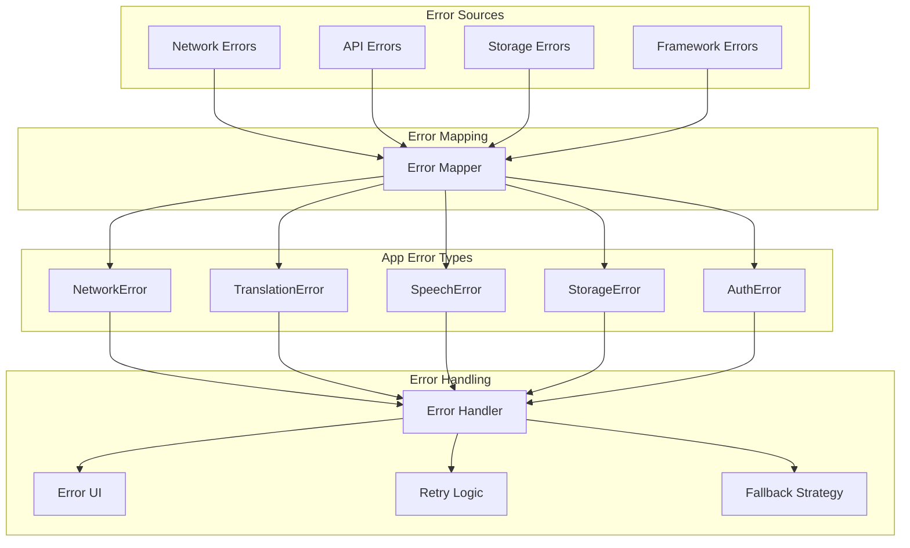

# LiveLingo - Application Layer Architecture

## Clean Architecture + MVVM Overview



---

## MVVM Pattern Detail

```mermaid
flowchart LR
    subgraph View[View Layer - SwiftUI]
        V1[InterpretationView]
        V2[HomeView]
        V3[HistoryView]
        V4[SettingsView]
    end

    subgraph ViewModel[ViewModel Layer]
        VM1[InterpretationViewModel<br/>@Published state<br/>@Published transcripts]
        VM2[HomeViewModel<br/>@Published languages]
        VM3[HistoryViewModel<br/>@Published conversations]
        VM4[SettingsViewModel<br/>@Published preferences]
    end

    subgraph Model[Model Layer]
        M1[SpeechRecognitionManager]
        M2[TranslationManager]
        M3[TTSManager]
        M4[ConversationRepository]
    end

    V1 <-->|ObservedObject| VM1
    V2 <-->|ObservedObject| VM2
    V3 <-->|ObservedObject| VM3
    V4 <-->|ObservedObject| VM4

    VM1 --> M1
    VM1 --> M2
    VM1 --> M3
    VM1 --> M4
```

---

## Dependency Injection Architecture

```mermaid
flowchart TB
    subgraph Container[DependencyContainer]
        Register[Service Registration]
        Resolve[Service Resolution]
    end

    subgraph Services[Registered Services]
        Auth[AuthManager]
        Speech[SpeechRecognitionManager]
        Trans[TranslationManager]
        TTS[TTSManager]
        Audio[AudioSessionManager]
        Data[DataManager]
        Net[NetworkManager]
        Perm[PermissionManager]
    end

    subgraph Consumers[Service Consumers]
        VMs[ViewModels]
        UCs[Use Cases]
    end

    Container -->|Singleton| Auth
    Container -->|Singleton| Speech
    Container -->|Singleton| Trans
    Container -->|Singleton| TTS
    Container -->|Singleton| Audio
    Container -->|Singleton| Data
    Container -->|Singleton| Net
    Container -->|Singleton| Perm

    VMs -->|@Injected| Container
    UCs -->|@Injected| Container
```

---

## Layer Responsibilities



---

## Module Structure

```mermaid
flowchart TB
    subgraph App[LiveLingo App]
        subgraph Features[Feature Modules]
            Interpretation[Interpretation<br/>Main translation feature]
            History[History<br/>Past conversations]
            Settings[Settings<br/>User preferences]
            Dictionary[Dictionary<br/>Custom glossary]
            Onboarding[Onboarding<br/>First-time setup]
        end

        subgraph Core[Core Modules]
            Audio[Audio<br/>Session management]
            Speech[Speech<br/>Recognition]
            Translation[Translation<br/>Text translation]
            Synthesis[Synthesis<br/>TTS]
            Security[Security<br/>Auth & encryption]
        end

        subgraph Shared[Shared Modules]
            UI[UI Components<br/>Reusable views]
            Utils[Utilities<br/>Extensions, helpers]
            Networking[Networking<br/>API clients]
            Persistence[Persistence<br/>Data storage]
        end
    end

    Features --> Core
    Features --> Shared
    Core --> Shared
```



---

## Protocol-Oriented Design



---

## Data Flow Between Layers

```mermaid
flowchart LR
    subgraph UI[UI Layer]
        View[SwiftUI View]
    end

    subgraph VM[ViewModel Layer]
        ViewModel[ViewModel<br/>@MainActor]
    end

    subgraph UseCase[Use Case Layer]
        UC[Use Case]
    end

    subgraph Repo[Repository Layer]
        Repository[Repository]
    end

    subgraph DS[Data Source Layer]
        Local[Local Data Source]
        Remote[Remote Data Source]
    end

    View -->|User Action| ViewModel
    ViewModel -->|Execute| UC
    UC -->|Fetch/Save| Repository
    Repository -->|Read/Write| Local
    Repository -->|API Call| Remote

    Remote -->|Response| Repository
    Local -->|Data| Repository
    Repository -->|Entity| UC
    UC -->|Result| ViewModel
    ViewModel -->|@Published| View
```

---

## Error Handling Flow



---

## Version History

| Version | Date | Changes | Author |
|---------|------|---------|--------|
| 1.0.0 | 2024-12-24 | Initial creation | AI Agent |
