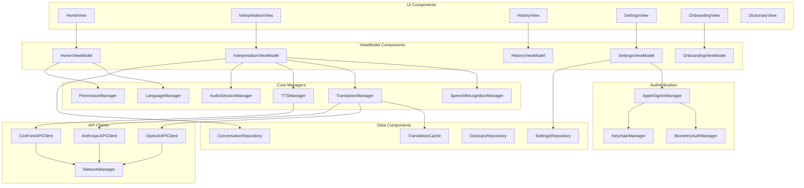
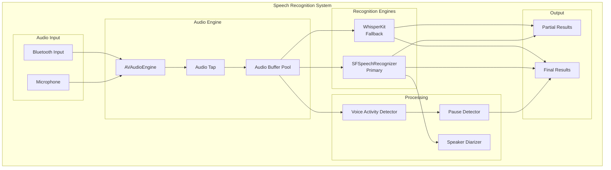
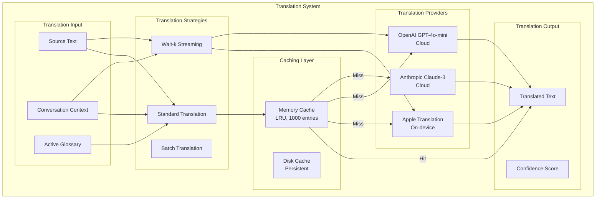
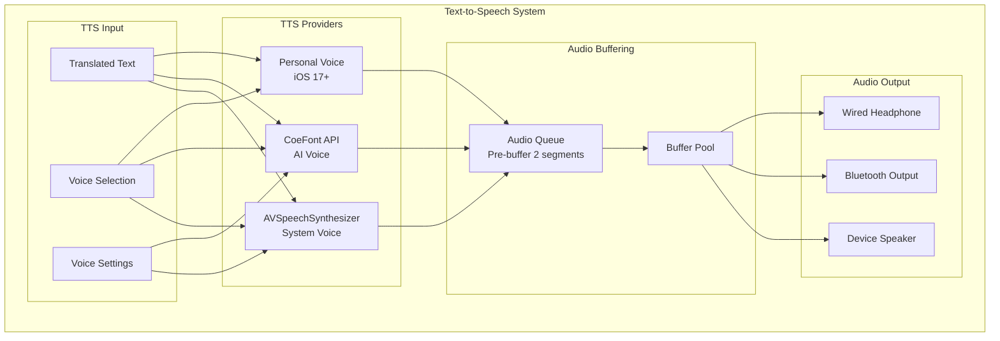
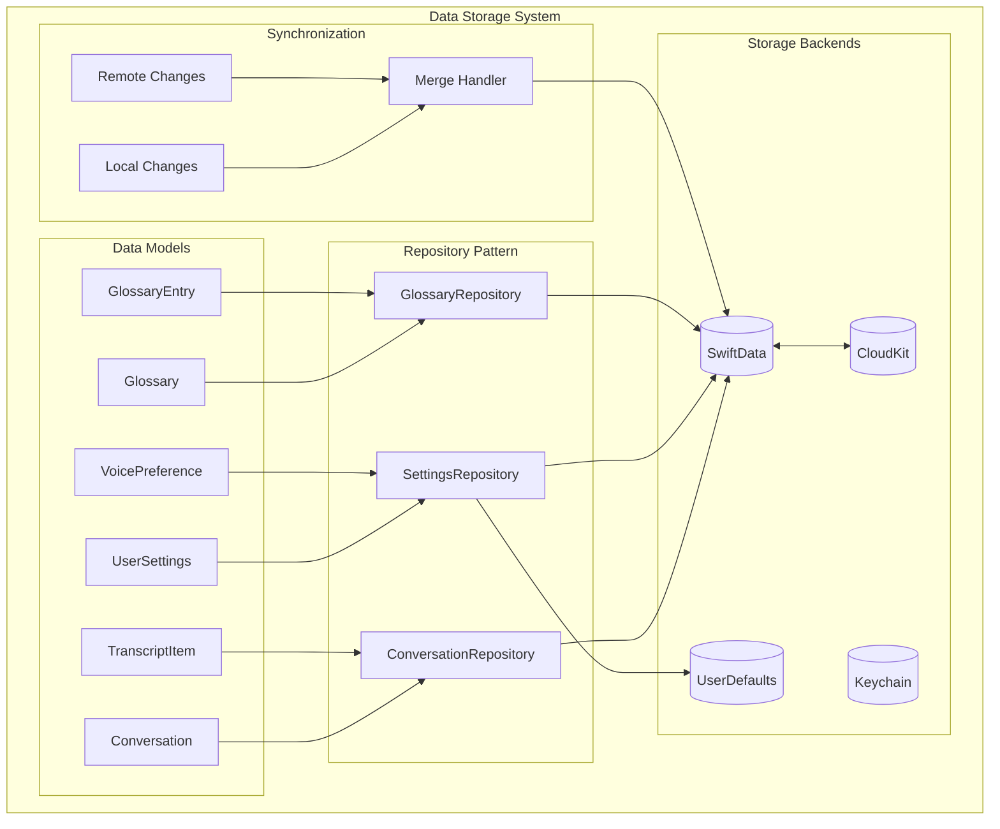
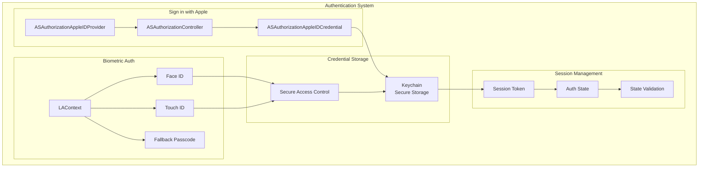
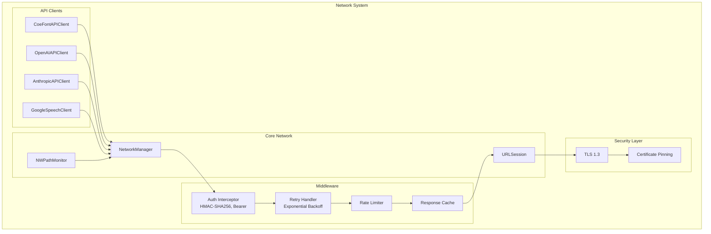
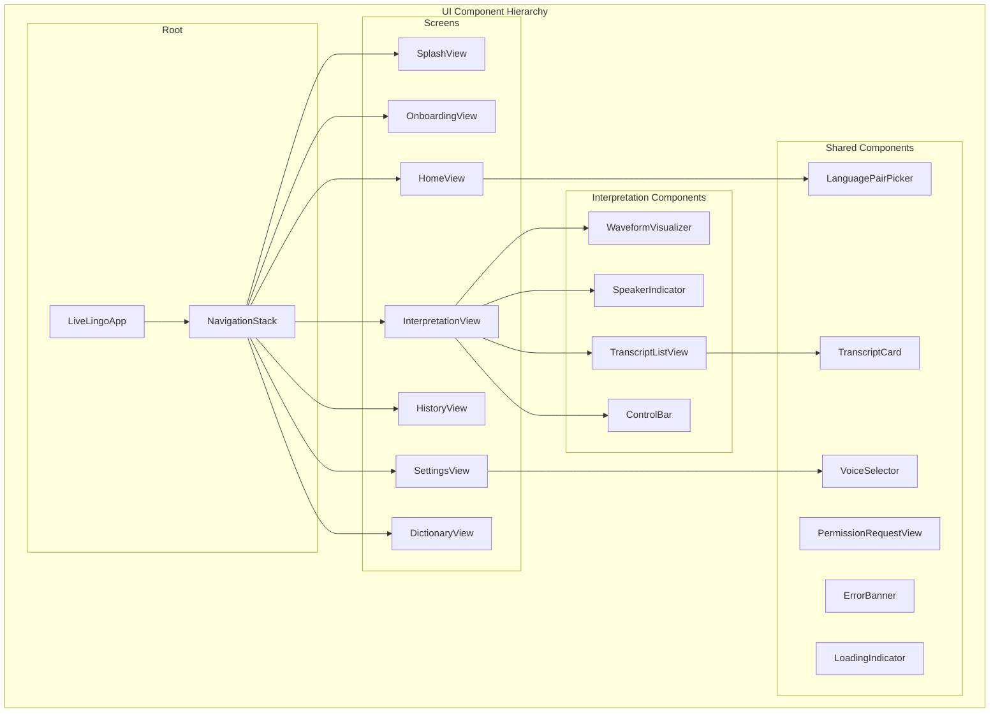
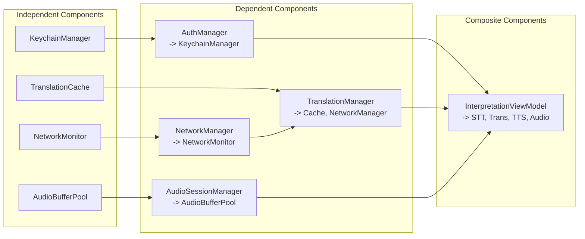

# LiveLingo - Component Architecture

## Complete Component Diagram

---

## Speech Recognition Components

---

## Translation Components

---

## TTS Components

---

## Data Storage Components

---

## Authentication Components

---

## Network Components

---

## UI Component Hierarchy

---

## Component Dependencies Matrix

---

## Version History

| Version | Date | Changes | Author |
|---------|------|---------|--------|
| 1.0.0 | 2024-12-24 | Initial creation | AI Agent |
