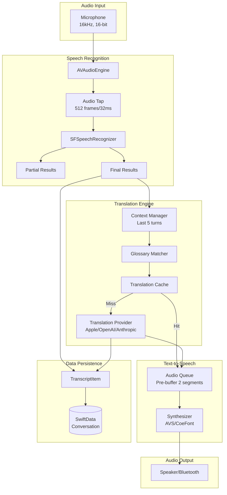
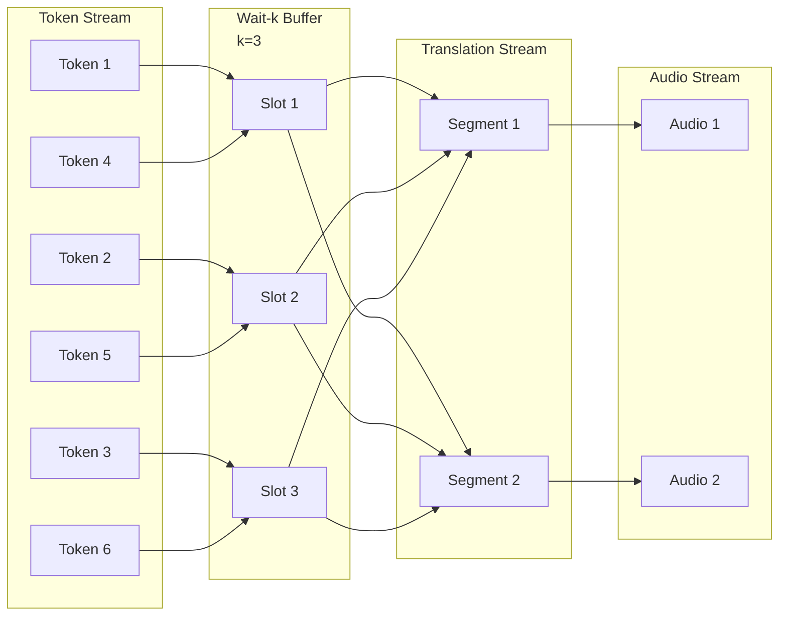
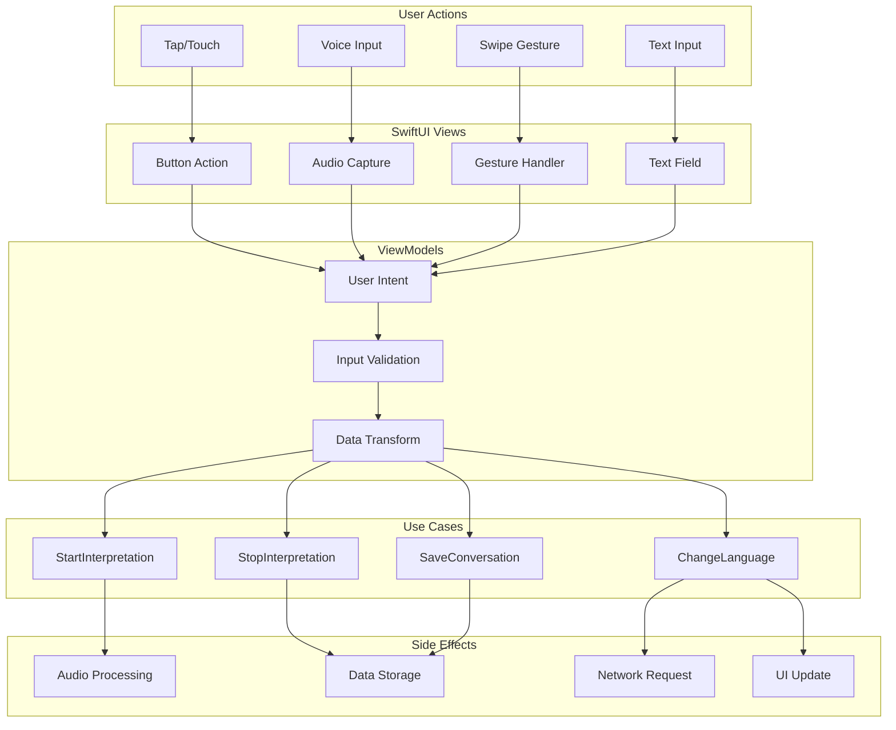
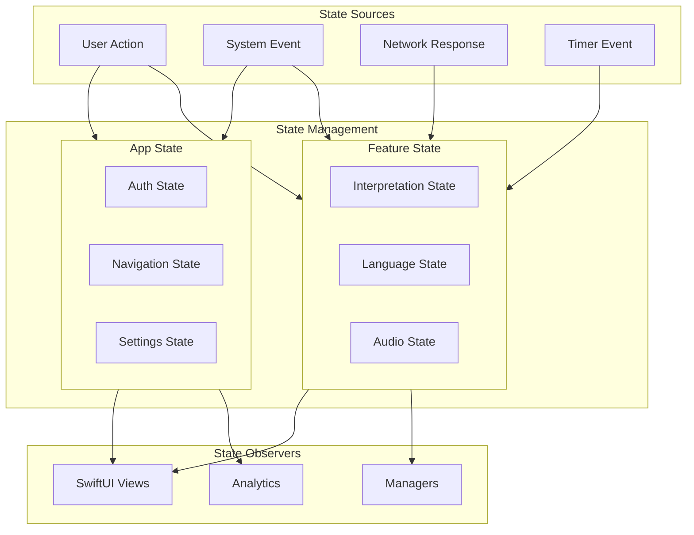
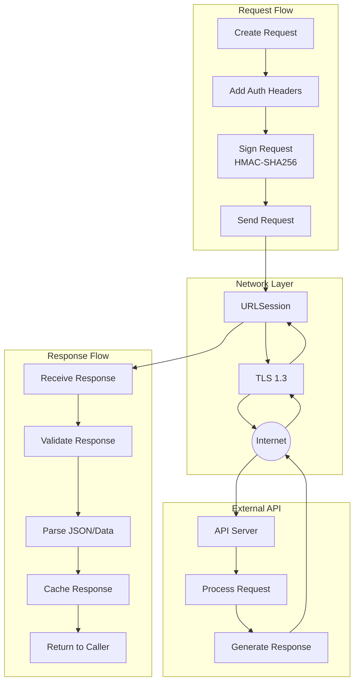
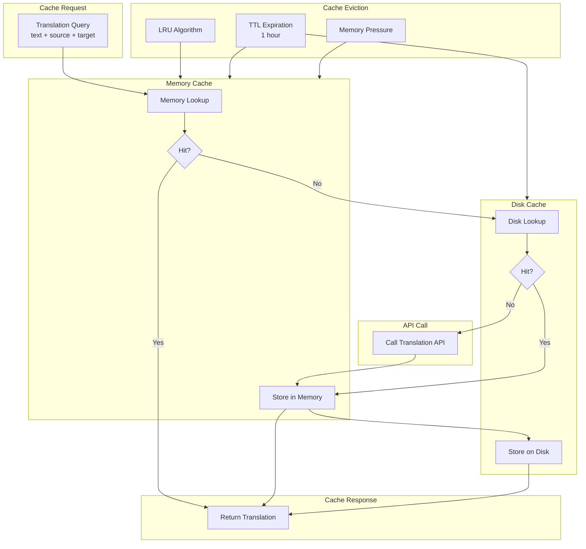
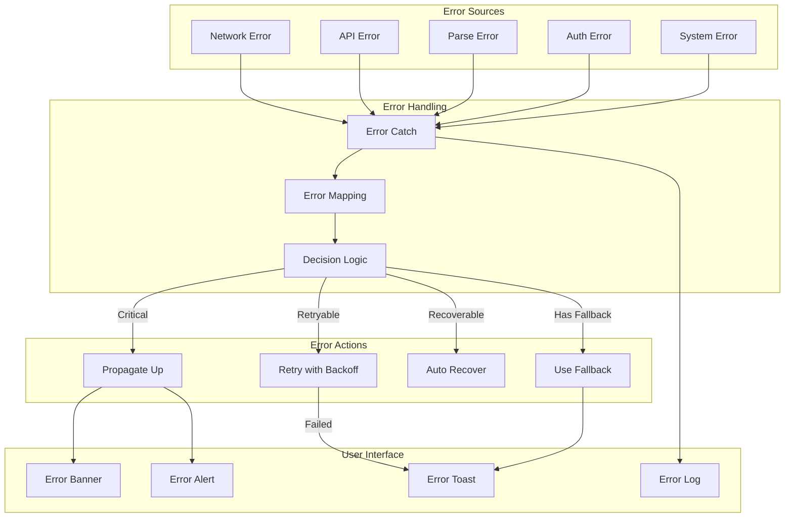
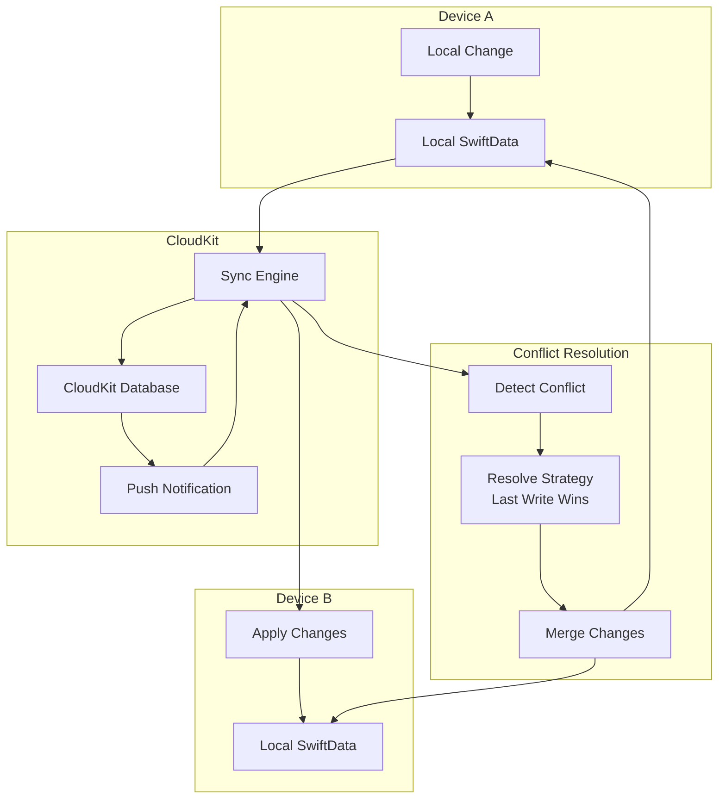
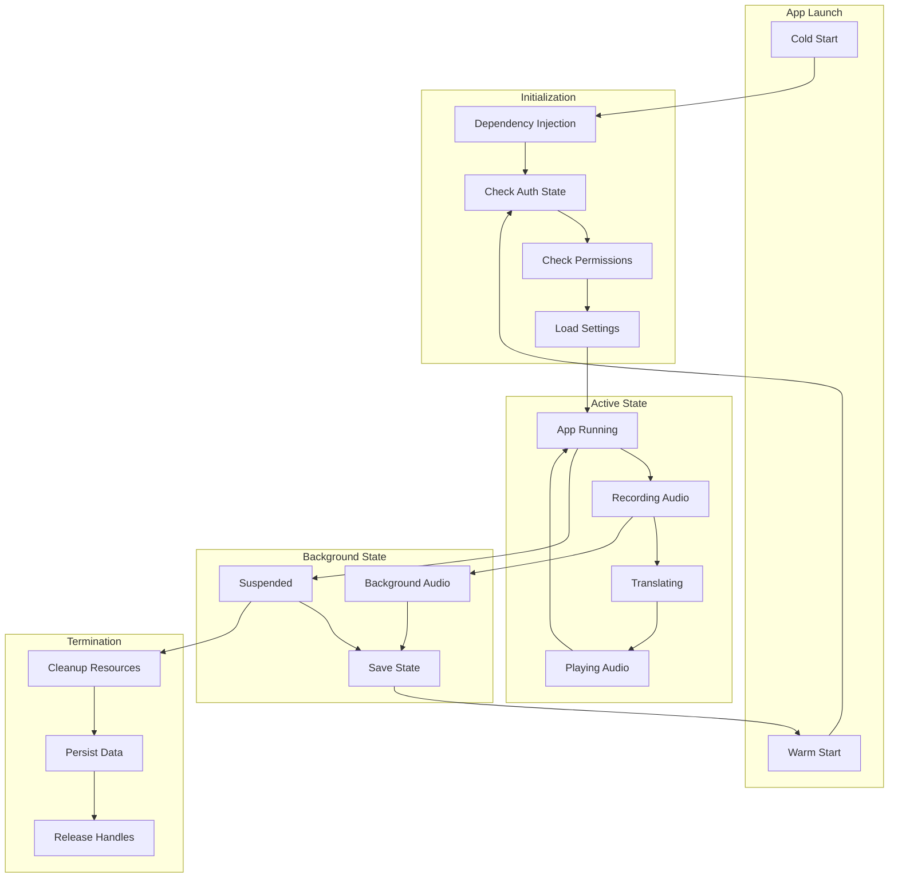

# LiveLingo - Data Flow Architecture

## End-to-End Interpretation Data Flow

---

## Real-time Streaming Data Flow (Wait-k)

---

## User Input Data Flow

---

## State Data Flow

---

## API Request/Response Flow

---

## Caching Data Flow

---

## Error Propagation Flow

---

## iCloud Sync Data Flow

---

## Lifecycle Data Flow

---

## Version History

| Version | Date | Changes | Author |
|---------|------|---------|--------|
| 1.0.0 | 2024-12-24 | Initial creation | AI Agent |
