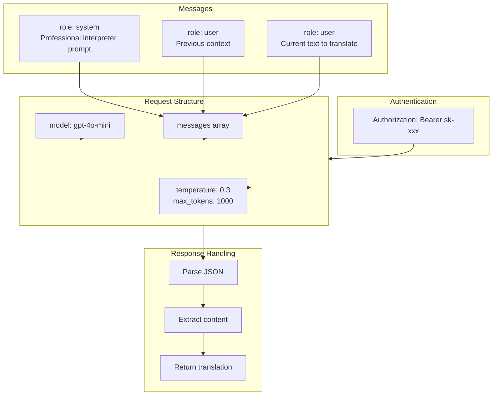
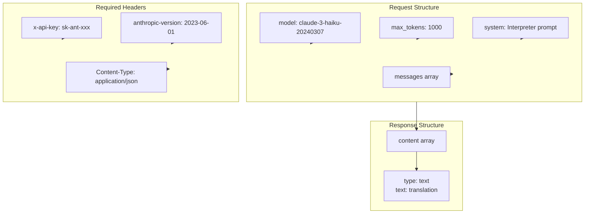
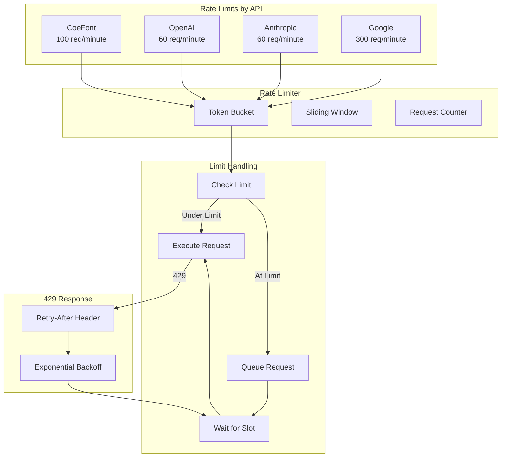
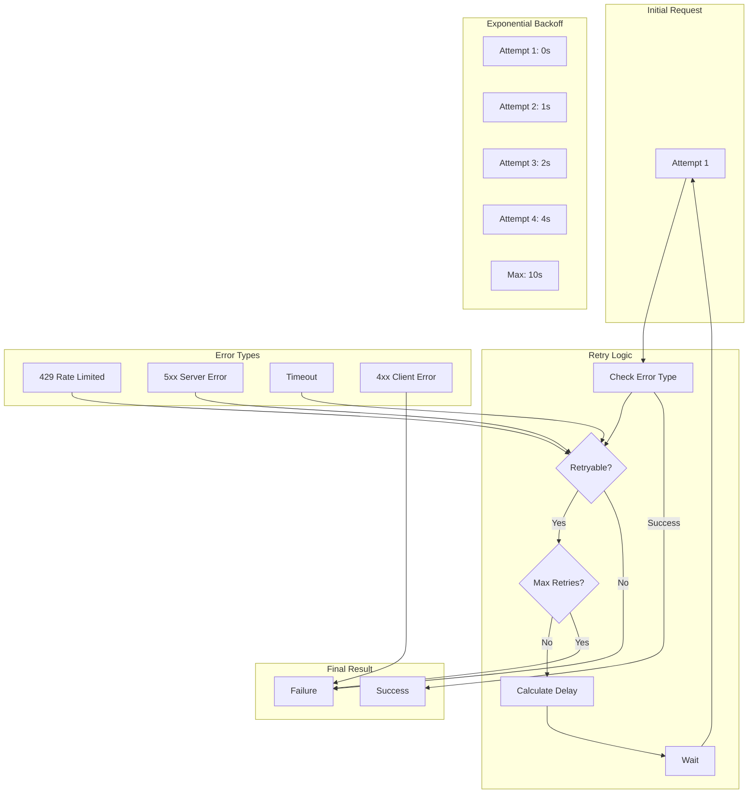
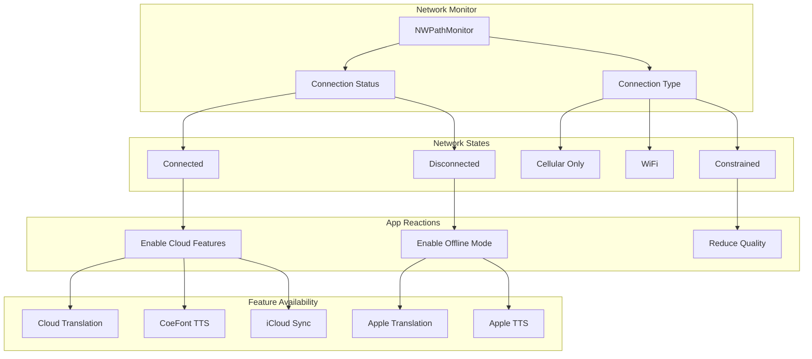
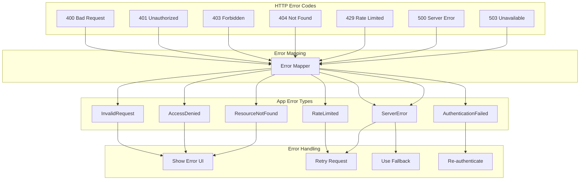
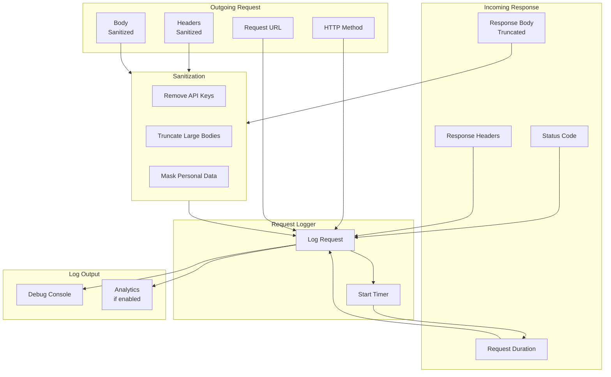
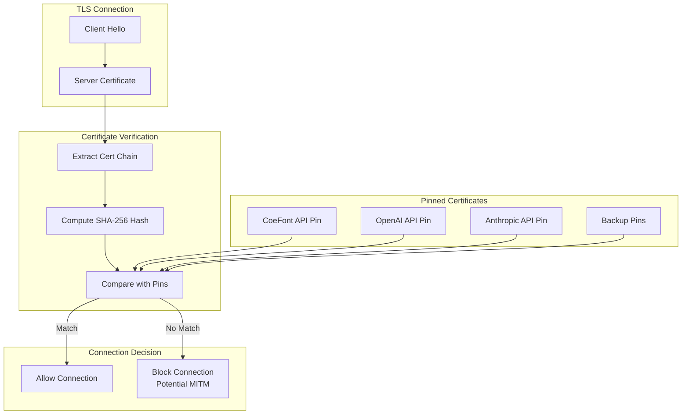

# LiveLingo - Network & API Architecture

## API Integration Overview

```mermaid
flowchart TB
    subgraph App[LiveLingo App]
        subgraph Clients[API Clients]
            CFC[CoeFontAPIClient]
            OAC[OpenAIAPIClient]
            ANC[AnthropicAPIClient]
            GSC[GoogleSpeechClient]
        end

        subgraph Core[Network Core]
            NM[NetworkManager]
            RL[RateLimiter]
            RH[RetryHandler]
            AM[AuthMiddleware]
        end
    end

    subgraph External[External APIs]
        subgraph CoeFont[CoeFont API]
            CF1[/v2/text2speech]
            CF2[/v2/voices]
        end

        subgraph OpenAI[OpenAI API]
            OA1[/v1/chat/completions]
        end

        subgraph Anthropic[Anthropic API]
            AN1[/v1/messages]
        end

        subgraph Google[Google Cloud API]
            GS1[/v1/speech:recognize]
        end
    end

    CFC --> NM
    OAC --> NM
    ANC --> NM
    GSC --> NM

    NM --> AM
    AM --> RL
    RL --> RH

    RH --> CF1
    RH --> CF2
    RH --> OA1
    RH --> AN1
    RH --> GS1
```

---

## CoeFont API Authentication (HMAC-SHA256)

```mermaid
flowchart TB
    subgraph Request[Request Building]
        Body[Request Body<br/>{coefont, text, speed, pitch}]
        Time[Timestamp<br/>Unix Epoch]
    end

    subgraph Signing[Signature Generation]
        Concat[Concatenate<br/>timestamp + body]
        HMAC[HMAC-SHA256<br/>secret key]
        Hex[Hex Encode]
    end

    subgraph Headers[Request Headers]
        H1[Authorization: accessKey]
        H2[X-Coefont-Date: timestamp]
        H3[X-Coefont-Content: signature]
        H4[Content-Type: application/json]
    end

    subgraph Send[Send Request]
        POST[POST /v2/text2speech]
    end

    Body --> Concat
    Time --> Concat
    Concat --> HMAC
    HMAC --> Hex
    Hex --> H3

    Time --> H2
    H1 --> POST
    H2 --> POST
    H3 --> POST
    H4 --> POST
    Body --> POST
```

---

## OpenAI API Integration



---

## Anthropic API Integration



---

## Rate Limiting Architecture



---

## Retry Strategy



---

## Network Monitoring



---

## API Error Handling



---

## Request/Response Logging



---

## Certificate Pinning



---

## Version History

| Version | Date | Changes | Author |
|---------|------|---------|--------|
| 1.0.0 | 2024-12-24 | Initial creation | AI Agent |
