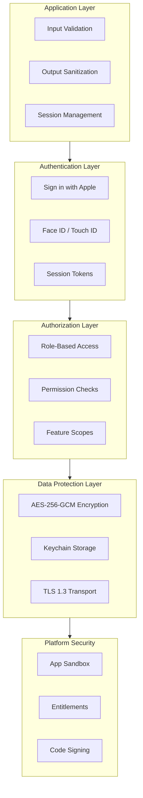
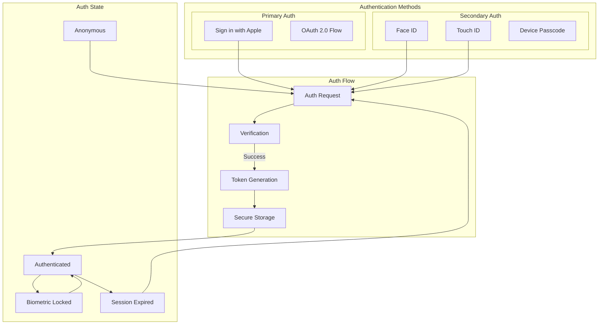
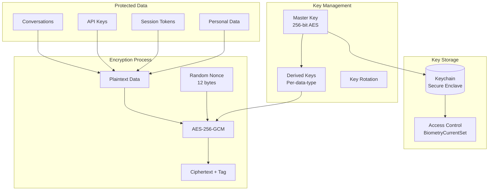
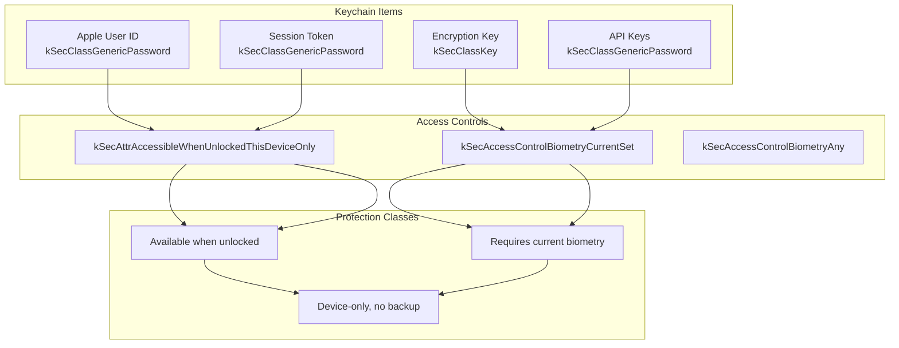
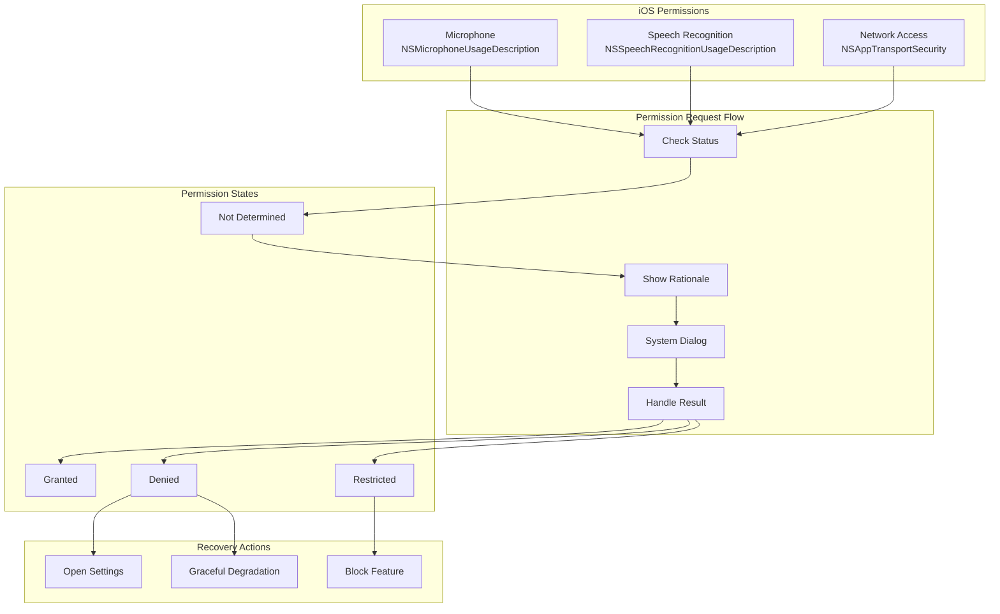
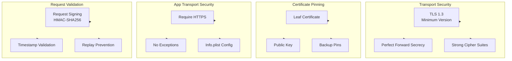
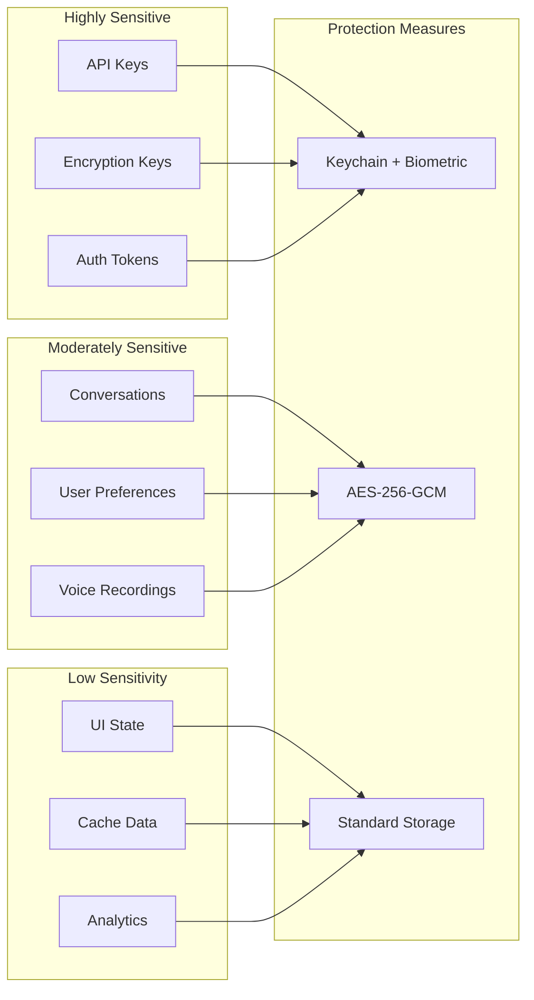
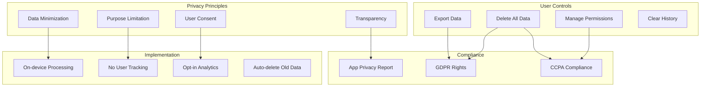
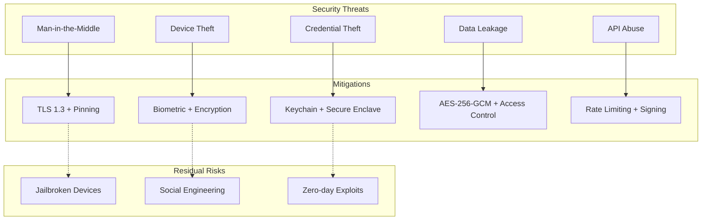

# LiveLingo - Security Architecture

## Security Layers Overview



---

## Authentication Architecture



---

## Encryption Architecture



---

## Keychain Security Model



---

## Permission Model



---

## Network Security



---

## Data Protection Levels



---

## Privacy Architecture



---

## Security Audit Logging

```mermaid
flowchart TB
    subgraph Events[Security Events]
        AuthSuccess[Auth Success]
        AuthFail[Auth Failure]
        PermChange[Permission Change]
        DataAccess[Sensitive Data Access]
        Error[Security Error]
    end

    subgraph Logger[Security Logger]
        Filter[Sensitive Data Filter]
        Format[Log Formatting]
        Timestamp[Timestamp (ISO8601)]
    end

    subgraph Storage[Log Storage]
        Local[Local Log File<br/>Last 1000 entries]
        Rotate[Log Rotation]
    end

    subgraph Privacy[Privacy Protection]
        NoSecrets[No Secrets Logged]
        Anonymize[Anonymize PII]
        Encrypt[Encrypt Logs]
    end

    AuthSuccess --> Logger
    AuthFail --> Logger
    PermChange --> Logger
    DataAccess --> Logger
    Error --> Logger

    Logger --> Filter
    Filter --> Format
    Format --> Timestamp
    Timestamp --> Local

    Local --> Rotate
    Logger --> NoSecrets
    Logger --> Anonymize
    Logger --> Encrypt
```

---

## Threat Model



---

## Version History

| Version | Date | Changes | Author |
|---------|------|---------|--------|
| 1.0.0 | 2024-12-24 | Initial creation | AI Agent |
