# LiveLingo - Audio Pipeline Architecture

## Complete Audio Pipeline

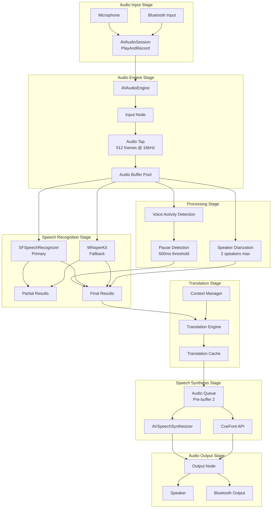

---

## Audio Engine Configuration

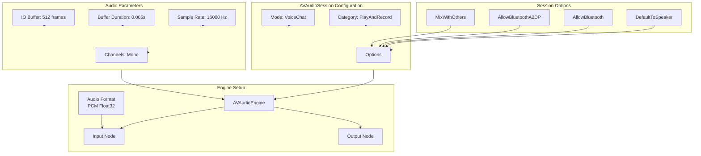

---

## Real-time Latency Budget

```mermaid
gantt
    title Audio Pipeline Latency Budget (Target: <1000ms)
    dateFormat X
    axisFormat %Lms

    section Audio Input
    Buffer Fill (32ms)    :0, 32

    section STT
    Recognition (200-400ms)    :32, 232

    section Translation
    API Call (300-500ms)    :232, 432

    section TTS
    Synthesis (100-200ms)    :432, 532
    Playback Start    :532, 550

    section Total
    End-to-End Target    :0, 1000
```

---

## Voice Activity Detection

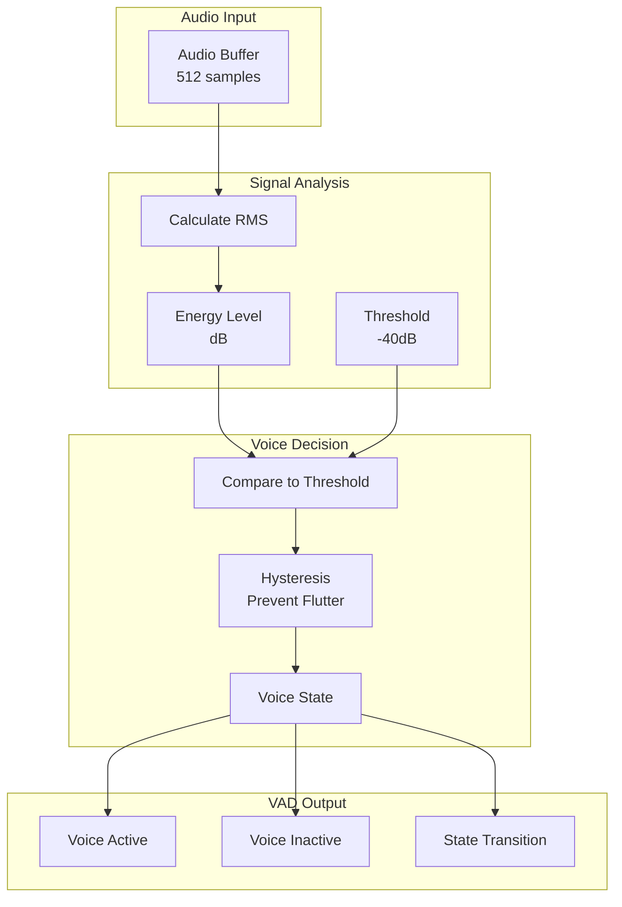

---

## Pause Detection State Machine

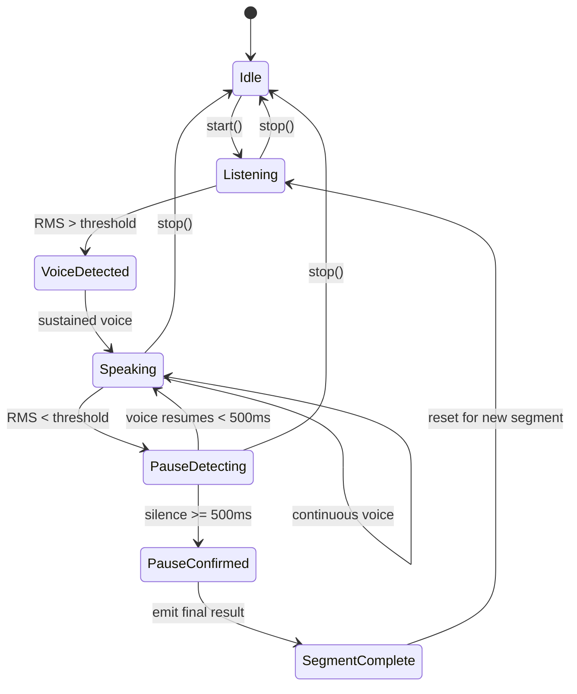

---

## Speaker Diarization Flow

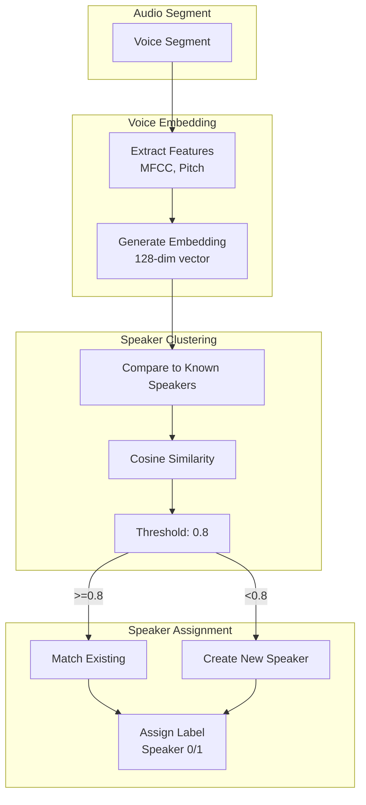

---

## Audio Buffer Pool Management

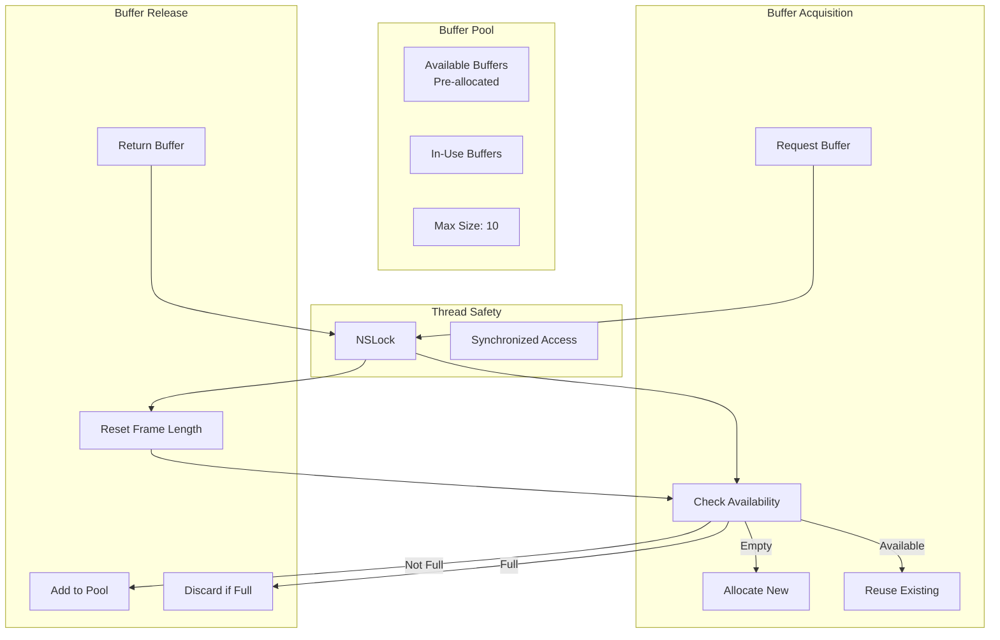

---

## TTS Audio Queue

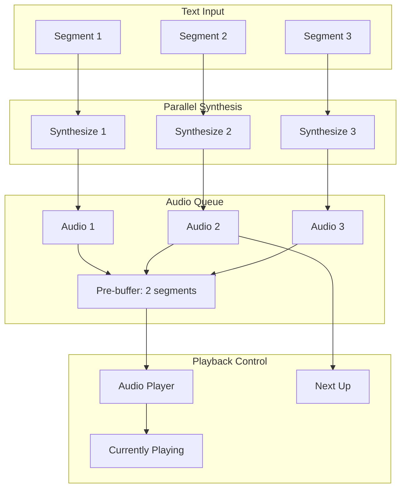

---

## Interruption Handling

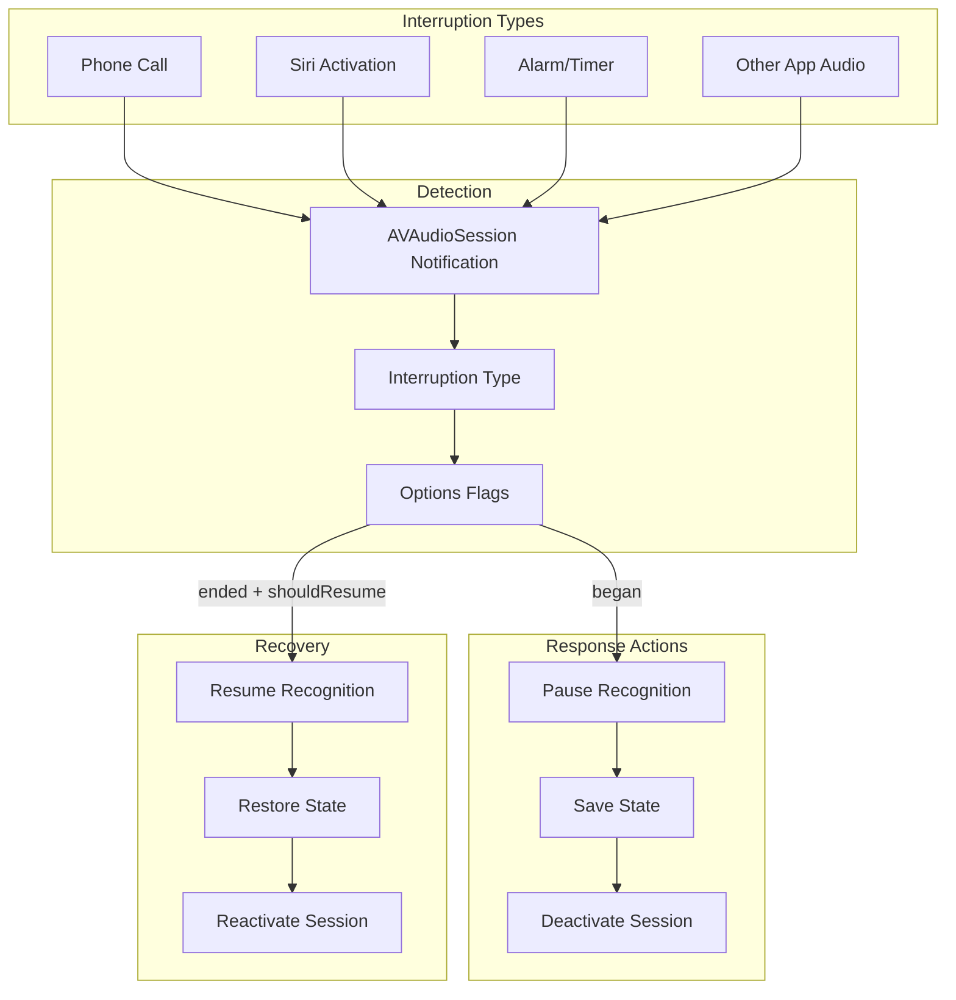

---

## Audio Route Management

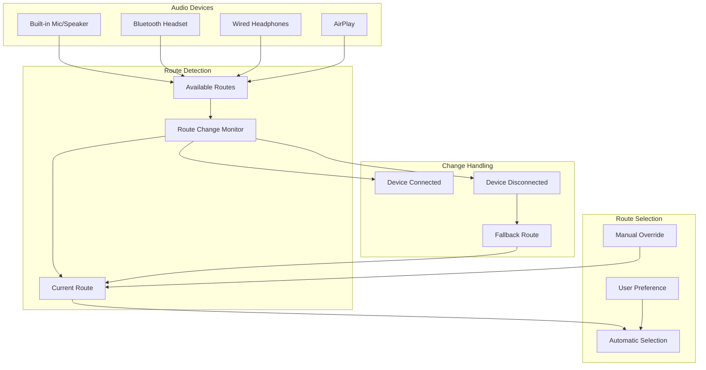

---

## Pipeline Performance Metrics

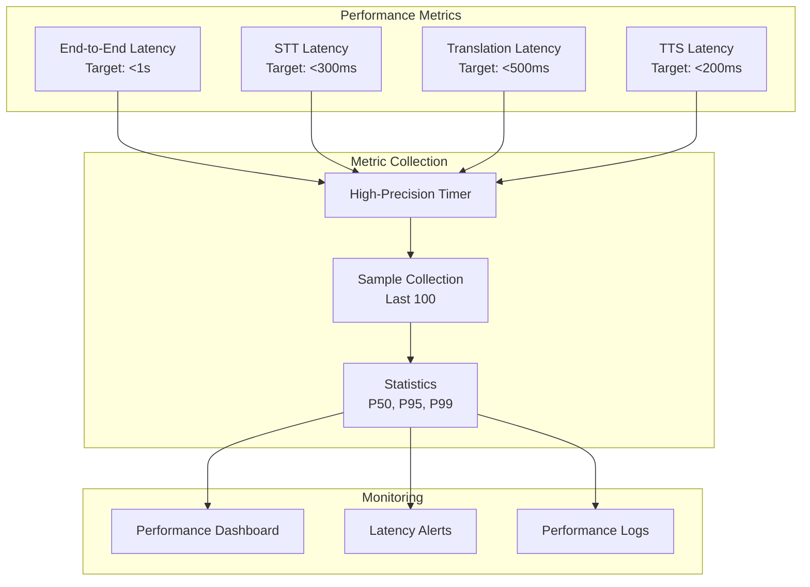

---

## Version History

| Version | Date | Changes | Author |
|---------|------|---------|--------|
| 1.0.0 | 2024-12-24 | Initial creation | AI Agent |
