# LiveLingo - State Management Architecture

## Application State Overview

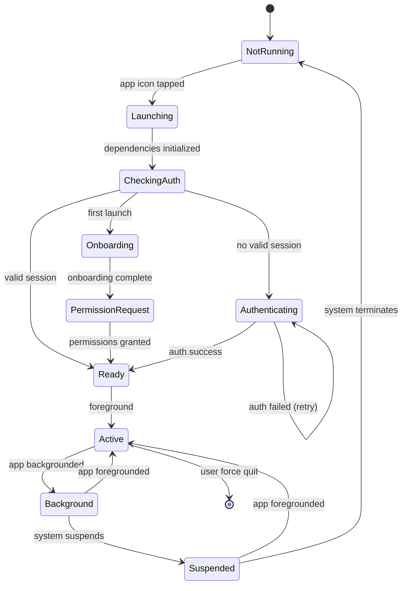

---

## Interpretation State Machine

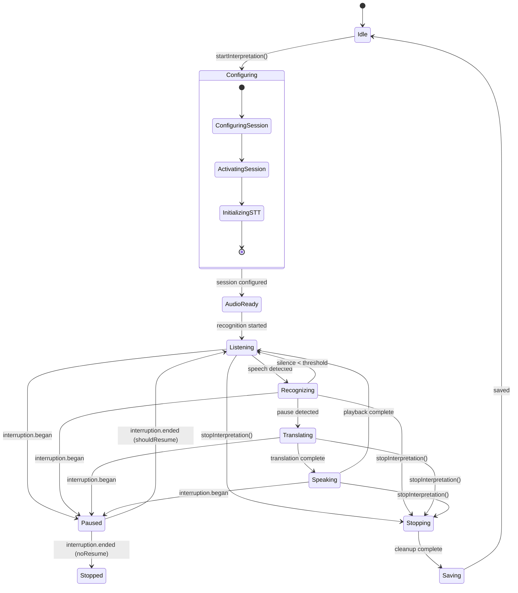

---

## Authentication State Machine

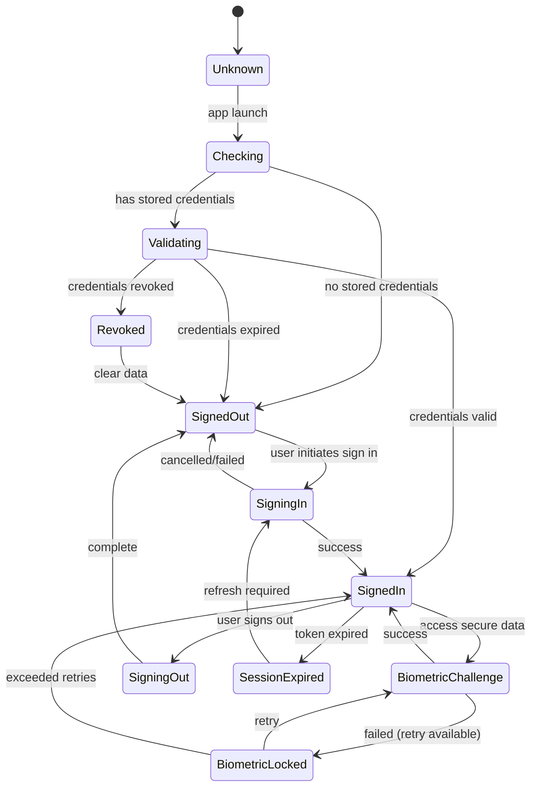

---

## Audio Session State Machine

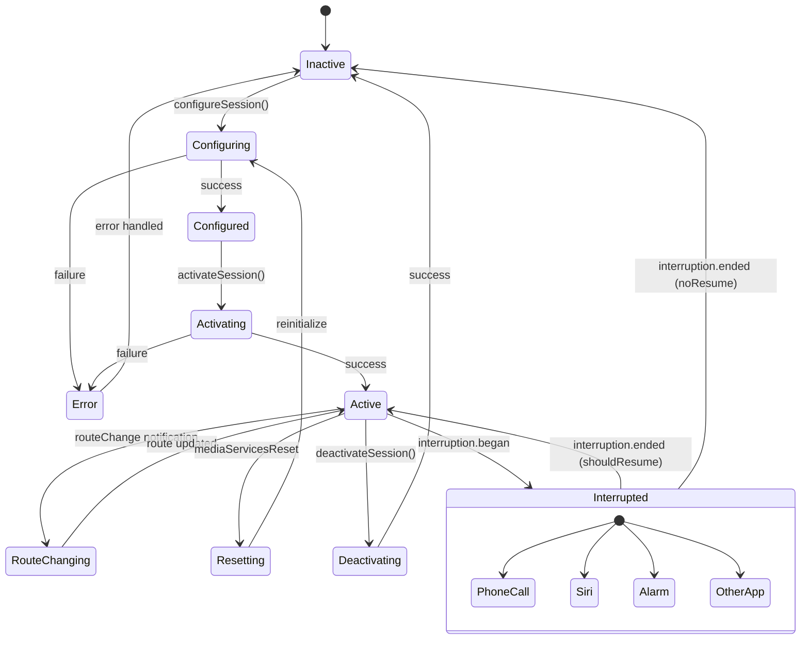

---

## Speech Recognition State Machine

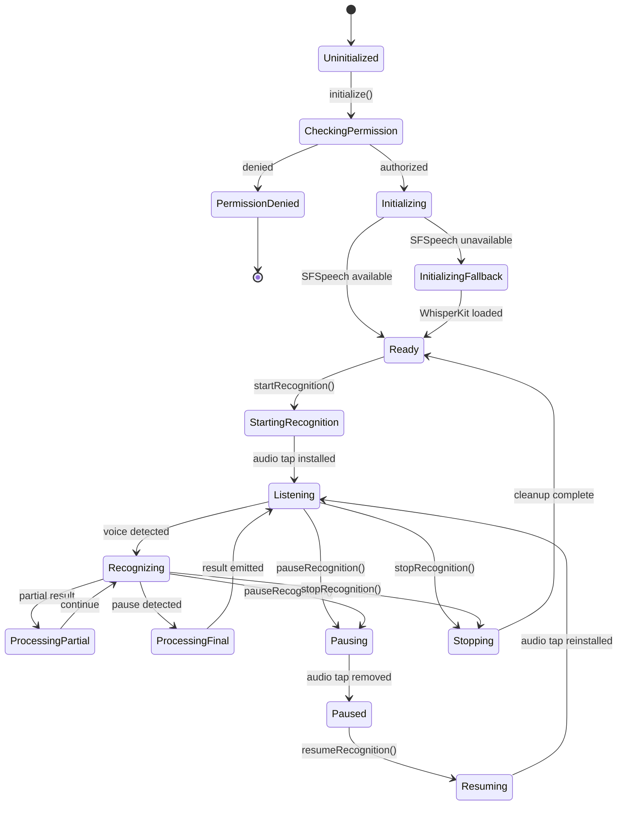

---

## Translation State Machine

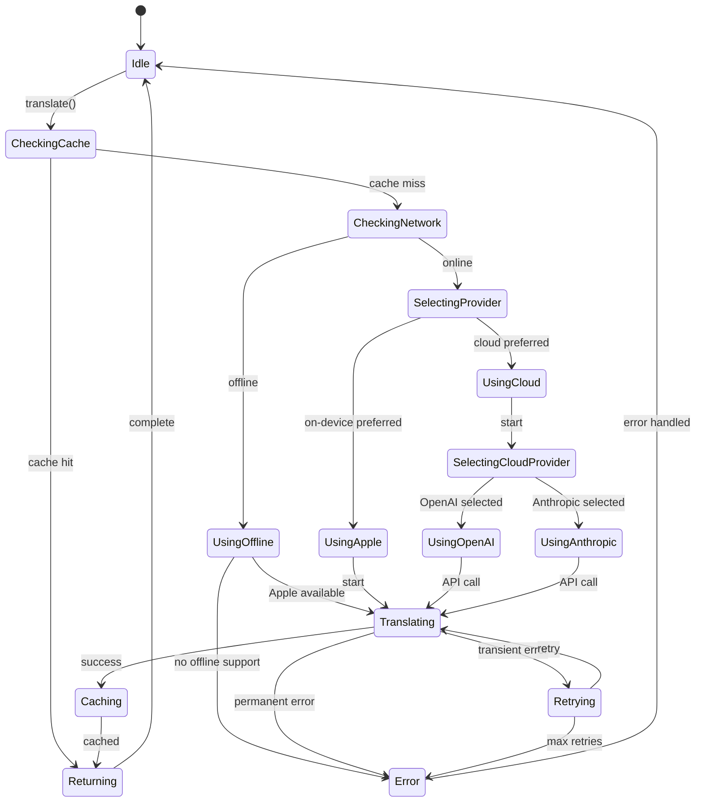

---

## TTS State Machine

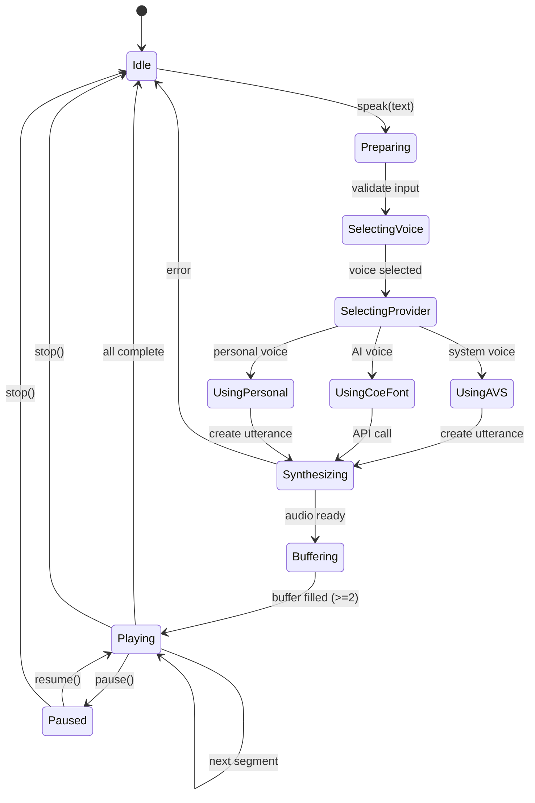

---

## Language State Machine

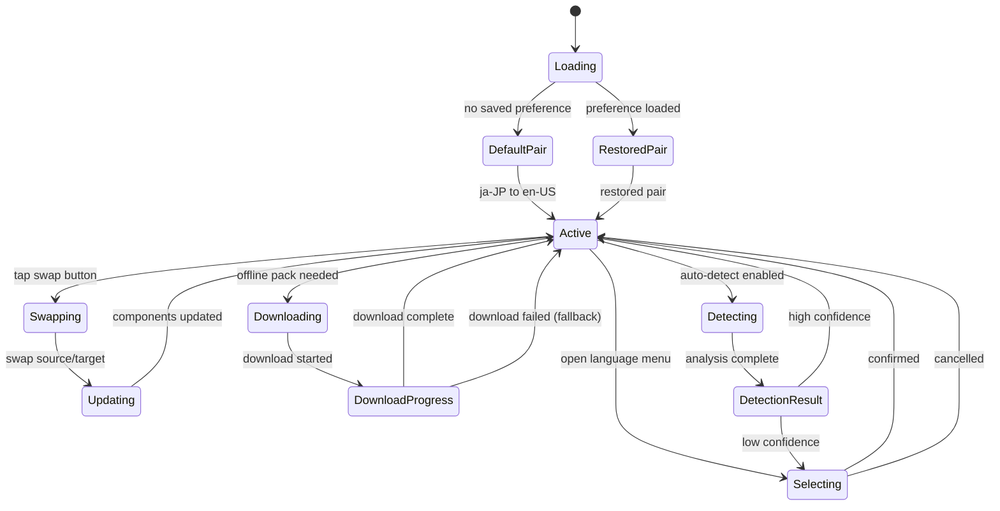

---

## Navigation State Diagram

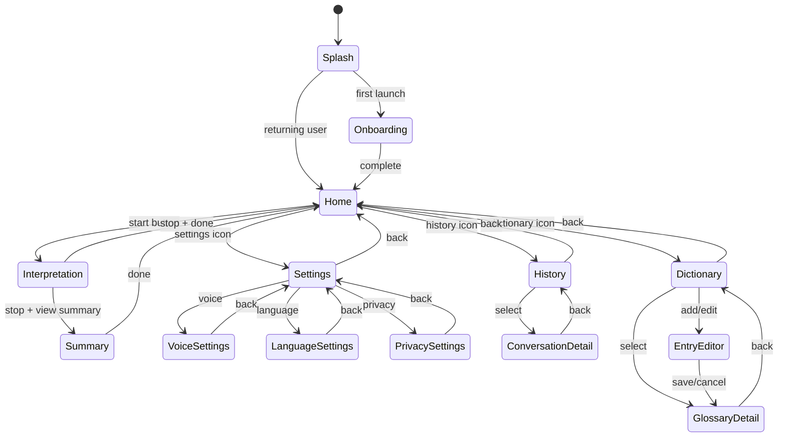

---

## Network State Machine

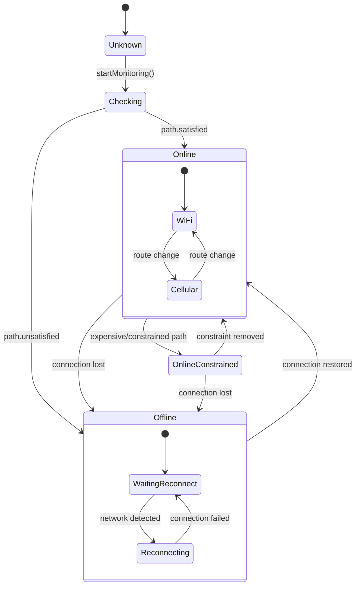

---

## Memory State Machine

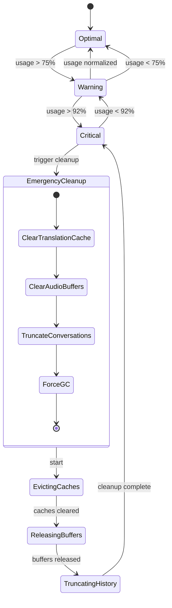

---

## Combined State Overview

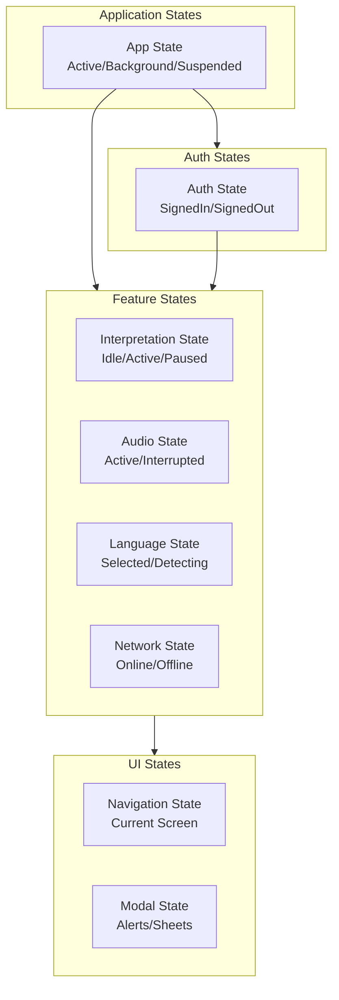

---

## Version History

| Version | Date | Changes | Author |
|---------|------|---------|--------|
| 1.0.0 | 2024-12-24 | Initial creation | AI Agent |
