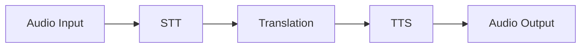
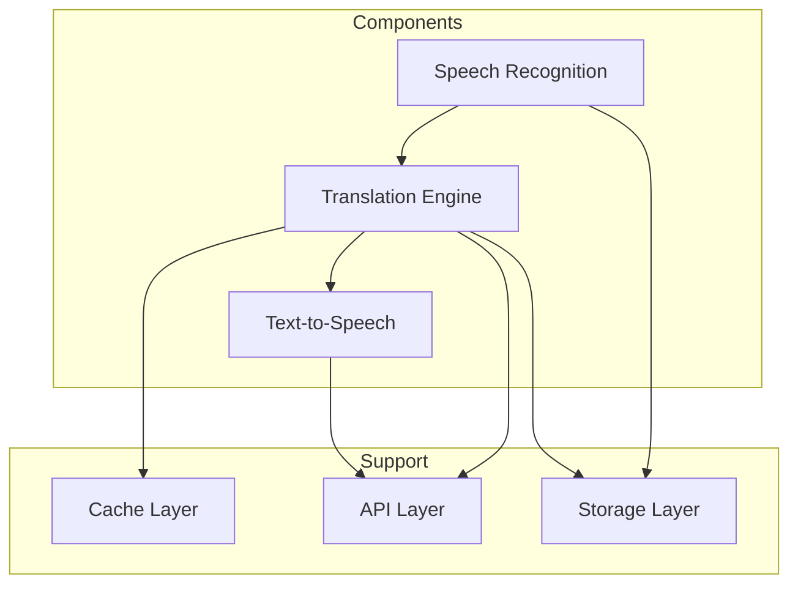
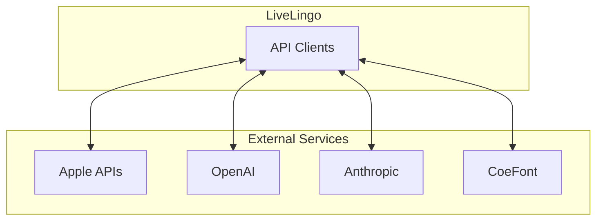
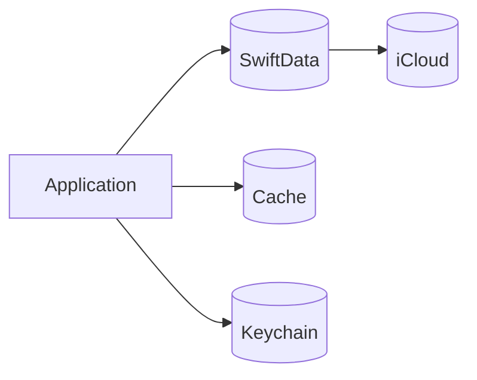
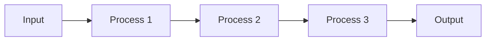
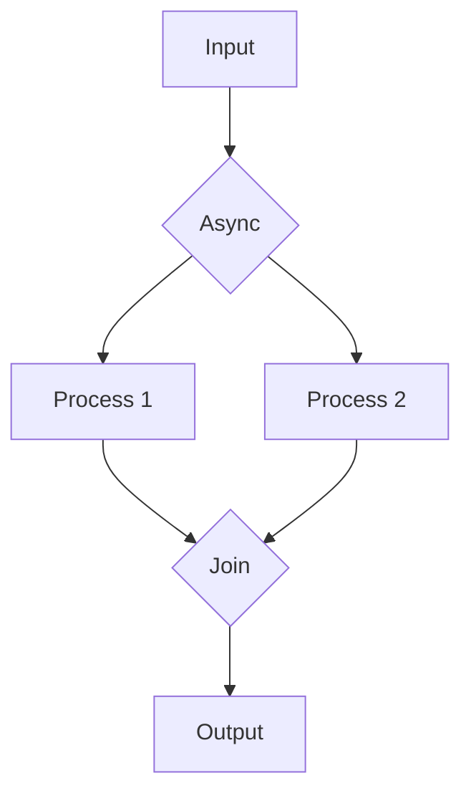
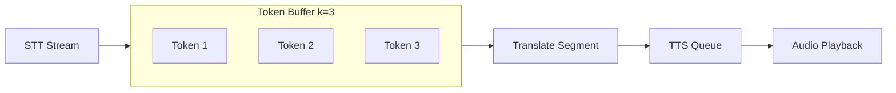
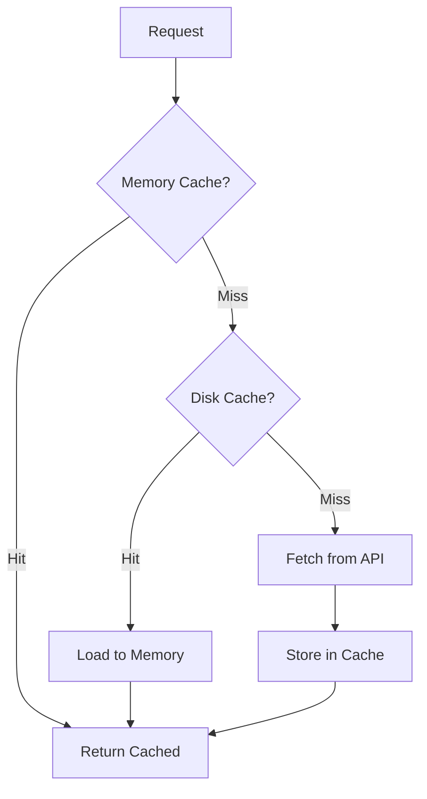
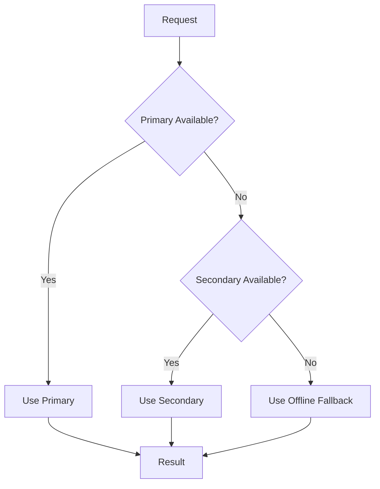

# LiveLingo - Data Flow Diagrams Index

## Overview

This documentation provides comprehensive Mermaid-format data flow diagrams extracted from 70+ workflows defined in the architecture and sequence documentation.

---

## Document Structure

| # | Document | Description | Data Flows |
|---|----------|-------------|------------|
| 00 | [Index](./00-dataflow-index.md) | This index document | - |
| 01 | [Core Pipeline](./01-core-pipeline-dataflows.md) | End-to-end interpretation data flows | 12 |
| 02 | [Speech Recognition](./02-stt-dataflows.md) | STT component data flows | 10 |
| 03 | [Translation](./03-translation-dataflows.md) | Translation engine data flows | 10 |
| 04 | [Text-to-Speech](./04-tts-dataflows.md) | TTS component data flows | 8 |
| 05 | [API Communication](./05-api-dataflows.md) | External API data flows | 10 |
| 06 | [Data Persistence](./06-persistence-dataflows.md) | Storage and sync data flows | 10 |
| 07 | [Security](./07-security-dataflows.md) | Authentication and encryption flows | 10 |
| 08 | [State Management](./08-state-dataflows.md) | Application state data flows | 10 |

**Total Data Flow Diagrams: 80+**

---

## Data Flow Categories

### 1. Core Pipeline Data Flows
Real-time interpretation pipeline from audio input to audio output.

### 2. Component Data Flows
Individual component internal data processing.

### 3. External Integration Data Flows
API communication patterns with external services.

### 4. Data Persistence Flows
Storage, caching, and synchronization patterns.

---

## Technology Stack

| Layer | Technology | Purpose |
|-------|------------|---------|
| UI | SwiftUI | Declarative user interface |
| State | Combine | Reactive data binding |
| Persistence | SwiftData | Local data storage |
| Sync | CloudKit | Cross-device synchronization |
| Security | Keychain | Secure credential storage |
| Audio | AVFoundation | Audio capture and playback |
| STT | SFSpeechRecognizer / WhisperKit | Speech-to-text |
| TTS | AVSpeechSynthesizer / CoeFont | Text-to-speech |
| Translation | Apple Translation / LLM APIs | Language translation |

---

## Key Performance Metrics

| Metric | Target | Measurement Point |
|--------|--------|-------------------|
| End-to-End Latency | < 1000ms | Audio In -> Audio Out |
| STT Latency | < 300ms | Speech -> Text |
| Translation Latency | < 500ms | Text -> Translated Text |
| TTS Latency | < 200ms | Text -> Audio Start |
| Memory (Active) | < 200MB | During interpretation |
| Memory (Idle) | < 100MB | App in foreground |

---

## Data Flow Patterns

### Pattern 1: Synchronous Pipeline
Sequential processing with blocking waits.

### Pattern 2: Asynchronous Pipeline
Non-blocking processing with async/await.

### Pattern 3: Streaming Pipeline (Wait-k)
Overlapped processing for reduced latency.

### Pattern 4: Cache-Through
Memory and disk caching with fallthrough.

### Pattern 5: Fallback Chain
Graceful degradation with fallback options.

---

## Cross-References

### Architecture Documents
- [System Overview](../architecture/01-system-overview.md)
- [Component Architecture](../architecture/03-component-architecture.md)
- [Data Flow Architecture](../architecture/04-data-flow.md)
- [Network & API](../architecture/05-network-api.md)
- [Security Architecture](../architecture/06-security-architecture.md)
- [Audio Pipeline](../architecture/07-audio-pipeline.md)
- [State Management](../architecture/08-state-management.md)

### Workflow Documents
- [Core Interpretation](../workflows/01-core-interpretation.md)
- [STT Workflows](../workflows/03-stt-workflows.md)
- [Translation Workflows](../workflows/04-translation-workflows.md)
- [TTS Workflows](../workflows/05-tts-workflows.md)
- [API Communication](../workflows/07-api-communication.md)
- [Data Persistence](../workflows/11-data-persistence.md)
- [Security & Privacy](../workflows/14-security-privacy.md)

---

## Version History

| Version | Date | Changes | Author |
|---------|------|---------|--------|
| 1.0.0 | 2024-12-24 | Initial creation with 80+ data flow diagrams | AI Agent |
