# LiveLingo - Core Pipeline Data Flows

## DF-CORE-001: Complete End-to-End Pipeline

Full interpretation data flow from microphone to speaker.

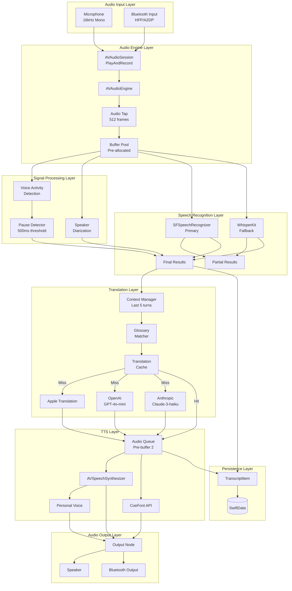

---

## DF-CORE-002: Real-time Streaming Data Flow (Wait-k)

Low-latency streaming with token buffering.

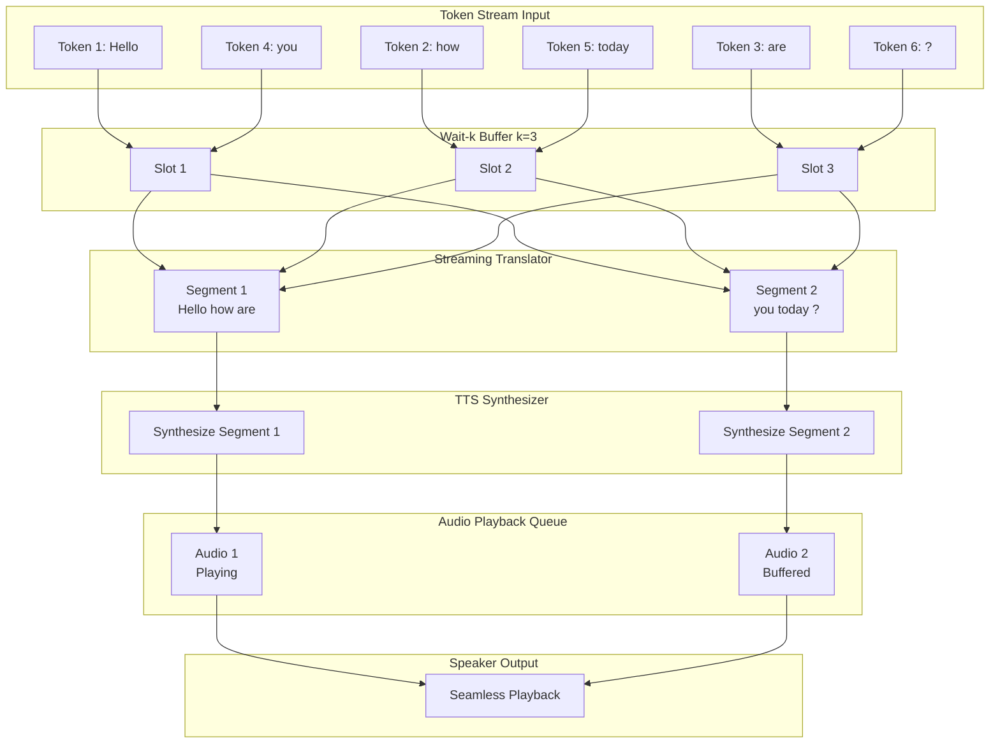

---

## DF-CORE-003: Dual Speaker Bidirectional Flow

Two-way interpretation between speakers.

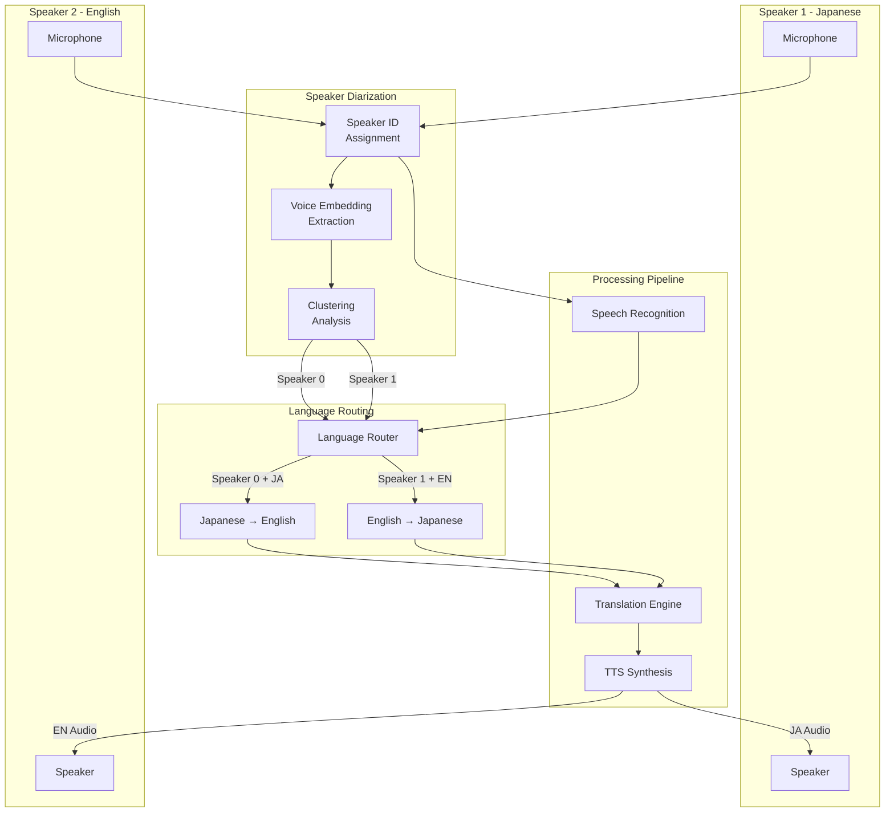

---

## DF-CORE-004: Single Speaker Broadcast Flow

One-way interpretation for presentations.

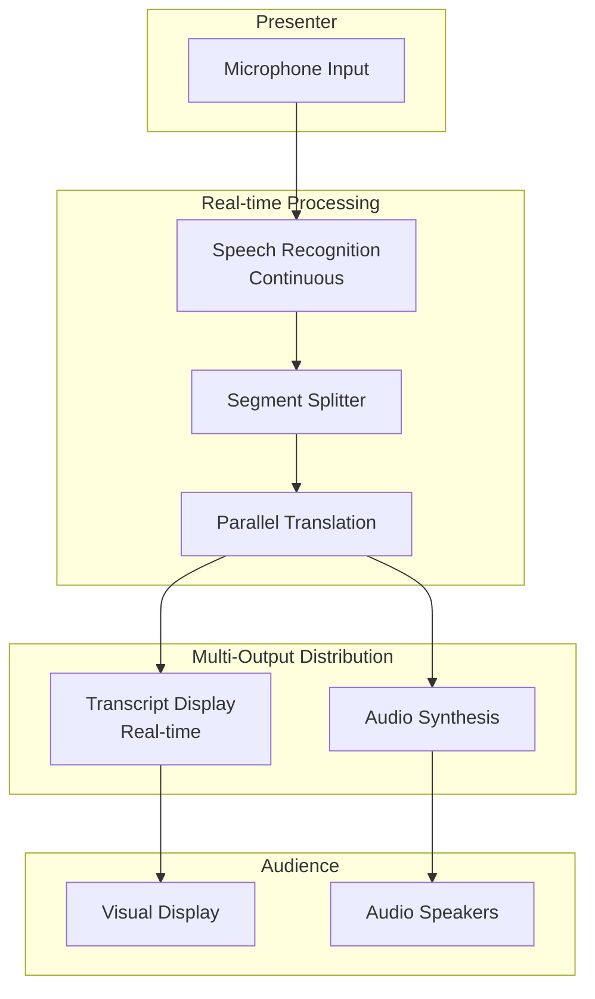

---

## DF-CORE-005: Pause Detection Segmentation Flow

Automatic segment splitting based on silence.

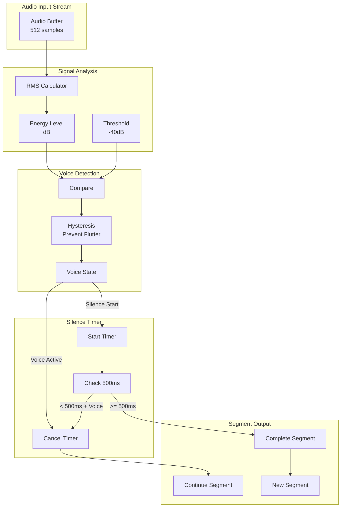

---

## DF-CORE-006: Interruption Handling Flow

Audio session interruption response.

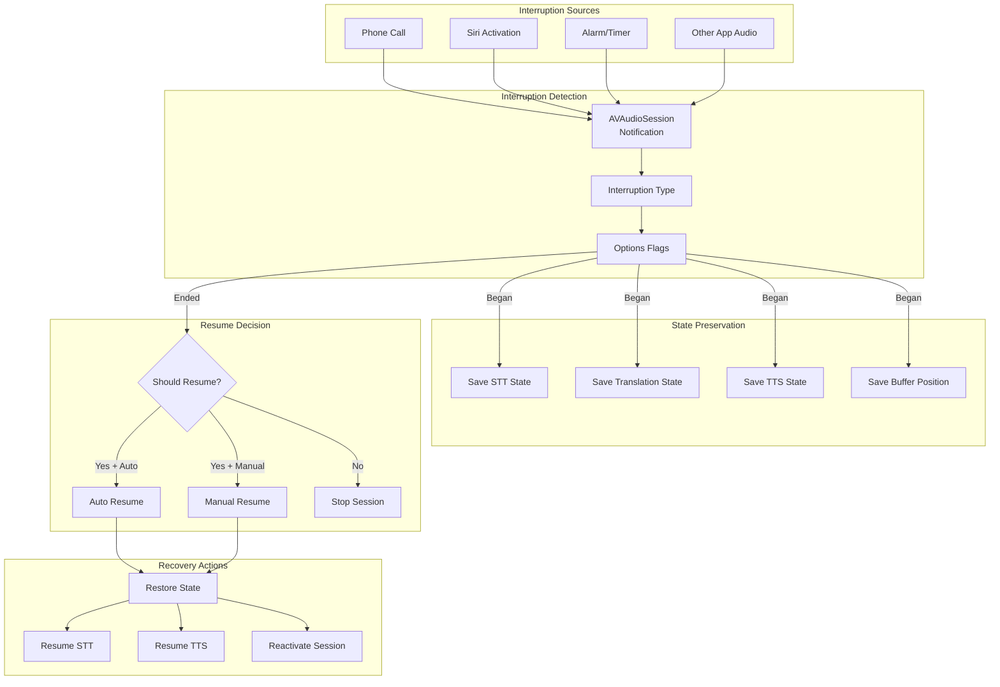

---

## DF-CORE-007: Memory Management Flow

Resource allocation and cleanup.

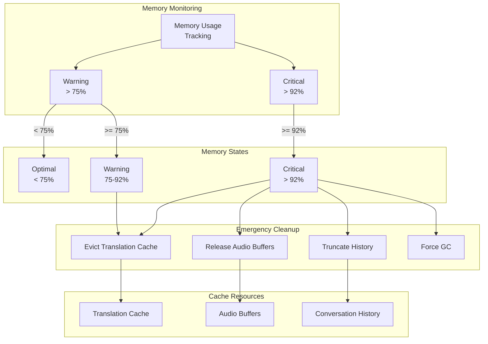

---

## DF-CORE-008: Audio Route Change Flow

Dynamic audio route switching.

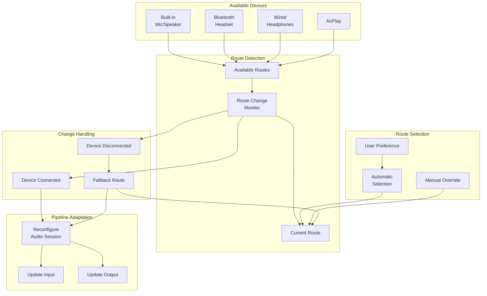

---

## DF-CORE-009: Context Window Management Flow

Conversation context for translation.

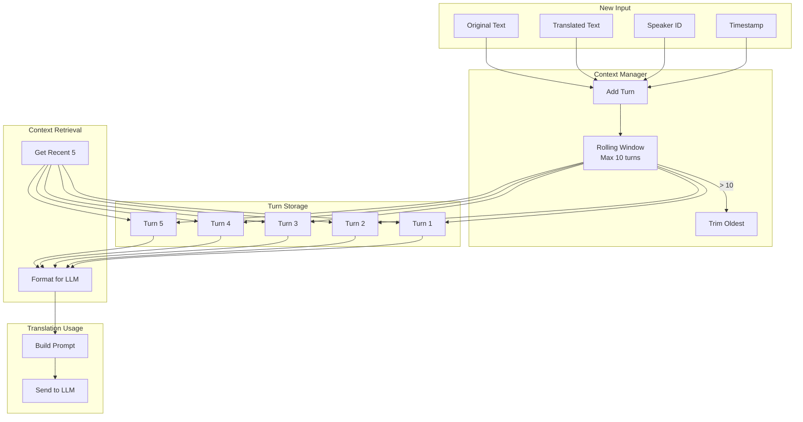

---

## DF-CORE-010: Error Recovery Pipeline Flow

Fault-tolerant processing with fallbacks.

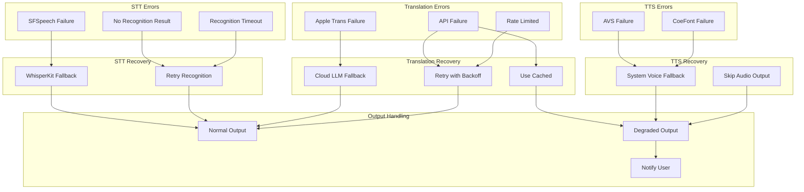

---

## DF-CORE-011: Latency Budget Distribution Flow

Time allocation across pipeline stages.

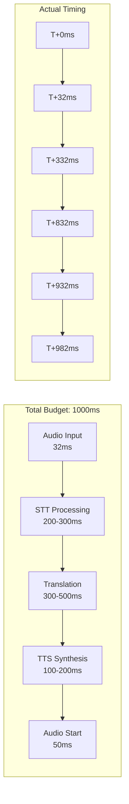

---

## DF-CORE-012: Parallel Processing Distribution Flow

Concurrent task execution.

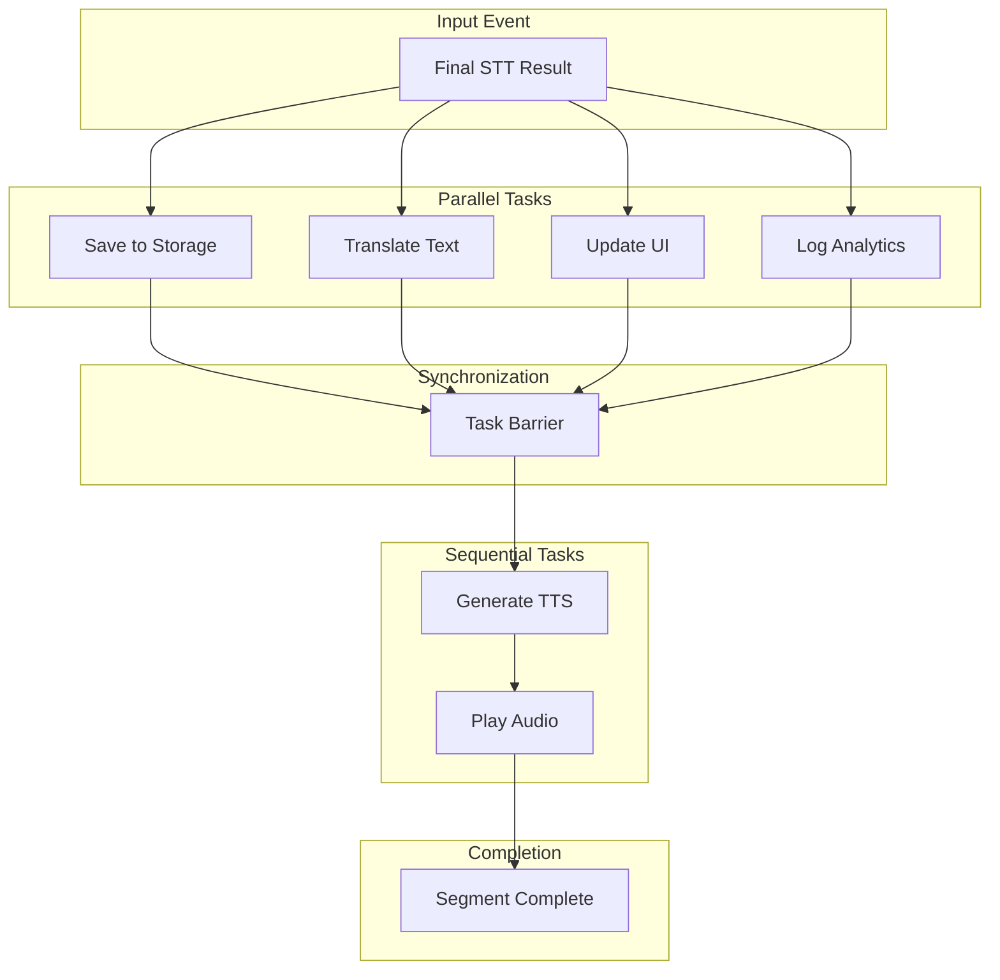

---

## Version History

| Version | Date | Changes | Author |
|---------|------|---------|--------|
| 1.0.0 | 2024-12-24 | Initial creation - 12 core pipeline data flows | AI Agent |
