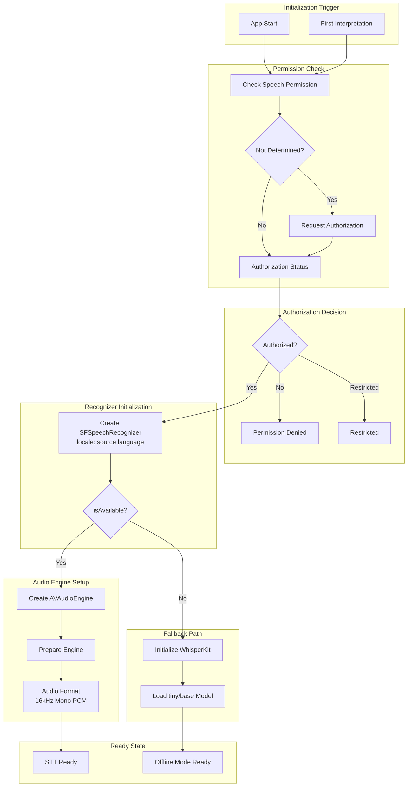
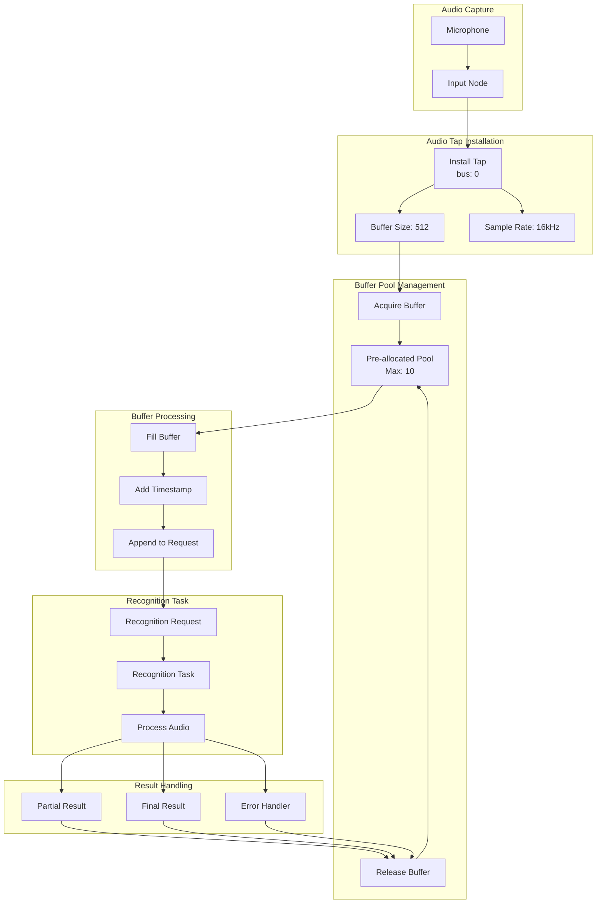
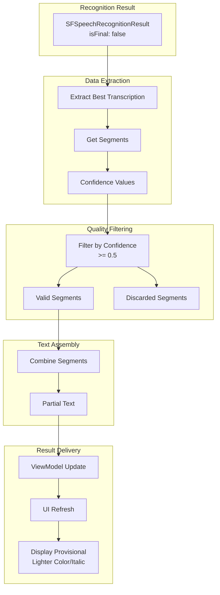
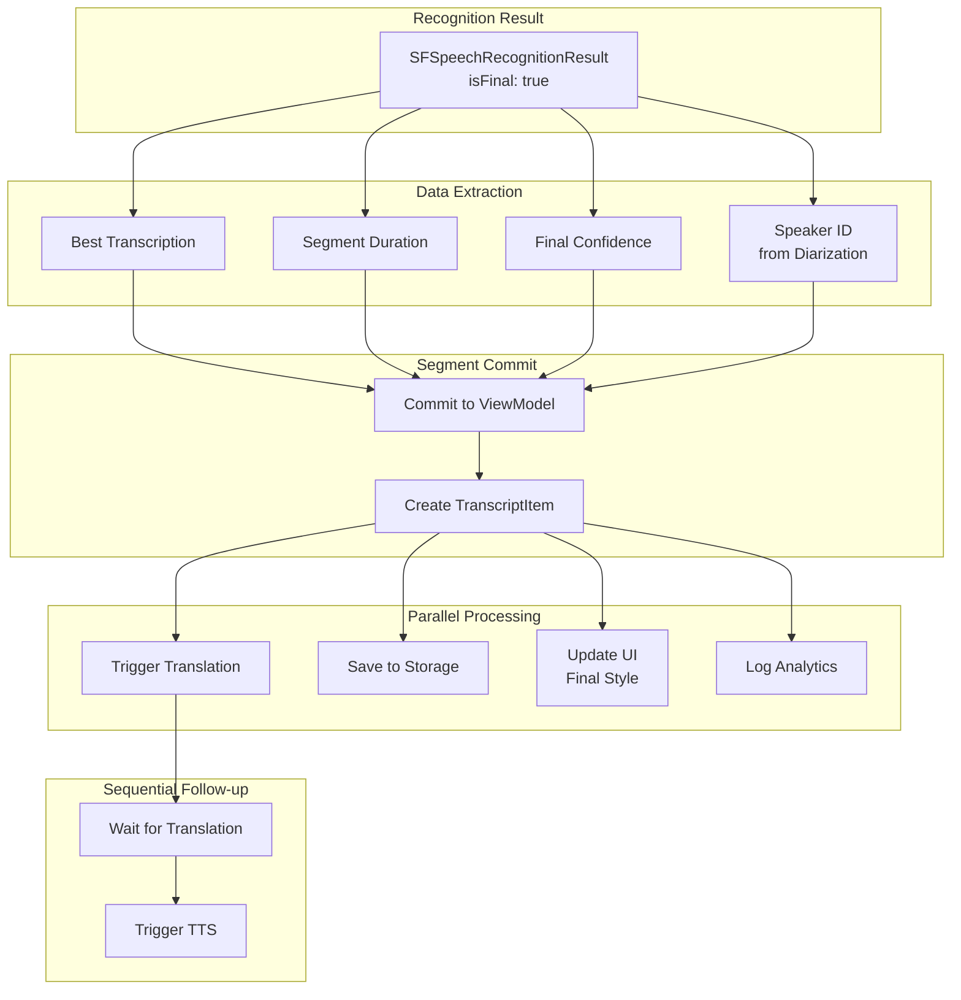
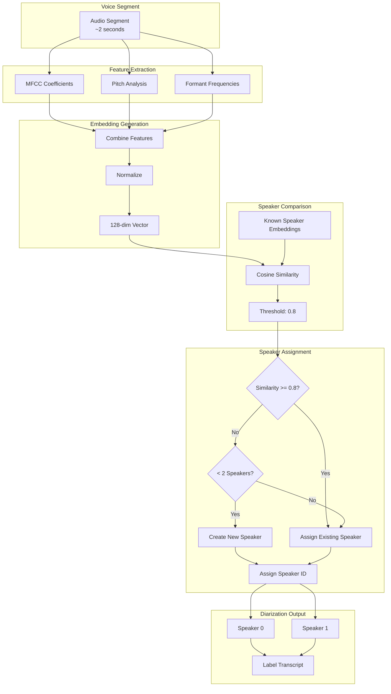
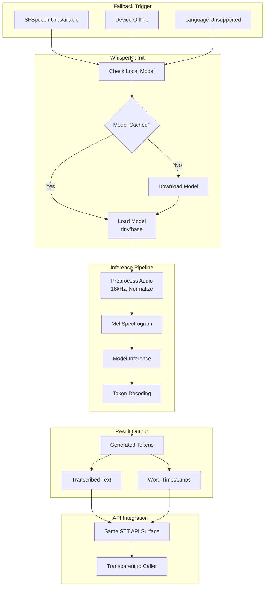
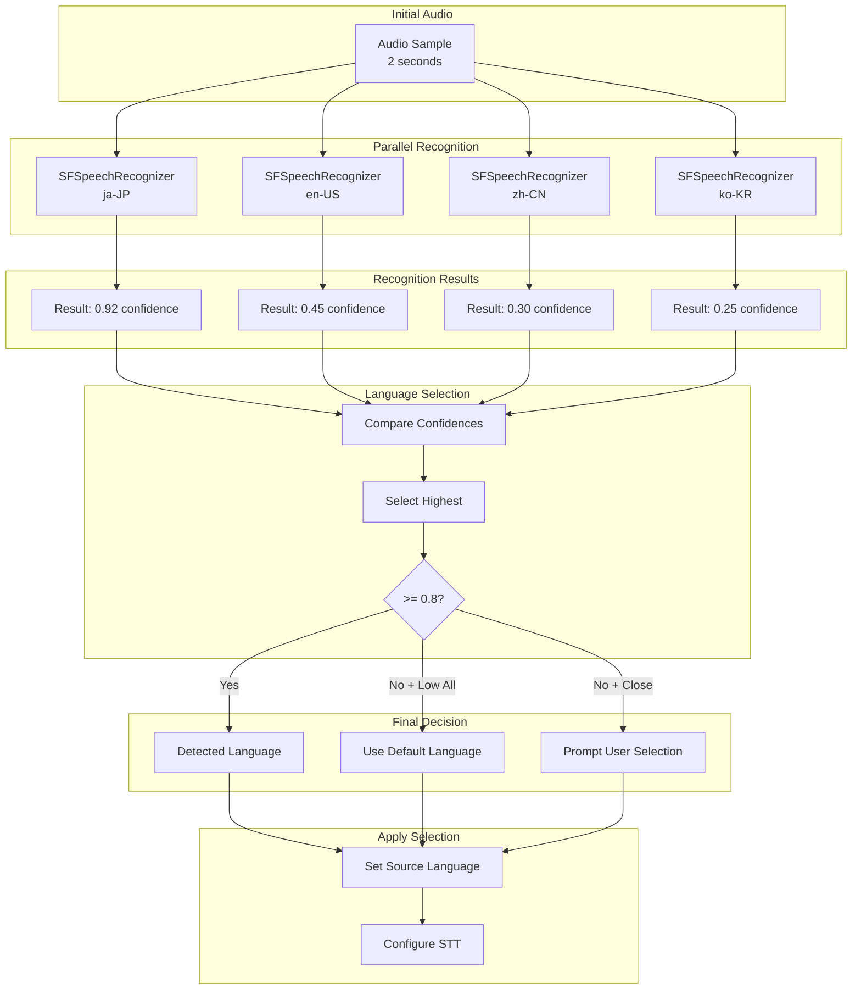
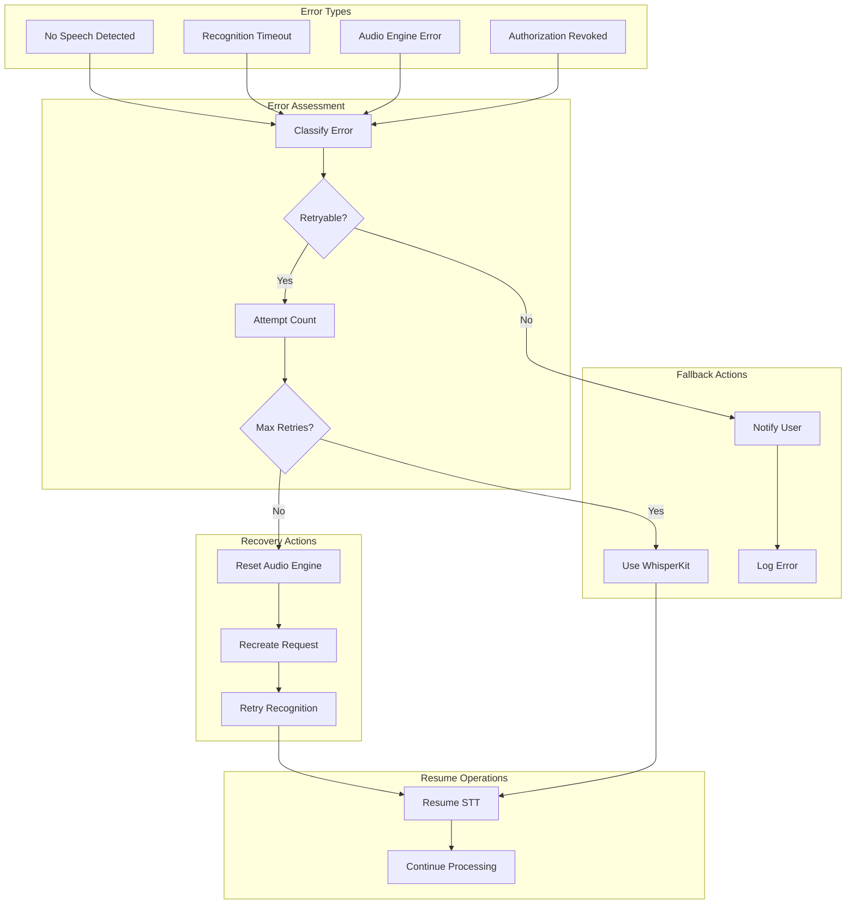
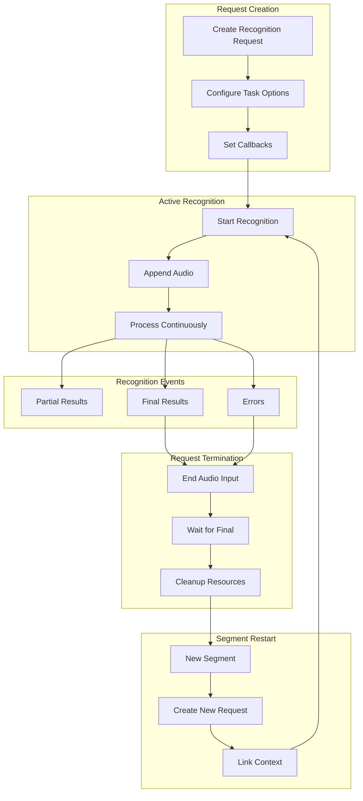

# LiveLingo - Speech Recognition (STT) Data Flows

## DF-STT-001: SFSpeechRecognizer Initialization Flow

Complete initialization with permission handling.



---

## DF-STT-002: Real-time Audio Processing Flow

Continuous audio buffer processing.



---

## DF-STT-003: Partial Result Processing Flow

Interim transcription result handling.



---

## DF-STT-004: Final Result Processing Flow

Confirmed transcription and downstream triggers.



---

## DF-STT-005: Voice Activity Detection (VAD) Flow

Voice/silence classification.

```mermaid
flowchart TB
    subgraph Input[Audio Input]
        BUFFER[Audio Buffer<br/>512 samples]
    end

    subgraph Analysis[Signal Analysis]
        SAMPLES[Get Samples]
        SUM_SQ[Sum of Squares]
        MEAN[Mean]
        SQRT[Square Root = RMS]
    end

    subgraph Convert[Level Conversion]
        RMS_VAL[RMS Value]
        DB[Convert to dB<br/>20 * log10(RMS)]
        LEVEL[Energy Level]
    end

    subgraph Threshold[Threshold Comparison]
        THRESHOLD_VAL[Threshold: -40dB]
        COMPARE[Compare Levels]
    end

    subgraph Hysteresis[Hysteresis Filter]
        VOICE_ON[Voice On Threshold<br/>-38dB]
        VOICE_OFF[Voice Off Threshold<br/>-42dB]
        PREVENT[Prevent Flutter]
    end

    subgraph Output[VAD Output]
        ACTIVE[Voice Active]
        INACTIVE[Voice Inactive]
        TRANSITION[State Transition]
    end

    BUFFER --> SAMPLES
    SAMPLES --> SUM_SQ
    SUM_SQ --> MEAN
    MEAN --> SQRT

    SQRT --> RMS_VAL
    RMS_VAL --> DB
    DB --> LEVEL

    LEVEL --> COMPARE
    THRESHOLD_VAL --> COMPARE

    COMPARE --> VOICE_ON
    COMPARE --> VOICE_OFF
    VOICE_ON --> PREVENT
    VOICE_OFF --> PREVENT

    PREVENT --> ACTIVE
    PREVENT --> INACTIVE
    PREVENT --> TRANSITION
```

---

## DF-STT-006: Speaker Diarization Flow

Two-speaker identification.



---

## DF-STT-007: WhisperKit Fallback Flow

Offline recognition when SFSpeech unavailable.



---

## DF-STT-008: Language Auto-Detection Flow

Automatic source language identification.



---

## DF-STT-009: Recognition Error Recovery Flow

Error handling and recovery strategies.



---

## DF-STT-010: Recognition Request Lifecycle Flow

Complete request lifecycle management.



---

## Version History

| Version | Date | Changes | Author |
|---------|------|---------|--------|
| 1.0.0 | 2024-12-24 | Initial creation - 10 STT data flows | AI Agent |
