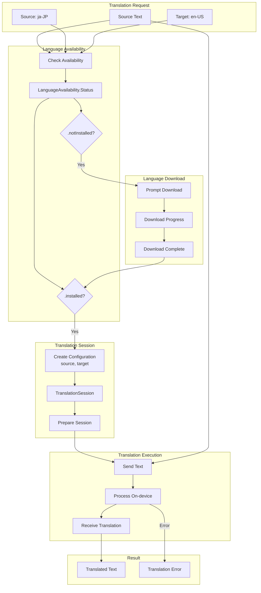
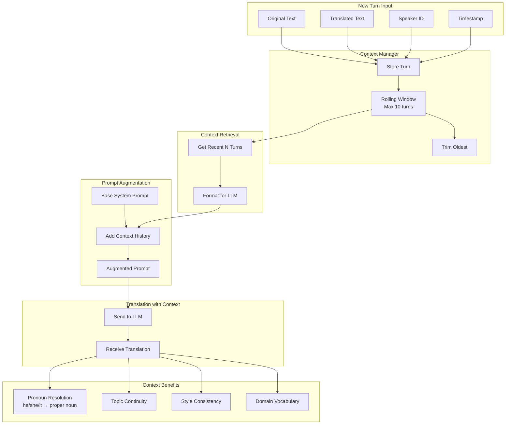
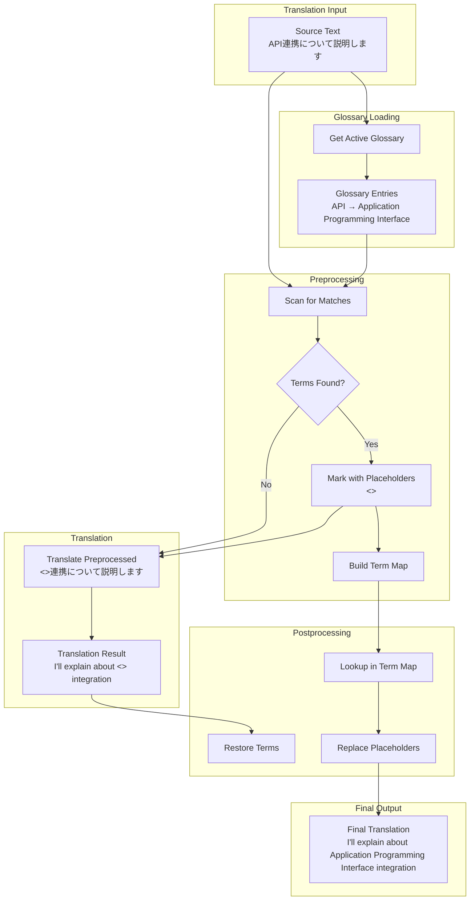
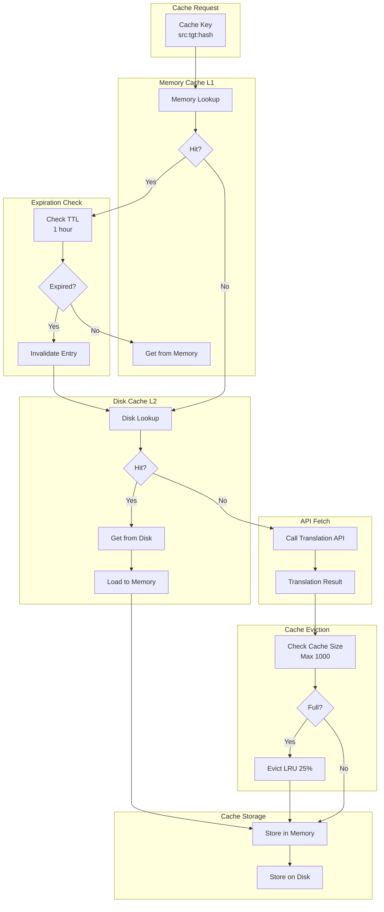
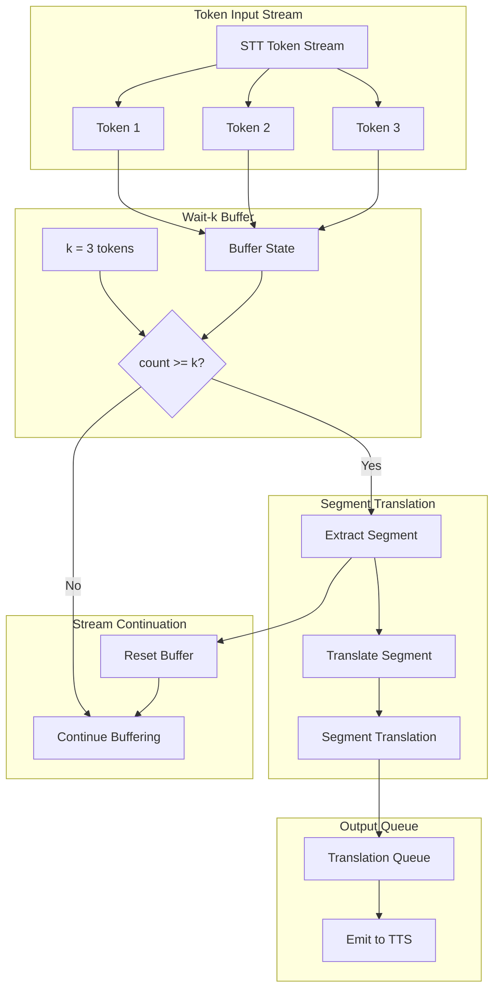
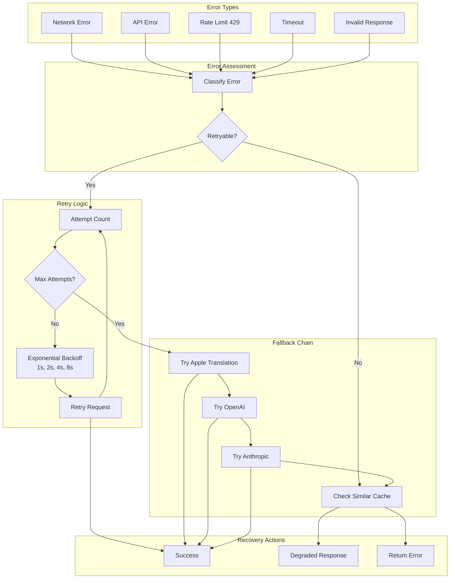
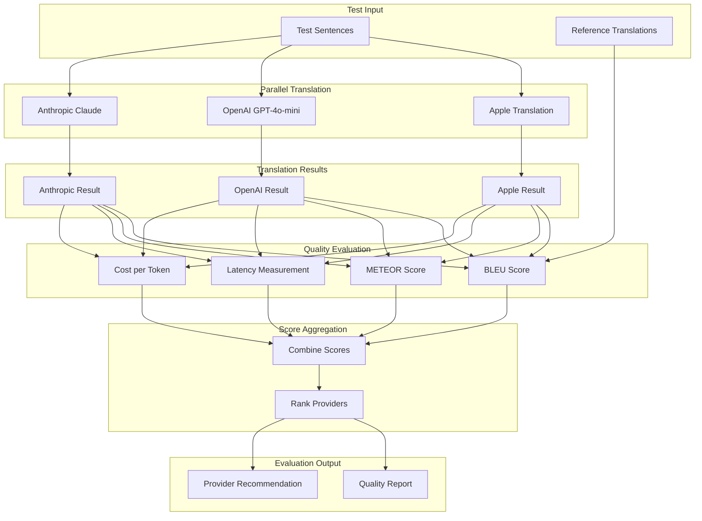

# LiveLingo - Translation Engine Data Flows

## DF-TRN-001: Provider Selection Flow

Translation provider routing logic.

```mermaid
flowchart TB
    subgraph Input[Translation Request]
        TEXT[Source Text]
        SRC[Source Language]
        TGT[Target Language]
        PREF[User Preference]
    end

    subgraph CacheCheck[Cache Layer]
        CACHE_KEY[Generate Cache Key<br/>src:tgt:hash(text)]
        CACHE_LOOKUP[Lookup Cache]
        HIT{Cache Hit?}
    end

    subgraph NetworkCheck[Network Check]
        NET_STATUS[Check Network]
        ONLINE{Online?}
    end

    subgraph OfflinePath[Offline Path]
        APPLE_AVAIL{Apple Trans<br/>Available?}
        APPLE_TRANS[Apple Translation<br/>On-device]
        OFFLINE_ERR[Offline Error<br/>No Support]
    end

    subgraph OnlinePath[Online Path]
        USER_PREF{User Preference}
        ON_DEVICE[Prefer On-device]
        CLOUD[Prefer Cloud]
    end

    subgraph CloudProvider[Cloud Provider Selection]
        PROVIDER_PREF{Provider Setting}
        OPENAI[OpenAI<br/>GPT-4o-mini]
        ANTHROPIC[Anthropic<br/>Claude-3-haiku]
    end

    subgraph Output[Result Output]
        RESULT[Translation Result]
        CACHE_STORE[Store in Cache]
    end

    TEXT --> CACHE_KEY
    SRC --> CACHE_KEY
    TGT --> CACHE_KEY
    CACHE_KEY --> CACHE_LOOKUP

    CACHE_LOOKUP --> HIT
    HIT -->|Yes| RESULT

    HIT -->|No| NET_STATUS
    NET_STATUS --> ONLINE

    ONLINE -->|No| APPLE_AVAIL
    APPLE_AVAIL -->|Yes| APPLE_TRANS
    APPLE_AVAIL -->|No| OFFLINE_ERR

    ONLINE -->|Yes| USER_PREF
    PREF --> USER_PREF

    USER_PREF --> ON_DEVICE
    USER_PREF --> CLOUD

    ON_DEVICE --> APPLE_AVAIL
    CLOUD --> PROVIDER_PREF

    PROVIDER_PREF --> OPENAI
    PROVIDER_PREF --> ANTHROPIC

    APPLE_TRANS --> CACHE_STORE
    OPENAI --> CACHE_STORE
    ANTHROPIC --> CACHE_STORE

    CACHE_STORE --> RESULT
```

---

## DF-TRN-002: Apple Translation On-Device Flow

Native translation framework usage.



---

## DF-TRN-003: OpenAI GPT Translation Flow

Cloud translation via OpenAI API.

```mermaid
flowchart TB
    subgraph Request[Translation Request]
        TEXT[Source Text]
        CONTEXT[Conversation Context<br/>Last 5 turns]
        SRC[Source Language]
        TGT[Target Language]
    end

    subgraph PromptBuilding[Prompt Construction]
        SYSTEM[System Prompt<br/>Professional Interpreter]
        CONTEXT_FORMAT[Format Context<br/>Previous translations]
        USER_MSG[User Message<br/>Current text to translate]
    end

    subgraph APIRequest[API Request]
        BUILD_REQ[Build Request Body]
        MODEL[model: gpt-4o-mini]
        PARAMS[temperature: 0.3<br/>max_tokens: 1000]
        HEADERS[Authorization: Bearer]
    end

    subgraph Network[Network Call]
        SEND[POST /v1/chat/completions]
        WAIT[Await Response]
    end

    subgraph Response[Response Handling]
        PARSE[Parse JSON Response]
        EXTRACT[Extract content<br/>choices[0].message.content]
        CLEAN[Clean Translation]
    end

    subgraph Output[Result]
        TRANSLATION[Translated Text]
        UPDATE_CTX[Update Context Manager]
    end

    TEXT --> USER_MSG
    CONTEXT --> CONTEXT_FORMAT
    SRC --> SYSTEM
    TGT --> SYSTEM

    SYSTEM --> BUILD_REQ
    CONTEXT_FORMAT --> BUILD_REQ
    USER_MSG --> BUILD_REQ
    MODEL --> BUILD_REQ
    PARAMS --> BUILD_REQ
    HEADERS --> BUILD_REQ

    BUILD_REQ --> SEND
    SEND --> WAIT

    WAIT --> PARSE
    PARSE --> EXTRACT
    EXTRACT --> CLEAN

    CLEAN --> TRANSLATION
    TRANSLATION --> UPDATE_CTX
```

---

## DF-TRN-004: Anthropic Claude Translation Flow

Cloud translation via Anthropic API.

```mermaid
flowchart TB
    subgraph Request[Translation Request]
        TEXT[Source Text]
        CONTEXT[Conversation Context]
        GLOSSARY[Active Glossary]
    end

    subgraph PromptBuilding[Prompt Construction]
        SYSTEM_PROMPT[System:<br/>Professional interpreter prompt]
        MESSAGES[Messages Array]
        CONTEXT_MSG[Context Messages<br/>Previous turns]
        CURRENT_MSG[Current Translation Request]
    end

    subgraph APIRequest[API Request]
        BUILD_REQ[Build Request Body]
        MODEL[model: claude-3-haiku-20240307]
        PARAMS[max_tokens: 1000]
        HEADERS[x-api-key<br/>anthropic-version: 2023-06-01]
    end

    subgraph Network[Network Call]
        SEND[POST /v1/messages]
        WAIT[Await Response]
    end

    subgraph Response[Response Handling]
        PARSE[Parse JSON Response]
        EXTRACT[Extract content[0].text]
        POST_PROCESS[Post-process]
    end

    subgraph Output[Result]
        TRANSLATION[Translated Text]
    end

    TEXT --> CURRENT_MSG
    CONTEXT --> CONTEXT_MSG
    GLOSSARY --> SYSTEM_PROMPT

    SYSTEM_PROMPT --> BUILD_REQ
    CONTEXT_MSG --> MESSAGES
    CURRENT_MSG --> MESSAGES
    MESSAGES --> BUILD_REQ
    MODEL --> BUILD_REQ
    PARAMS --> BUILD_REQ
    HEADERS --> BUILD_REQ

    BUILD_REQ --> SEND
    SEND --> WAIT

    WAIT --> PARSE
    PARSE --> EXTRACT
    EXTRACT --> POST_PROCESS

    POST_PROCESS --> TRANSLATION
```

---

## DF-TRN-005: Context-Aware Translation Flow

Multi-turn context management for coherent translation.



---

## DF-TRN-006: Glossary Application Flow

Custom dictionary term handling.



---

## DF-TRN-007: Translation Cache Flow

Multi-tier caching for performance.



---

## DF-TRN-008: Wait-k Streaming Translation Flow

Low-latency streaming with token buffering.



---

## DF-TRN-009: Translation Error Recovery Flow

Error handling with fallback chain.



---

## DF-TRN-010: Translation Quality Evaluation Flow

Quality metrics and provider comparison.



---

## Version History

| Version | Date | Changes | Author |
|---------|------|---------|--------|
| 1.0.0 | 2024-12-24 | Initial creation - 10 translation data flows | AI Agent |
