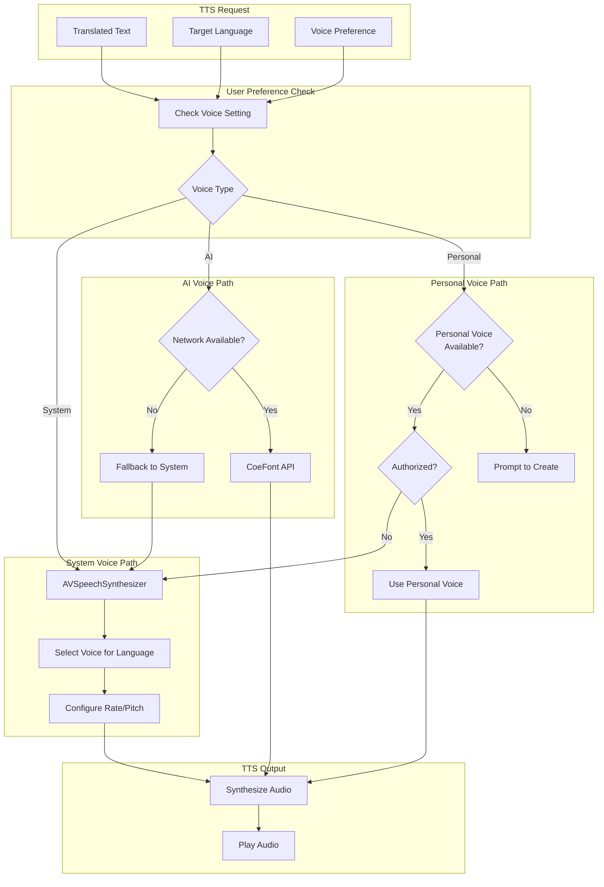
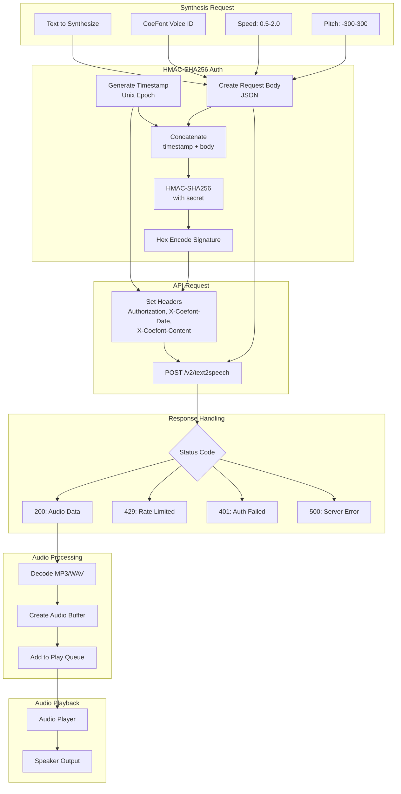
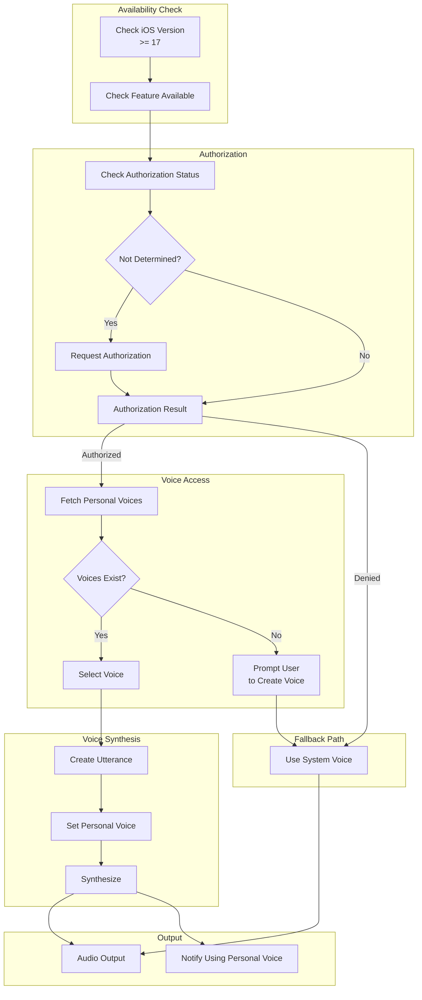
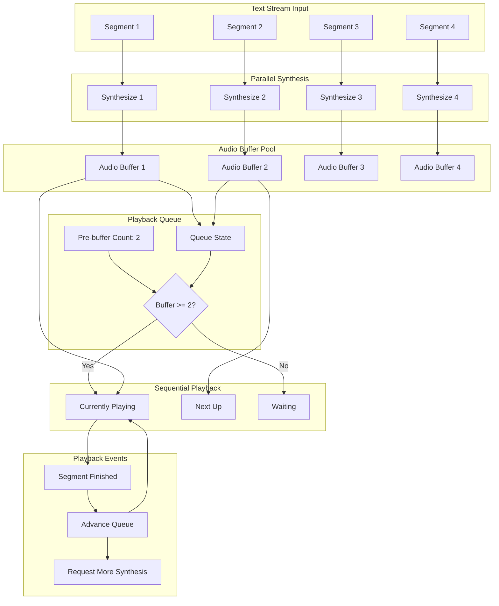
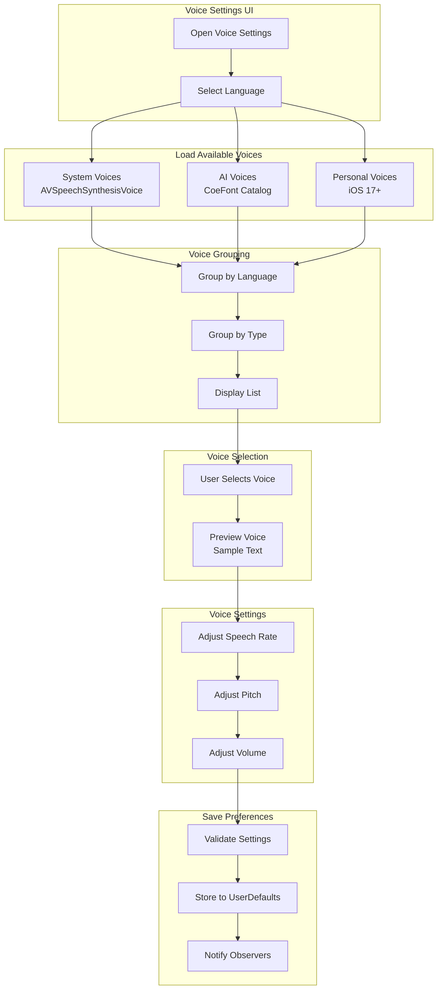
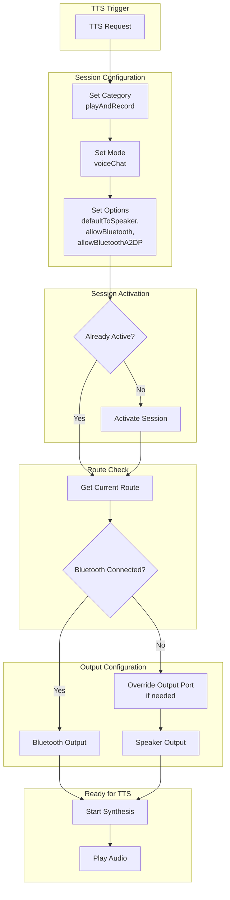
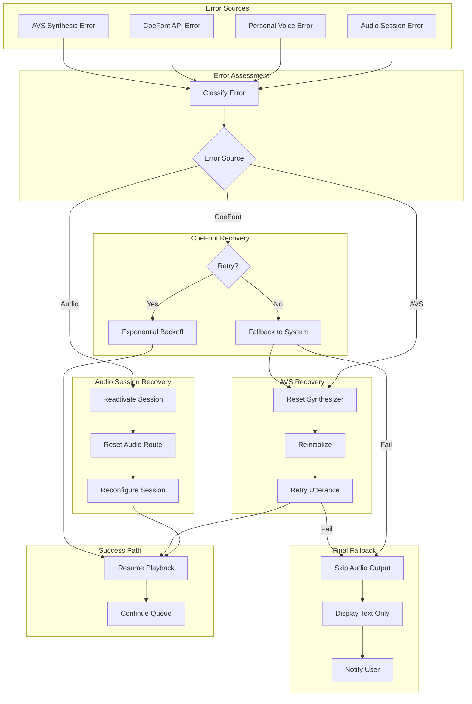

# LiveLingo - Text-to-Speech (TTS) Data Flows

## DF-TTS-001: TTS Provider Selection Flow

Voice synthesis provider routing.



---

## DF-TTS-002: AVSpeechSynthesizer Flow

System TTS using Apple's built-in synthesizer.

```mermaid
flowchart TB
    subgraph Input[Synthesis Request]
        TEXT[Text to Speak]
        LANG[Language Code]
        SETTINGS[Voice Settings<br/>rate, pitch, volume]
    end

    subgraph VoiceSelection[Voice Selection]
        GET_VOICES[Get Available Voices]
        FILTER_LANG[Filter by Language]
        QUALITY[Select Quality<br/>Enhanced > Default]
        SELECTED[Selected Voice]
    end

    subgraph UtteranceCreation[Utterance Creation]
        CREATE_UTT[Create AVSpeechUtterance]
        SET_VOICE[Set Voice]
        SET_RATE[Set Rate: 0.4-0.6]
        SET_PITCH[Set Pitch: 0.8-1.2]
        SET_VOL[Set Volume: 0.0-1.0]
    end

    subgraph Synthesis[Synthesis Process]
        SYNTH[AVSpeechSynthesizer]
        SPEAK[speak(utterance)]
        DELEGATE[Delegate Callbacks]
    end

    subgraph Events[Speech Events]
        DID_START[didStart]
        DID_CONTINUE[didContinue]
        DID_PAUSE[didPause]
        DID_CANCEL[didCancel]
        DID_FINISH[didFinish]
    end

    subgraph Output[Audio Output]
        AUDIO_OUT[Audio Session Output]
        SPEAKER[Speaker/Bluetooth]
    end

    TEXT --> CREATE_UTT
    LANG --> GET_VOICES
    GET_VOICES --> FILTER_LANG
    FILTER_LANG --> QUALITY
    QUALITY --> SELECTED

    SELECTED --> SET_VOICE
    CREATE_UTT --> SET_VOICE
    SETTINGS --> SET_RATE
    SETTINGS --> SET_PITCH
    SETTINGS --> SET_VOL

    SET_VOICE --> SET_RATE
    SET_RATE --> SET_PITCH
    SET_PITCH --> SET_VOL
    SET_VOL --> SPEAK

    SYNTH --> SPEAK
    SPEAK --> DELEGATE

    DELEGATE --> DID_START
    DELEGATE --> DID_CONTINUE
    DELEGATE --> DID_PAUSE
    DELEGATE --> DID_CANCEL
    DELEGATE --> DID_FINISH

    SPEAK --> AUDIO_OUT
    AUDIO_OUT --> SPEAKER
```

---

## DF-TTS-003: CoeFont API Synthesis Flow

AI voice synthesis via CoeFont cloud service.



---

## DF-TTS-004: Personal Voice (iOS 17+) Flow

User's cloned voice synthesis.



---

## DF-TTS-005: Streaming Audio Queue Flow

Pre-buffered playback for seamless audio.



---

## DF-TTS-006: Voice Configuration Flow

Voice selection and settings management.



---

## DF-TTS-007: Audio Session Configuration for TTS Flow

Audio session setup for playback.



---

## DF-TTS-008: TTS Error Recovery Flow

Error handling and fallback strategies.



---

## Version History

| Version | Date | Changes | Author |
|---------|------|---------|--------|
| 1.0.0 | 2024-12-24 | Initial creation - 8 TTS data flows | AI Agent |
