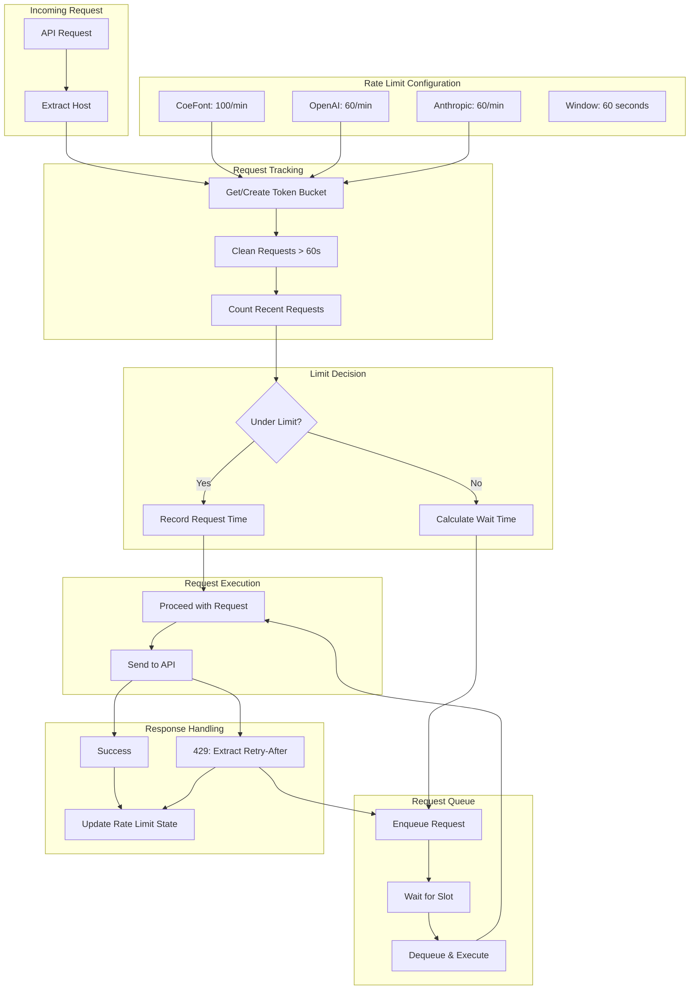
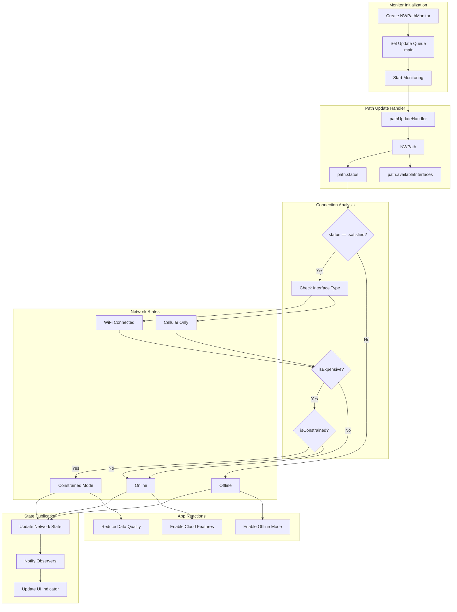
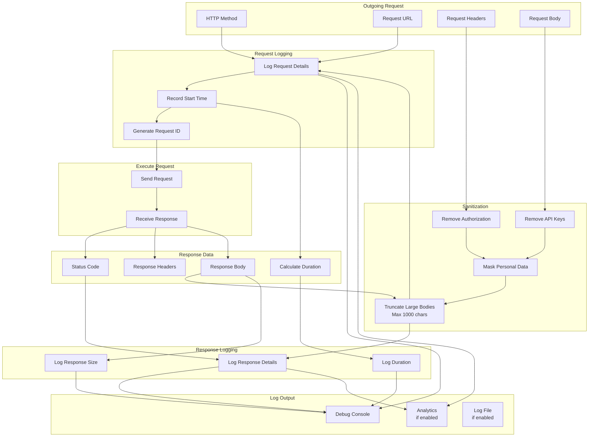
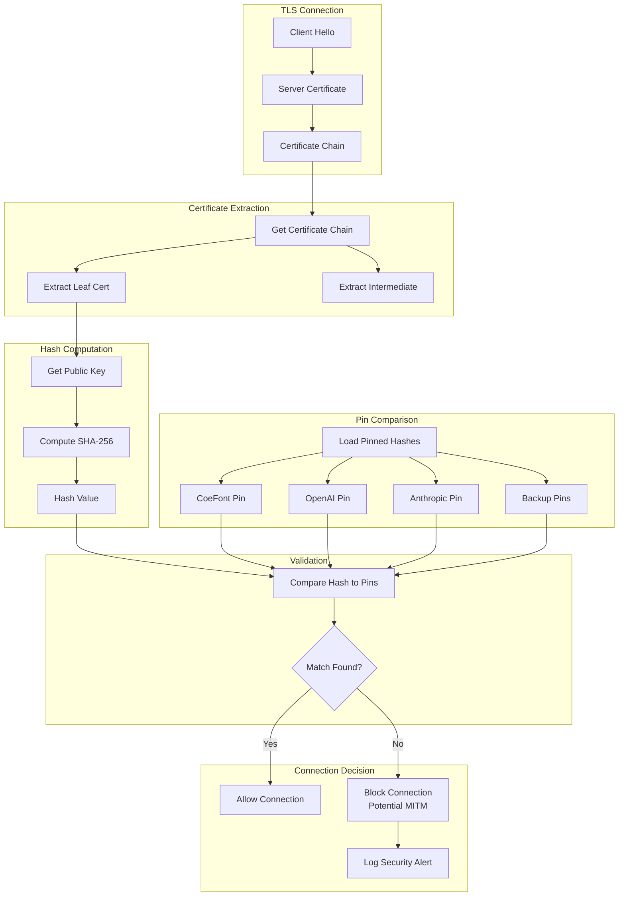
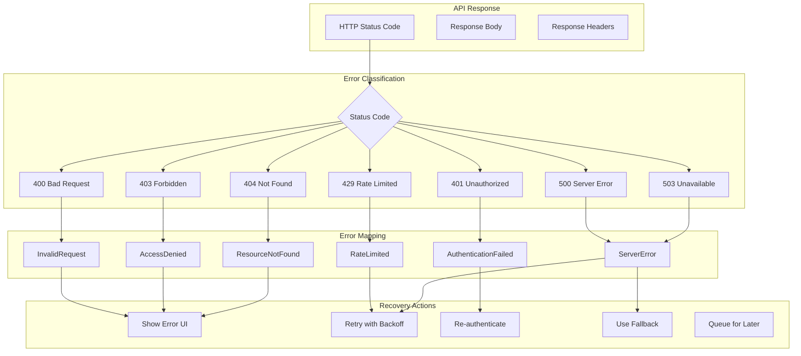
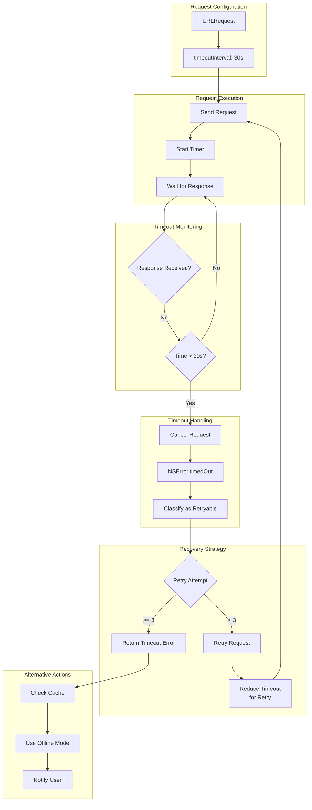

# LiveLingo - API Communication Data Flows

## DF-API-001: CoeFont HMAC-SHA256 Authentication Flow

Cryptographic request signing for CoeFont API.

```mermaid
flowchart TB
    subgraph Input[Request Data]
        BODY_DATA[Request Body<br/>{coefont, text, speed, pitch}]
        ACCESS_KEY[Access Key<br/>from Keychain]
        SECRET_KEY[Secret Key<br/>from Keychain]
    end

    subgraph Preparation[Data Preparation]
        JSON_ENCODE[JSON Encode Body]
        BODY_STRING[Body as String]
        TIMESTAMP[Generate Timestamp<br/>Unix Epoch Seconds]
    end

    subgraph Signing[Signature Generation]
        CONCAT[Concatenate<br/>timestamp + bodyString]
        MESSAGE[Message to Sign]
        SYM_KEY[Create SymmetricKey<br/>from secret]
    end

    subgraph HMAC[HMAC Computation]
        COMPUTE[HMAC<SHA256>.authenticationCode]
        AUTH_CODE[Authentication Code<br/>32 bytes]
        HEX_ENCODE[Hex Encode<br/>64 characters]
        SIGNATURE[Final Signature]
    end

    subgraph Headers[Request Headers]
        H_AUTH[Authorization: accessKey]
        H_DATE[X-Coefont-Date: timestamp]
        H_CONTENT[X-Coefont-Content: signature]
        H_TYPE[Content-Type: application/json]
    end

    subgraph Request[Final Request]
        BUILD[Build URLRequest]
        SEND[Send to API]
    end

    BODY_DATA --> JSON_ENCODE
    JSON_ENCODE --> BODY_STRING

    BODY_STRING --> CONCAT
    TIMESTAMP --> CONCAT
    CONCAT --> MESSAGE

    SECRET_KEY --> SYM_KEY
    MESSAGE --> COMPUTE
    SYM_KEY --> COMPUTE

    COMPUTE --> AUTH_CODE
    AUTH_CODE --> HEX_ENCODE
    HEX_ENCODE --> SIGNATURE

    ACCESS_KEY --> H_AUTH
    TIMESTAMP --> H_DATE
    SIGNATURE --> H_CONTENT

    H_AUTH --> BUILD
    H_DATE --> BUILD
    H_CONTENT --> BUILD
    H_TYPE --> BUILD
    BODY_STRING --> BUILD

    BUILD --> SEND
```

---

## DF-API-002: Exponential Backoff Retry Flow

Failed request retry with increasing delays.

```mermaid
flowchart TB
    subgraph Initial[Initial Request]
        REQUEST[API Request]
        ATTEMPT[Attempt: 1]
    end

    subgraph Execute[Execute Request]
        SEND[Send Request]
        RESPONSE[Get Response]
    end

    subgraph Analyze[Response Analysis]
        CHECK{Response Status}
        SUCCESS[2xx Success]
        RETRYABLE[429, 5xx, Timeout]
        NON_RETRYABLE[4xx Client Error]
    end

    subgraph RetryLogic[Retry Logic]
        COUNT{Attempt < Max?<br/>Max: 4]
        CALC_DELAY[Calculate Delay<br/>min(1s * 2^attempt, 10s)]
    end

    subgraph Delays[Delay Schedule]
        D1[Attempt 1: 0s]
        D2[Attempt 2: 1s]
        D3[Attempt 3: 2s]
        D4[Attempt 4: 4s]
    end

    subgraph Wait[Wait Period]
        SLEEP[Sleep for Delay]
        INCREMENT[Increment Attempt]
    end

    subgraph Output[Final Output]
        RETURN_SUCCESS[Return Result]
        RETURN_ERROR[Return Error]
    end

    REQUEST --> ATTEMPT
    ATTEMPT --> SEND
    SEND --> RESPONSE

    RESPONSE --> CHECK
    CHECK --> SUCCESS
    CHECK --> RETRYABLE
    CHECK --> NON_RETRYABLE

    SUCCESS --> RETURN_SUCCESS
    NON_RETRYABLE --> RETURN_ERROR

    RETRYABLE --> COUNT
    COUNT -->|Yes| CALC_DELAY
    COUNT -->|No| RETURN_ERROR

    CALC_DELAY --> D1
    CALC_DELAY --> D2
    CALC_DELAY --> D3
    CALC_DELAY --> D4

    D1 --> SLEEP
    D2 --> SLEEP
    D3 --> SLEEP
    D4 --> SLEEP

    SLEEP --> INCREMENT
    INCREMENT --> SEND
```

---

## DF-API-003: Rate Limiter Flow

Request throttling per API endpoint.



---

## DF-API-004: Network Reachability Monitor Flow

Connection state tracking.



---

## DF-API-005: Request/Response Logging Flow

Sanitized logging for debugging.



---

## DF-API-006: Certificate Pinning Flow

TLS certificate validation.



---

## DF-API-007: OpenAI API Request Flow

Complete OpenAI API call lifecycle.

```mermaid
flowchart TB
    subgraph Input[Translation Input]
        TEXT[Source Text]
        CONTEXT[Context History]
        LANG_PAIR[Language Pair]
    end

    subgraph PromptBuild[Prompt Building]
        SYSTEM_MSG[System Message<br/>Interpreter Role]
        CONTEXT_MSG[Context Messages]
        USER_MSG[User Message<br/>Translation Request]
        MESSAGES[Messages Array]
    end

    subgraph RequestBuild[Request Building]
        MODEL[model: gpt-4o-mini]
        TEMP[temperature: 0.3]
        MAX_TOKENS[max_tokens: 1000]
        AUTH[Authorization: Bearer sk-xxx]
    end

    subgraph Network[Network Call]
        RATE_CHECK[Rate Limit Check]
        SEND[POST /v1/chat/completions]
        WAIT[Await Response]
    end

    subgraph Response[Response Processing]
        PARSE[Parse JSON]
        EXTRACT[Extract choices[0].message.content]
        VALIDATE[Validate Translation]
    end

    subgraph Output[Output]
        RESULT[Translation Result]
        UPDATE_CTX[Update Context]
        CACHE[Cache Result]
    end

    TEXT --> USER_MSG
    CONTEXT --> CONTEXT_MSG
    LANG_PAIR --> SYSTEM_MSG

    SYSTEM_MSG --> MESSAGES
    CONTEXT_MSG --> MESSAGES
    USER_MSG --> MESSAGES

    MESSAGES --> MODEL
    MODEL --> TEMP
    TEMP --> MAX_TOKENS
    MAX_TOKENS --> AUTH

    AUTH --> RATE_CHECK
    RATE_CHECK --> SEND
    SEND --> WAIT

    WAIT --> PARSE
    PARSE --> EXTRACT
    EXTRACT --> VALIDATE

    VALIDATE --> RESULT
    RESULT --> UPDATE_CTX
    RESULT --> CACHE
```

---

## DF-API-008: Anthropic API Request Flow

Complete Anthropic API call lifecycle.

```mermaid
flowchart TB
    subgraph Input[Translation Input]
        TEXT[Source Text]
        CONTEXT[Context History]
        GLOSSARY[Active Glossary]
    end

    subgraph RequestBuild[Request Building]
        MODEL[model: claude-3-haiku-20240307]
        MAX_TOKENS[max_tokens: 1000]
        SYSTEM[system: Interpreter prompt]
        MESSAGES[messages: [...]]
    end

    subgraph Headers[Request Headers]
        API_KEY[x-api-key: sk-ant-xxx]
        VERSION[anthropic-version: 2023-06-01]
        CONTENT_TYPE[Content-Type: application/json]
    end

    subgraph Network[Network Call]
        BUILD[Build Request]
        SEND[POST /v1/messages]
        WAIT[Await Response]
    end

    subgraph Response[Response Processing]
        PARSE[Parse JSON]
        EXTRACT[Extract content[0].text]
        CLEAN[Clean Response]
    end

    subgraph Output[Output]
        RESULT[Translation Result]
        TOKENS[Usage: input/output tokens]
    end

    TEXT --> MESSAGES
    CONTEXT --> MESSAGES
    GLOSSARY --> SYSTEM

    MODEL --> BUILD
    MAX_TOKENS --> BUILD
    SYSTEM --> BUILD
    MESSAGES --> BUILD

    API_KEY --> BUILD
    VERSION --> BUILD
    CONTENT_TYPE --> BUILD

    BUILD --> SEND
    SEND --> WAIT

    WAIT --> PARSE
    PARSE --> EXTRACT
    EXTRACT --> CLEAN

    CLEAN --> RESULT
    PARSE --> TOKENS
```

---

## DF-API-009: API Error Response Handling Flow

HTTP error code processing.



---

## DF-API-010: Request Timeout Handling Flow

Timeout detection and recovery.



---

## Version History

| Version | Date | Changes | Author |
|---------|------|---------|--------|
| 1.0.0 | 2024-12-24 | Initial creation - 10 API data flows | AI Agent |
