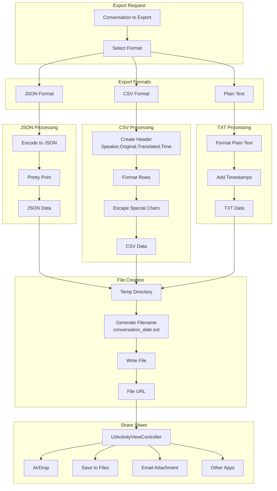
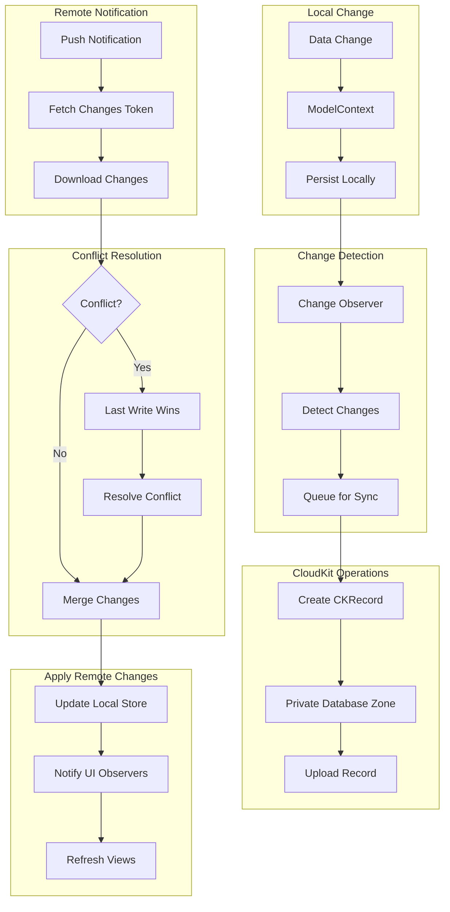
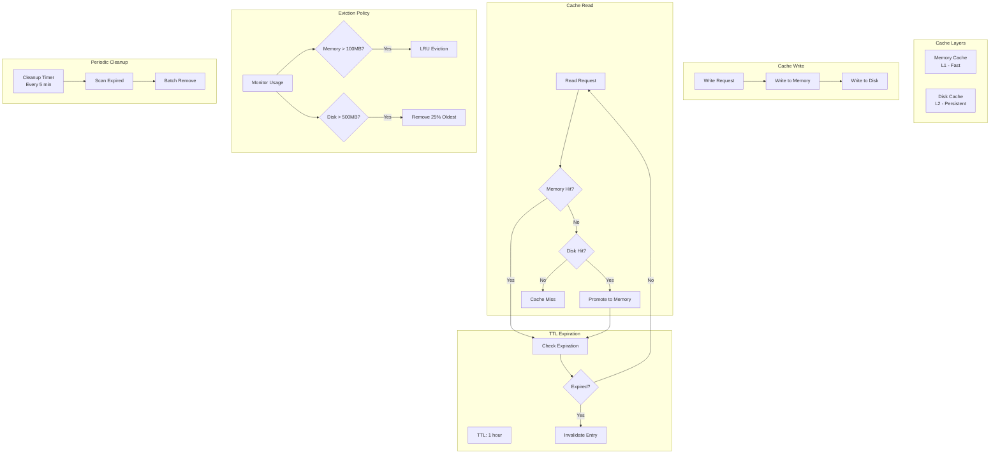
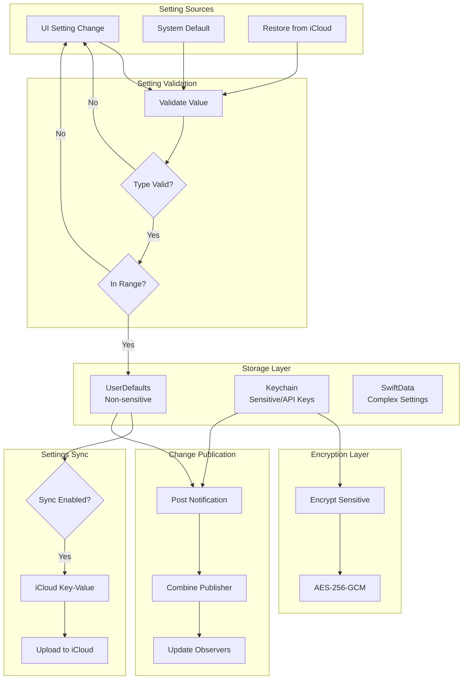
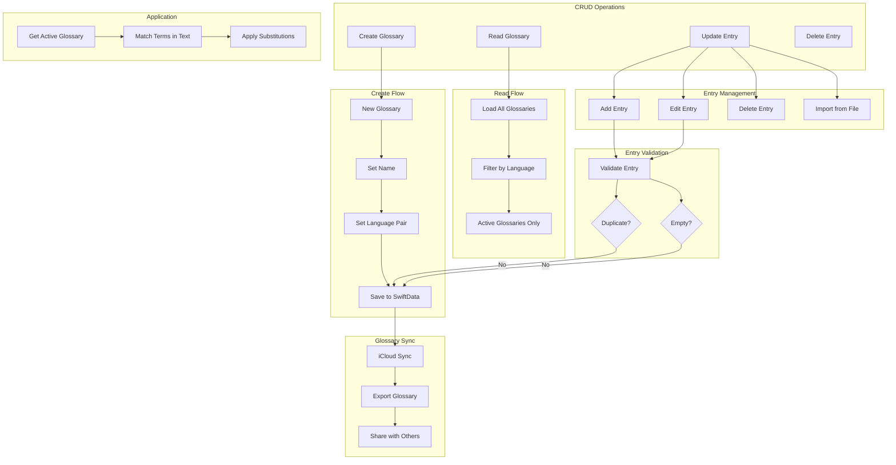

# LiveLingo - Data Persistence Data Flows

## DF-DATA-001: Conversation Save Flow

Persist conversation to SwiftData.

```mermaid
flowchart TB
    subgraph Trigger[Save Trigger]
        END_INTERP[Interpretation Ended]
        AUTO_SAVE[Auto-save Timer<br/>Every 60s]
        APP_BACKGROUND[App Backgrounded]
    end

    subgraph Preparation[Data Preparation]
        CONV[Conversation Object]
        TRANSCRIPTS[Transcript Items]
        META[Metadata<br/>duration, wordCount]
    end

    subgraph Validation[Data Validation]
        VALIDATE[Validate Data]
        CHECK_EMPTY{Has Content?}
        GENERATE_TITLE[Generate Title<br/>First 50 chars]
    end

    subgraph Timestamps[Timestamp Update]
        UPDATE_CREATED[Set createdAt<br/>if new]
        UPDATE_MODIFIED[Set updatedAt<br/>always]
    end

    subgraph SwiftData[SwiftData Operations]
        CONTEXT[ModelContext]
        INSERT[Insert Conversation]
        LINK[Link Transcripts]
        SAVE[context.save()]
    end

    subgraph Sync[iCloud Sync]
        CHECK_ICLOUD{iCloud Enabled?}
        QUEUE_SYNC[Queue for Sync]
        CK_RECORD[Create CKRecord]
    end

    subgraph Result[Save Result]
        SUCCESS[Save Success]
        FAILURE[Save Failure]
        NOTIFY[Notify UI]
    end

    END_INTERP --> CONV
    AUTO_SAVE --> CONV
    APP_BACKGROUND --> CONV

    CONV --> TRANSCRIPTS
    TRANSCRIPTS --> META

    META --> VALIDATE
    VALIDATE --> CHECK_EMPTY
    CHECK_EMPTY -->|No| FAILURE
    CHECK_EMPTY -->|Yes| GENERATE_TITLE

    GENERATE_TITLE --> UPDATE_CREATED
    UPDATE_CREATED --> UPDATE_MODIFIED

    UPDATE_MODIFIED --> CONTEXT
    CONTEXT --> INSERT
    INSERT --> LINK
    LINK --> SAVE

    SAVE --> CHECK_ICLOUD
    CHECK_ICLOUD -->|Yes| QUEUE_SYNC
    QUEUE_SYNC --> CK_RECORD

    SAVE --> SUCCESS
    SUCCESS --> NOTIFY
    FAILURE --> NOTIFY
```

---

## DF-DATA-002: Conversation Load Flow

Fetch conversations with pagination.

```mermaid
flowchart TB
    subgraph Request[Load Request]
        UI_APPEAR[View onAppear]
        REFRESH[Pull to Refresh]
        LOAD_MORE[Load More<br/>Pagination]
    end

    subgraph QueryBuild[Query Building]
        DESCRIPTOR[FetchDescriptor]
        SORT[sortBy: updatedAt DESC]
        LIMIT[fetchLimit: 50]
        OFFSET[fetchOffset: n * 50]
    end

    subgraph Filter[Optional Filters]
        DATE_RANGE[Date Range]
        LANGUAGE[Language Pair]
        FAVORITE[Favorites Only]
        SEARCH[Search Query]
    end

    subgraph SwiftData[SwiftData Fetch]
        CONTEXT[ModelContext]
        FETCH[context.fetch(descriptor)]
        RESULTS[Conversation Array]
    end

    subgraph Processing[Result Processing]
        GROUP[Group by Date<br/>Today, Yesterday, etc.]
        SECTIONS[Create Sections]
        COUNT[Get Total Count]
    end

    subgraph Delivery[Result Delivery]
        VIEW_MODEL[Update ViewModel]
        UI_UPDATE[Refresh UI]
        HAS_MORE{More Available?}
        ENABLE_LOAD[Enable Load More]
    end

    UI_APPEAR --> DESCRIPTOR
    REFRESH --> DESCRIPTOR
    LOAD_MORE --> OFFSET

    DESCRIPTOR --> SORT
    SORT --> LIMIT
    LIMIT --> OFFSET

    DATE_RANGE --> DESCRIPTOR
    LANGUAGE --> DESCRIPTOR
    FAVORITE --> DESCRIPTOR
    SEARCH --> DESCRIPTOR

    OFFSET --> CONTEXT
    CONTEXT --> FETCH
    FETCH --> RESULTS

    RESULTS --> GROUP
    GROUP --> SECTIONS
    RESULTS --> COUNT

    SECTIONS --> VIEW_MODEL
    COUNT --> HAS_MORE
    VIEW_MODEL --> UI_UPDATE
    HAS_MORE -->|Yes| ENABLE_LOAD
```

---

## DF-DATA-003: Full-Text Search Flow

Search across conversation transcripts.

```mermaid
flowchart TB
    subgraph Input[Search Input]
        USER_INPUT[User Text Input]
        DEBOUNCE[Debounce 300ms]
        QUERY[Search Query]
    end

    subgraph QueryBuild[Query Building]
        PREDICATE[Build Predicate]
        ORIGINAL[originalText.contains(query)]
        TRANSLATED[translatedText.contains(query)]
        COMBINE[OR Predicate]
    end

    subgraph SwiftData[SwiftData Search]
        DESCRIPTOR[FetchDescriptor]
        CONTEXT[ModelContext]
        FETCH[Fetch Matching]
        RESULTS[Matching Conversations]
    end

    subgraph Processing[Result Processing]
        EXTRACT[Extract Matching Segments]
        HIGHLIGHT[Highlight Matches]
        RANK[Rank by Relevance]
    end

    subgraph Display[Result Display]
        FORMAT[Format Results]
        SNIPPET[Show Snippet with Highlight]
        COUNT[Match Count]
    end

    subgraph Output[Search Output]
        UI_UPDATE[Update UI]
        EMPTY{Results Empty?}
        NO_RESULTS[Show "No Results"]
        SHOW_RESULTS[Show Results List]
    end

    USER_INPUT --> DEBOUNCE
    DEBOUNCE --> QUERY

    QUERY --> PREDICATE
    PREDICATE --> ORIGINAL
    PREDICATE --> TRANSLATED
    ORIGINAL --> COMBINE
    TRANSLATED --> COMBINE

    COMBINE --> DESCRIPTOR
    DESCRIPTOR --> CONTEXT
    CONTEXT --> FETCH
    FETCH --> RESULTS

    RESULTS --> EXTRACT
    EXTRACT --> HIGHLIGHT
    HIGHLIGHT --> RANK

    RANK --> FORMAT
    FORMAT --> SNIPPET
    FORMAT --> COUNT

    SNIPPET --> UI_UPDATE
    COUNT --> EMPTY
    EMPTY -->|Yes| NO_RESULTS
    EMPTY -->|No| SHOW_RESULTS
```

---

## DF-DATA-004: Conversation Export Flow

Export to JSON/CSV/TXT formats.



---

## DF-DATA-005: Conversation Delete Flow

Remove conversation with cascade.

```mermaid
flowchart TB
    subgraph Trigger[Delete Trigger]
        SWIPE[Swipe to Delete]
        MENU[Context Menu Delete]
        BULK[Bulk Delete]
    end

    subgraph Confirm[Confirmation]
        SHOW_CONFIRM[Show Confirmation Dialog]
        USER_CONFIRM{User Confirms?}
        CANCEL[Cancel Delete]
    end

    subgraph Prepare[Prepare Deletion]
        GET_CONV[Get Conversation]
        GET_TRANSCRIPTS[Get Related Transcripts]
        BACKUP{Create Backup?}
    end

    subgraph SwiftData[SwiftData Delete]
        CONTEXT[ModelContext]
        DELETE_TRANS[Delete Transcripts]
        DELETE_CONV[Delete Conversation]
        SAVE[context.save()]
    end

    subgraph CacheClean[Cache Cleanup]
        INVALIDATE[Invalidate Related Cache]
        CLEAR_TRANS[Clear Translation Cache]
    end

    subgraph Sync[iCloud Sync]
        MARK_DELETED[Mark as Deleted]
        SYNC_DELETE[Sync Deletion]
    end

    subgraph UI[UI Update]
        ANIMATE[Animate Removal]
        UPDATE_LIST[Update List]
        NOTIFY[Notify Completion]
    end

    SWIPE --> SHOW_CONFIRM
    MENU --> SHOW_CONFIRM
    BULK --> SHOW_CONFIRM

    SHOW_CONFIRM --> USER_CONFIRM
    USER_CONFIRM -->|No| CANCEL
    USER_CONFIRM -->|Yes| GET_CONV

    GET_CONV --> GET_TRANSCRIPTS
    GET_TRANSCRIPTS --> BACKUP

    BACKUP --> CONTEXT
    CONTEXT --> DELETE_TRANS
    DELETE_TRANS --> DELETE_CONV
    DELETE_CONV --> SAVE

    SAVE --> INVALIDATE
    INVALIDATE --> CLEAR_TRANS

    SAVE --> MARK_DELETED
    MARK_DELETED --> SYNC_DELETE

    SAVE --> ANIMATE
    ANIMATE --> UPDATE_LIST
    UPDATE_LIST --> NOTIFY
```

---

## DF-DATA-006: iCloud Sync Flow

Cross-device synchronization.



---

## DF-DATA-007: Cache Management Flow

Multi-layer cache with eviction.



---

## DF-DATA-008: Settings Persistence Flow

User preferences storage.



---

## DF-DATA-009: Schema Migration Flow

Database version migration.

```mermaid
flowchart TB
    subgraph Launch[App Launch]
        START[App Start]
        LOAD_CONTAINER[Load ModelContainer]
    end

    subgraph VersionCheck[Version Check]
        CURRENT[Current Schema Version]
        STORED[Stored Schema Version]
        COMPARE{Versions Match?}
    end

    subgraph MigrationPlan[Migration Planning]
        PLAN[SchemaMigrationPlan]
        STAGES[Identify Stages]
        V1_V2[V1 → V2]
        V2_V3[V2 → V3]
    end

    subgraph Migration[Migration Execution]
        BACKUP[Backup Database]
        WILL_MIGRATE[willMigrate()]
        PERFORM[Perform Migration]
        DID_MIGRATE[didMigrate()]
    end

    subgraph Transforms[Data Transforms]
        ADD_FIELD[Add New Fields]
        RENAME[Rename Properties]
        RESTRUCTURE[Restructure Relations]
        DATA_MIGRATE[Migrate Data Values]
    end

    subgraph Completion[Migration Complete]
        UPDATE_VERSION[Update Version]
        CLEANUP[Cleanup Old Data]
        READY[Container Ready]
    end

    subgraph Error[Error Handling]
        FAIL[Migration Failed]
        ROLLBACK[Rollback to Backup]
        NOTIFY_USER[Notify User]
    end

    START --> LOAD_CONTAINER
    LOAD_CONTAINER --> CURRENT
    LOAD_CONTAINER --> STORED

    CURRENT --> COMPARE
    STORED --> COMPARE

    COMPARE -->|Yes| READY
    COMPARE -->|No| PLAN

    PLAN --> STAGES
    STAGES --> V1_V2
    V1_V2 --> V2_V3

    V1_V2 --> BACKUP
    BACKUP --> WILL_MIGRATE
    WILL_MIGRATE --> PERFORM

    PERFORM --> ADD_FIELD
    PERFORM --> RENAME
    PERFORM --> RESTRUCTURE
    PERFORM --> DATA_MIGRATE

    DATA_MIGRATE --> DID_MIGRATE
    DID_MIGRATE --> UPDATE_VERSION
    UPDATE_VERSION --> CLEANUP
    CLEANUP --> READY

    PERFORM -->|Error| FAIL
    FAIL --> ROLLBACK
    ROLLBACK --> NOTIFY_USER
```

---

## DF-DATA-010: Glossary Management Flow

Custom dictionary CRUD operations.



---

## Version History

| Version | Date | Changes | Author |
|---------|------|---------|--------|
| 1.0.0 | 2024-12-24 | Initial creation - 10 persistence data flows | AI Agent |
