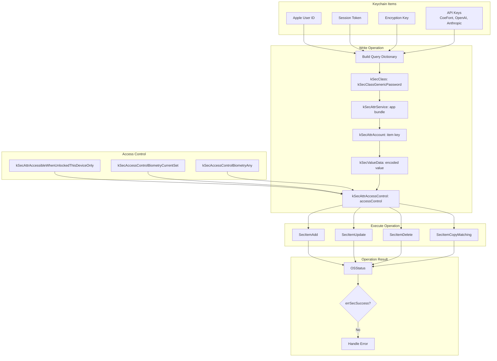
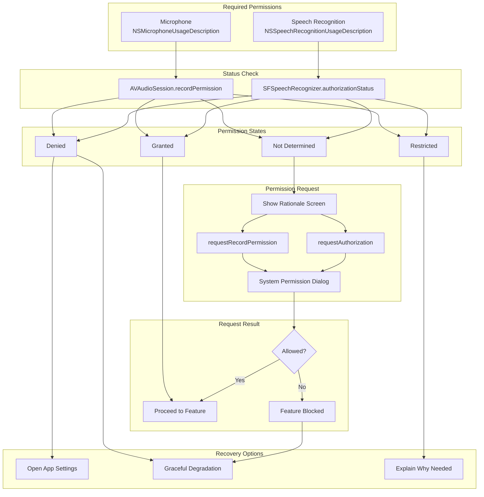
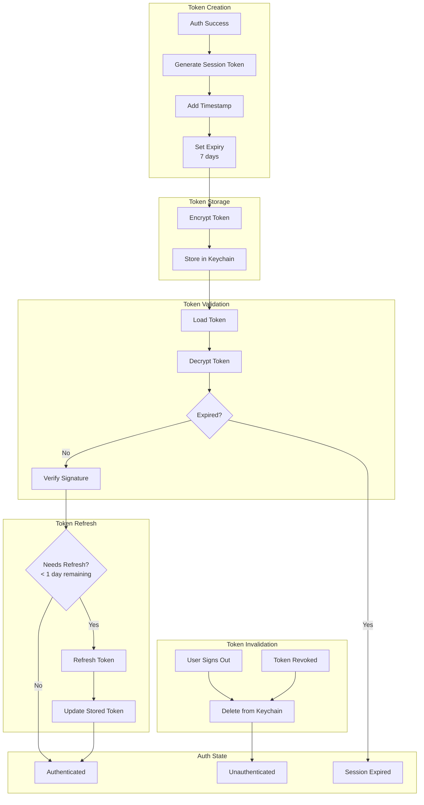
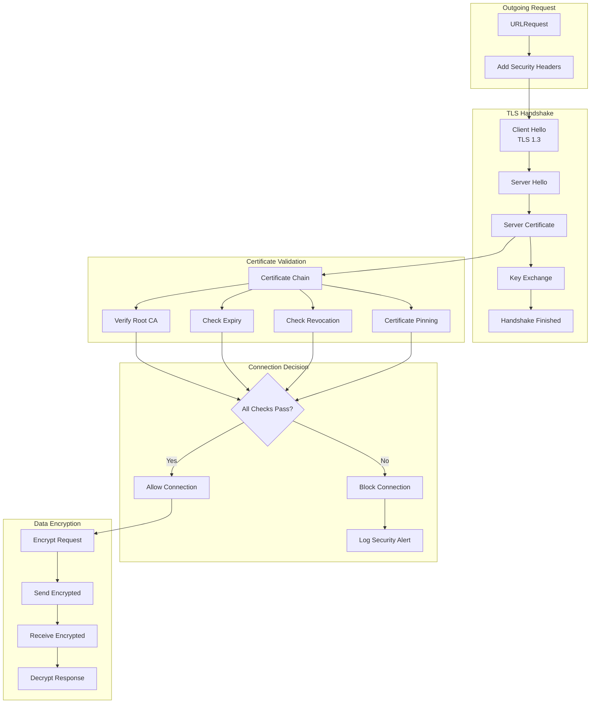
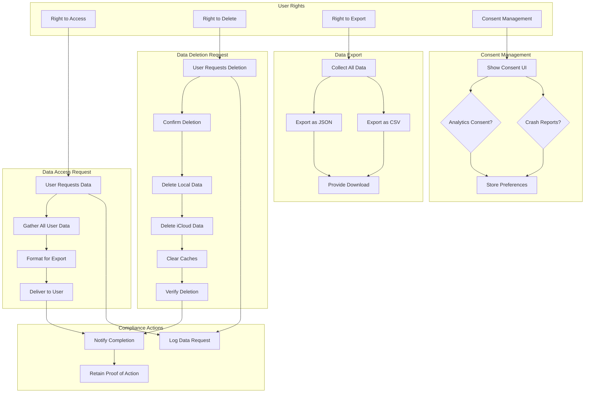

# LiveLingo - Security Data Flows

## DF-SEC-001: Sign in with Apple Flow

OAuth-based authentication with Apple.

```mermaid
flowchart TB
    subgraph Trigger[Auth Trigger]
        USER_TAP[User Taps Sign In]
        SESSION_EXPIRED[Session Expired]
    end

    subgraph Request[Auth Request]
        CREATE_REQ[Create ASAuthorizationAppleIDRequest]
        SCOPES[Request Scopes<br/>fullName, email]
        NONCE[Generate Nonce]
    end

    subgraph Controller[Auth Controller]
        CONTROLLER[ASAuthorizationController]
        DELEGATE[Set Delegate]
        PRESENT[Present Auth UI]
    end

    subgraph Apple[Apple Auth Service]
        BIOMETRIC[Face ID / Touch ID]
        VERIFY[Verify Identity]
        GENERATE[Generate Credentials]
    end

    subgraph Callback[Auth Callback]
        SUCCESS[didCompleteWithAuthorization]
        FAILURE[didCompleteWithError]
    end

    subgraph Extract[Credential Extraction]
        USER_ID[User Identifier]
        ID_TOKEN[Identity Token]
        AUTH_CODE[Authorization Code]
        EMAIL[Email (first time)]
        NAME[Full Name (first time)]
    end

    subgraph Store[Secure Storage]
        KEYCHAIN[Store in Keychain]
        CREATE_SESSION[Create Session]
        SAVE_PROFILE[Save User Profile]
    end

    subgraph Complete[Completion]
        AUTH_STATE[Update Auth State]
        NAVIGATE[Navigate to Home]
    end

    USER_TAP --> CREATE_REQ
    SESSION_EXPIRED --> CREATE_REQ

    CREATE_REQ --> SCOPES
    SCOPES --> NONCE

    NONCE --> CONTROLLER
    CONTROLLER --> DELEGATE
    DELEGATE --> PRESENT

    PRESENT --> BIOMETRIC
    BIOMETRIC --> VERIFY
    VERIFY --> GENERATE

    GENERATE --> SUCCESS
    GENERATE --> FAILURE

    SUCCESS --> USER_ID
    SUCCESS --> ID_TOKEN
    SUCCESS --> AUTH_CODE
    SUCCESS --> EMAIL
    SUCCESS --> NAME

    USER_ID --> KEYCHAIN
    ID_TOKEN --> KEYCHAIN
    KEYCHAIN --> CREATE_SESSION
    EMAIL --> SAVE_PROFILE
    NAME --> SAVE_PROFILE

    CREATE_SESSION --> AUTH_STATE
    AUTH_STATE --> NAVIGATE
```

---

## DF-SEC-002: Biometric Authentication Flow

Face ID / Touch ID for sensitive operations.

```mermaid
flowchart TB
    subgraph Trigger[Auth Trigger]
        ACCESS_KEYS[Access API Keys]
        VIEW_HISTORY[View Sensitive History]
        CHANGE_SETTINGS[Change Security Settings]
    end

    subgraph Context[LA Context]
        CREATE_CTX[Create LAContext]
        CHECK_BIOMETRY[Check Biometry Available]
        POLICY[Policy: deviceOwnerAuthenticationWithBiometrics]
    end

    subgraph Availability[Availability Check]
        CAN_EVAL{canEvaluatePolicy?}
        BIO_TYPE[Biometry Type<br/>Face ID / Touch ID]
        FALLBACK[Passcode Fallback]
    end

    subgraph Evaluate[Authentication]
        REASON[Localized Reason<br/>"Access secure data"]
        EVALUATE[evaluatePolicy]
        BIOMETRIC_PROMPT[Show Biometric Prompt]
    end

    subgraph Result[Auth Result]
        SUCCESS{Success?}
        ERROR[Error Handling]
    end

    subgraph ErrorTypes[Error Types]
        USER_CANCEL[User Cancelled]
        FAILED[Auth Failed]
        LOCKOUT[Biometry Lockout]
        NOT_ENROLLED[Not Enrolled]
    end

    subgraph Complete[Completion]
        GRANT_ACCESS[Grant Access]
        DENY_ACCESS[Deny Access]
        SHOW_PASSCODE[Show Passcode UI]
    end

    ACCESS_KEYS --> CREATE_CTX
    VIEW_HISTORY --> CREATE_CTX
    CHANGE_SETTINGS --> CREATE_CTX

    CREATE_CTX --> CHECK_BIOMETRY
    CHECK_BIOMETRY --> POLICY

    POLICY --> CAN_EVAL
    CAN_EVAL -->|Yes| BIO_TYPE
    CAN_EVAL -->|No| FALLBACK

    BIO_TYPE --> REASON
    REASON --> EVALUATE
    EVALUATE --> BIOMETRIC_PROMPT

    BIOMETRIC_PROMPT --> SUCCESS
    SUCCESS -->|Yes| GRANT_ACCESS
    SUCCESS -->|No| ERROR

    ERROR --> USER_CANCEL
    ERROR --> FAILED
    ERROR --> LOCKOUT
    ERROR --> NOT_ENROLLED

    USER_CANCEL --> DENY_ACCESS
    FAILED --> DENY_ACCESS
    LOCKOUT --> SHOW_PASSCODE
    NOT_ENROLLED --> SHOW_PASSCODE
```

---

## DF-SEC-003: AES-256-GCM Encryption Flow

Data encryption for sensitive storage.

```mermaid
flowchart TB
    subgraph Input[Plaintext Data]
        DATA[Sensitive Data]
        TYPE[Data Type<br/>Conversation, API Key, etc.]
    end

    subgraph KeyManagement[Key Management]
        MASTER_KEY[Master Key<br/>from Keychain]
        DERIVE[Derive Per-Type Key<br/>HKDF]
        KEY[Encryption Key<br/>256-bit AES]
    end

    subgraph Encryption[Encryption Process]
        NONCE[Generate Random Nonce<br/>12 bytes]
        GCM[AES-256-GCM]
        SEAL[seal(data, using: key, nonce: nonce)]
    end

    subgraph Output[Encrypted Output]
        SEALED_BOX[SealedBox]
        CIPHERTEXT[Ciphertext]
        TAG[Authentication Tag<br/>16 bytes]
        COMBINED[Combined: nonce + ciphertext + tag]
    end

    subgraph Storage[Secure Storage]
        STORE[Store Encrypted Data]
        META[Store Metadata]
    end

    DATA --> DERIVE
    TYPE --> DERIVE
    MASTER_KEY --> DERIVE
    DERIVE --> KEY

    DATA --> GCM
    KEY --> GCM
    NONCE --> GCM

    GCM --> SEAL
    SEAL --> SEALED_BOX

    SEALED_BOX --> CIPHERTEXT
    SEALED_BOX --> TAG
    NONCE --> COMBINED
    CIPHERTEXT --> COMBINED
    TAG --> COMBINED

    COMBINED --> STORE
    TYPE --> META
```

---

## DF-SEC-004: AES-256-GCM Decryption Flow

Data decryption for retrieval.

```mermaid
flowchart TB
    subgraph Input[Encrypted Input]
        COMBINED[Combined Data<br/>nonce + ciphertext + tag]
        TYPE[Data Type]
    end

    subgraph Parse[Data Parsing]
        EXTRACT_NONCE[Extract Nonce<br/>First 12 bytes]
        EXTRACT_CIPHER[Extract Ciphertext]
        EXTRACT_TAG[Extract Tag<br/>Last 16 bytes]
        SEALED_BOX[Reconstruct SealedBox]
    end

    subgraph KeyManagement[Key Management]
        MASTER_KEY[Master Key<br/>from Keychain]
        DERIVE[Derive Per-Type Key<br/>HKDF]
        KEY[Decryption Key<br/>256-bit AES]
    end

    subgraph Decryption[Decryption Process]
        GCM[AES-256-GCM]
        OPEN[open(sealedBox, using: key)]
        VERIFY[Verify Auth Tag]
    end

    subgraph Result[Decryption Result]
        SUCCESS{Valid?}
        PLAINTEXT[Plaintext Data]
        ERROR[Decryption Error<br/>Tampered / Wrong Key]
    end

    COMBINED --> EXTRACT_NONCE
    COMBINED --> EXTRACT_CIPHER
    COMBINED --> EXTRACT_TAG

    EXTRACT_NONCE --> SEALED_BOX
    EXTRACT_CIPHER --> SEALED_BOX
    EXTRACT_TAG --> SEALED_BOX

    TYPE --> DERIVE
    MASTER_KEY --> DERIVE
    DERIVE --> KEY

    SEALED_BOX --> OPEN
    KEY --> OPEN

    OPEN --> VERIFY
    VERIFY --> SUCCESS

    SUCCESS -->|Yes| PLAINTEXT
    SUCCESS -->|No| ERROR
```

---

## DF-SEC-005: Keychain Storage Flow

Secure credential storage.



---

## DF-SEC-006: Permission Request Flow

iOS permission handling.



---

## DF-SEC-007: Session Token Management Flow

Authentication session lifecycle.



---

## DF-SEC-008: Secure Network Request Flow

TLS 1.3 with certificate validation.



---

## DF-SEC-009: Security Audit Logging Flow

Security event tracking.

```mermaid
flowchart TB
    subgraph Events[Security Events]
        AUTH_SUCCESS[Auth Success]
        AUTH_FAIL[Auth Failure]
        PERM_CHANGE[Permission Change]
        DATA_ACCESS[Sensitive Data Access]
        ERROR[Security Error]
    end

    subgraph Capture[Event Capture]
        TIMESTAMP[ISO8601 Timestamp]
        EVENT_TYPE[Event Type]
        USER_ID[User ID (hashed)]
        DETAILS[Event Details]
    end

    subgraph Sanitize[Data Sanitization]
        NO_SECRETS[Remove Secrets]
        HASH_PII[Hash PII]
        TRUNCATE[Truncate Long Values]
    end

    subgraph Format[Log Formatting]
        JSON_FORMAT[JSON Format]
        LEVEL[Log Level<br/>info/warning/error]
        CATEGORY[Category: Security]
    end

    subgraph Storage[Log Storage]
        BUFFER[In-Memory Buffer]
        ROTATE[Rotate at 1000 entries]
        FILE[Local Log File]
        ENCRYPT_LOG[Encrypt Log File]
    end

    subgraph Retention[Log Retention]
        KEEP[Keep 7 Days]
        PURGE[Purge Old Logs]
    end

    AUTH_SUCCESS --> TIMESTAMP
    AUTH_FAIL --> TIMESTAMP
    PERM_CHANGE --> TIMESTAMP
    DATA_ACCESS --> TIMESTAMP
    ERROR --> TIMESTAMP

    TIMESTAMP --> EVENT_TYPE
    EVENT_TYPE --> USER_ID
    USER_ID --> DETAILS

    DETAILS --> NO_SECRETS
    NO_SECRETS --> HASH_PII
    HASH_PII --> TRUNCATE

    TRUNCATE --> JSON_FORMAT
    JSON_FORMAT --> LEVEL
    LEVEL --> CATEGORY

    CATEGORY --> BUFFER
    BUFFER --> ROTATE
    ROTATE --> FILE
    FILE --> ENCRYPT_LOG

    ENCRYPT_LOG --> KEEP
    KEEP --> PURGE
```

---

## DF-SEC-010: Data Privacy Compliance Flow

GDPR/CCPA compliance handling.



---

## Version History

| Version | Date | Changes | Author |
|---------|------|---------|--------|
| 1.0.0 | 2024-12-24 | Initial creation - 10 security data flows | AI Agent |
