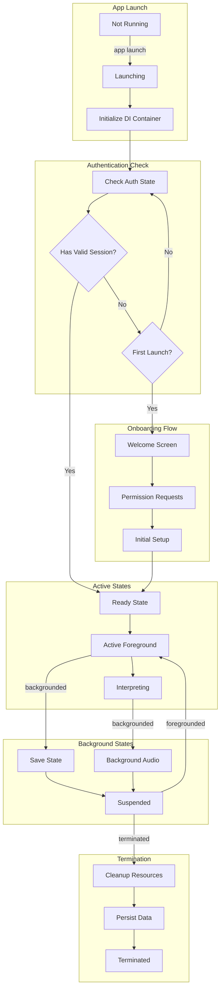
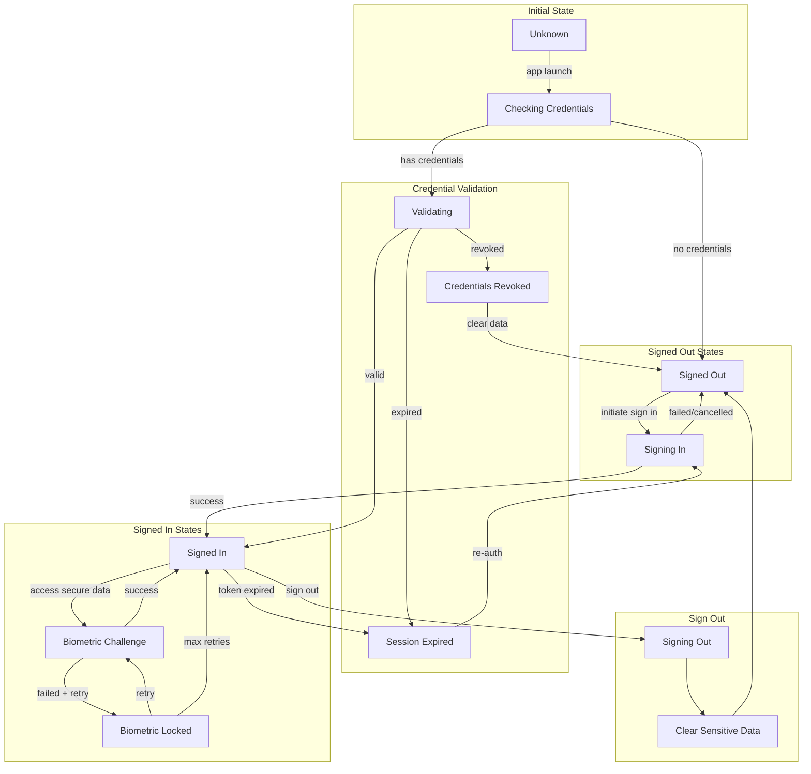
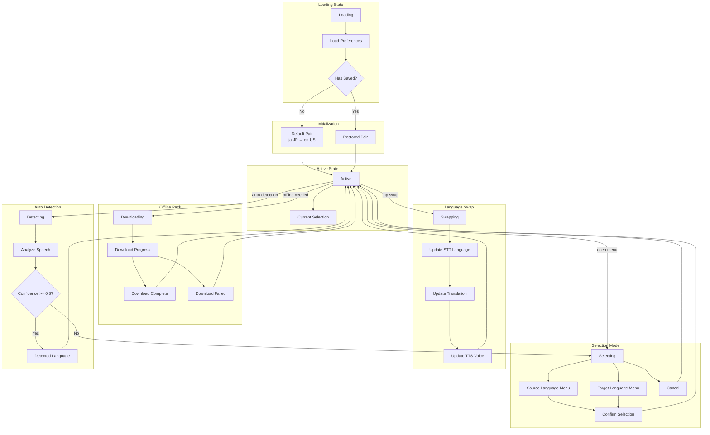
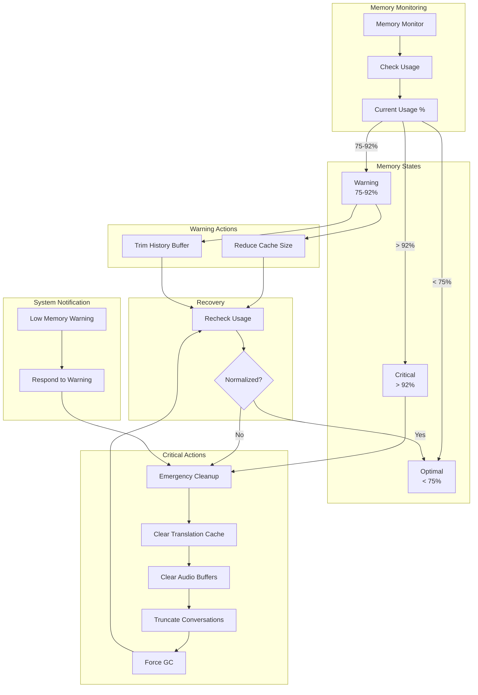
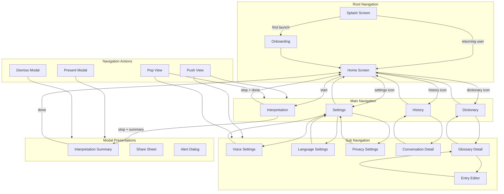
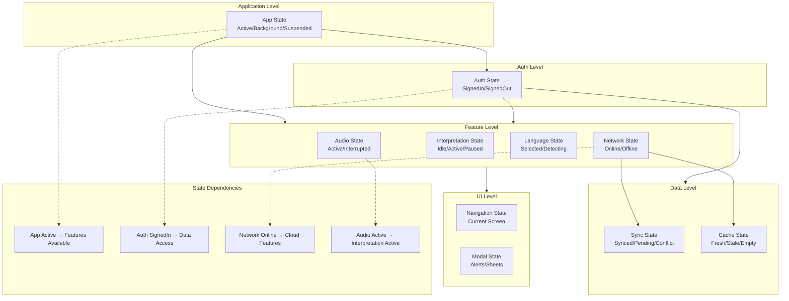

# LiveLingo - State Management Data Flows

## DF-STATE-001: Application Lifecycle State Flow

App state transitions throughout lifecycle.



---

## DF-STATE-002: Interpretation State Flow

Real-time interpretation state machine.

```mermaid
flowchart TB
    subgraph Idle[Idle State]
        IDLE[Idle]
        READY_START[Ready to Start]
    end

    subgraph Starting[Starting Phase]
        CONFIG[Configuring]
        CONFIG_SESSION[Configure Audio Session]
        ACTIVATE[Activating Session]
        INIT_STT[Initialize STT]
    end

    subgraph Active[Active Interpretation]
        LISTENING[Listening]
        RECOGNIZING[Recognizing Speech]
        TRANSLATING[Translating]
        SPEAKING[Speaking Translation]
    end

    subgraph Paused[Paused States]
        PAUSED[Paused]
        INTERRUPTED[Interrupted<br/>Phone/Siri/Alarm]
    end

    subgraph Stopping[Stopping Phase]
        STOPPING[Stopping]
        CLEANUP[Cleanup]
        SAVING[Saving Conversation]
    end

    IDLE -->|startInterpretation()| CONFIG
    CONFIG --> CONFIG_SESSION
    CONFIG_SESSION --> ACTIVATE
    ACTIVATE --> INIT_STT
    INIT_STT --> LISTENING

    LISTENING -->|speech detected| RECOGNIZING
    RECOGNIZING -->|silence < 500ms| LISTENING
    RECOGNIZING -->|pause detected| TRANSLATING
    TRANSLATING --> SPEAKING
    SPEAKING -->|playback complete| LISTENING

    LISTENING -->|interruption| INTERRUPTED
    RECOGNIZING -->|interruption| INTERRUPTED
    TRANSLATING -->|interruption| INTERRUPTED
    SPEAKING -->|interruption| INTERRUPTED

    INTERRUPTED -->|shouldResume| LISTENING
    INTERRUPTED -->|noResume| STOPPING

    LISTENING -->|pauseInterpretation()| PAUSED
    PAUSED -->|resumeInterpretation()| LISTENING
    PAUSED -->|stopInterpretation()| STOPPING

    LISTENING -->|stopInterpretation()| STOPPING
    RECOGNIZING -->|stopInterpretation()| STOPPING
    TRANSLATING -->|stopInterpretation()| STOPPING
    SPEAKING -->|stopInterpretation()| STOPPING

    STOPPING --> CLEANUP
    CLEANUP --> SAVING
    SAVING --> IDLE
```

---

## DF-STATE-003: Audio Session State Flow

AVAudioSession state management.

```mermaid
flowchart TB
    subgraph Inactive[Inactive States]
        INACTIVE[Inactive]
        DEACTIVATED[Deactivated]
    end

    subgraph Configuration[Configuration Phase]
        CONFIGURING[Configuring]
        SET_CATEGORY[Set Category<br/>playAndRecord]
        SET_MODE[Set Mode<br/>voiceChat]
        SET_OPTIONS[Set Options]
        CONFIGURED[Configured]
    end

    subgraph Activation[Activation Phase]
        ACTIVATING[Activating]
        ACTIVE[Active]
    end

    subgraph Interruption[Interruption Handling]
        INTERRUPTED[Interrupted]
        PHONE_CALL[Phone Call]
        SIRI[Siri]
        ALARM[Alarm/Timer]
        OTHER_APP[Other App]
    end

    subgraph RouteChange[Route Changes]
        ROUTE_CHANGING[Route Changing]
        NEW_ROUTE[New Route Active]
    end

    subgraph Reset[Media Reset]
        RESETTING[Resetting]
        REINIT[Reinitialize]
    end

    subgraph Error[Error State]
        ERROR[Error]
        HANDLE_ERR[Handle Error]
    end

    INACTIVE -->|configure()| CONFIGURING
    CONFIGURING --> SET_CATEGORY
    SET_CATEGORY --> SET_MODE
    SET_MODE --> SET_OPTIONS
    SET_OPTIONS --> CONFIGURED
    CONFIGURING -->|error| ERROR

    CONFIGURED -->|activate()| ACTIVATING
    ACTIVATING --> ACTIVE
    ACTIVATING -->|error| ERROR

    ACTIVE -->|interruption.began| INTERRUPTED
    INTERRUPTED --> PHONE_CALL
    INTERRUPTED --> SIRI
    INTERRUPTED --> ALARM
    INTERRUPTED --> OTHER_APP

    INTERRUPTED -->|ended + shouldResume| ACTIVE
    INTERRUPTED -->|ended + noResume| INACTIVE

    ACTIVE -->|routeChange| ROUTE_CHANGING
    ROUTE_CHANGING --> NEW_ROUTE
    NEW_ROUTE --> ACTIVE

    ACTIVE -->|mediaServicesReset| RESETTING
    RESETTING --> REINIT
    REINIT --> CONFIGURING

    ACTIVE -->|deactivate()| DEACTIVATED
    DEACTIVATED --> INACTIVE

    ERROR --> HANDLE_ERR
    HANDLE_ERR --> INACTIVE
```

---

## DF-STATE-004: Authentication State Flow

User authentication state transitions.



---

## DF-STATE-005: Network State Flow

Network connectivity state tracking.

```mermaid
flowchart TB
    subgraph Initial[Initial State]
        UNKNOWN[Unknown]
        START_MONITOR[Start NWPathMonitor]
    end

    subgraph Checking[Checking State]
        CHECKING[Checking]
        PATH_UPDATE[Path Update]
    end

    subgraph Online[Online States]
        ONLINE[Online]
        WIFI[WiFi Connected]
        CELLULAR[Cellular Only]
        CONSTRAINED[Constrained<br/>Low Data Mode]
    end

    subgraph Offline[Offline States]
        OFFLINE[Offline]
        WAITING[Waiting Reconnect]
        RECONNECTING[Reconnecting]
    end

    subgraph AppReaction[App Reactions]
        CLOUD_ENABLED[Cloud Features Enabled]
        OFFLINE_MODE[Offline Mode]
        REDUCED_QUALITY[Reduced Quality]
    end

    UNKNOWN -->|startMonitoring()| START_MONITOR
    START_MONITOR --> CHECKING

    CHECKING -->|path.satisfied| ONLINE
    CHECKING -->|path.unsatisfied| OFFLINE

    ONLINE --> WIFI
    ONLINE --> CELLULAR
    WIFI --> CONSTRAINED
    CELLULAR --> CONSTRAINED

    WIFI -->|connection lost| OFFLINE
    CELLULAR -->|connection lost| OFFLINE
    CONSTRAINED -->|connection lost| OFFLINE

    OFFLINE --> WAITING
    WAITING -->|network detected| RECONNECTING
    RECONNECTING -->|success| ONLINE
    RECONNECTING -->|failed| WAITING

    ONLINE --> CLOUD_ENABLED
    CONSTRAINED --> REDUCED_QUALITY
    OFFLINE --> OFFLINE_MODE
```

---

## DF-STATE-006: Language Selection State Flow

Source and target language management.



---

## DF-STATE-007: Memory Management State Flow

Memory pressure handling.



---

## DF-STATE-008: Navigation State Flow

Screen navigation and modal management.



---

## DF-STATE-009: Translation State Flow

Translation request state machine.

```mermaid
flowchart TB
    subgraph Initial[Initial State]
        IDLE[Idle]
        REQUEST[Translation Request]
    end

    subgraph CachePhase[Cache Phase]
        CHECK_CACHE[Checking Cache]
        CACHE_HIT{Cache Hit?}
        RETURN_CACHED[Return Cached]
    end

    subgraph NetworkPhase[Network Phase]
        CHECK_NET[Checking Network]
        ONLINE{Online?}
    end

    subgraph ProviderPhase[Provider Selection]
        SELECT[Selecting Provider]
        USE_APPLE[Using Apple]
        USE_CLOUD[Using Cloud]
    end

    subgraph Execution[Translation Execution]
        TRANSLATING[Translating]
        SUCCESS[Success]
        TRANSIENT_ERR[Transient Error]
        PERMANENT_ERR[Permanent Error]
    end

    subgraph Retry[Retry Logic]
        RETRYING[Retrying]
        MAX_RETRIES{Max Retries?}
    end

    subgraph Caching[Cache Storage]
        CACHING[Caching Result]
    end

    subgraph Complete[Completion]
        RETURNING[Returning Result]
        ERROR[Error State]
    end

    IDLE -->|translate()| REQUEST
    REQUEST --> CHECK_CACHE

    CHECK_CACHE --> CACHE_HIT
    CACHE_HIT -->|Yes| RETURN_CACHED
    CACHE_HIT -->|No| CHECK_NET

    CHECK_NET --> ONLINE
    ONLINE -->|No| USE_APPLE
    ONLINE -->|Yes| SELECT

    SELECT -->|prefer on-device| USE_APPLE
    SELECT -->|prefer cloud| USE_CLOUD

    USE_APPLE --> TRANSLATING
    USE_CLOUD --> TRANSLATING

    TRANSLATING --> SUCCESS
    TRANSLATING --> TRANSIENT_ERR
    TRANSLATING --> PERMANENT_ERR

    TRANSIENT_ERR --> RETRYING
    RETRYING --> MAX_RETRIES
    MAX_RETRIES -->|No| TRANSLATING
    MAX_RETRIES -->|Yes| ERROR

    PERMANENT_ERR --> ERROR

    SUCCESS --> CACHING
    CACHING --> RETURNING
    RETURN_CACHED --> RETURNING
    RETURNING --> IDLE
    ERROR --> IDLE
```

---

## DF-STATE-010: Combined State Overview Flow

Hierarchical state relationships.



---

## Version History

| Version | Date | Changes | Author |
|---------|------|---------|--------|
| 1.0.0 | 2024-12-24 | Initial creation - 10 state management data flows | AI Agent |
