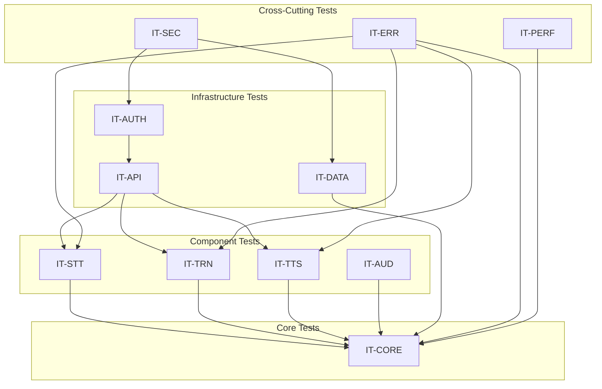

# LiveLingo - Integration Test Design Index

## Overview

This document provides a comprehensive index of integration test designs based on all sequence diagrams documented in the `/docs/workflows/` directory. Integration tests verify the correct interaction between multiple components as depicted in the sequence diagrams.

## Test Categories

| ID | Category | Workflows | Test Cases | Priority |
|----|----------|-----------|------------|----------|
| IT-CORE | Core Interpretation | 5 | 45 | P0-Critical |
| IT-LIFE | App Lifecycle | 6 | 38 | P0-Critical |
| IT-STT | Speech Recognition | 8 | 52 | P0-Critical |
| IT-TRN | Translation | 6 | 42 | P0-Critical |
| IT-TTS | Text-to-Speech | 5 | 35 | P0-Critical |
| IT-AUD | Audio Session | 6 | 40 | P1-High |
| IT-API | API Communication | 5 | 38 | P1-High |
| IT-AUTH | Authentication | 4 | 28 | P1-High |
| IT-LNG | Language Management | 5 | 32 | P2-Medium |
| IT-NAV | UI Navigation | 7 | 45 | P2-Medium |
| IT-DATA | Data Persistence | 6 | 42 | P1-High |
| IT-ERR | Error Handling | 5 | 48 | P0-Critical |
| IT-PERF | Performance | 4 | 35 | P1-High |
| IT-SEC | Security & Privacy | 4 | 40 | P0-Critical |

**Total: 70 Workflows, 560+ Test Cases**

---

## Document Structure

Each integration test design document follows this structure:

1. **Overview** - Purpose and scope
2. **Test Environment** - Required setup and dependencies
3. **Test Cases** - Detailed test specifications
4. **Test Data** - Sample data and fixtures
5. **Mocking Strategy** - Component mocking requirements
6. **Verification Criteria** - Success/failure criteria

---

## Test Case Naming Convention

```
IT-{CATEGORY}-{WORKFLOW}-{SEQUENCE}
```

Examples:
- `IT-CORE-001-01` - Core Interpretation, Workflow 1, Test Case 1
- `IT-STT-003-05` - STT, Workflow 3, Test Case 5
- `IT-ERR-002-03` - Error Handling, Workflow 2, Test Case 3

---

## Integration Test Documents

### P0-Critical (Must Pass for Release)

| File | Category | Description |
|------|----------|-------------|
| [01-core-interpretation-integration.md](./01-core-interpretation-integration.md) | IT-CORE | Main interpretation loop, streaming, speaker modes |
| [02-app-lifecycle-integration.md](./02-app-lifecycle-integration.md) | IT-LIFE | Cold/warm start, background/foreground transitions |
| [03-stt-integration.md](./03-stt-integration.md) | IT-STT | Speech recognition pipeline integration |
| [04-translation-integration.md](./04-translation-integration.md) | IT-TRN | Translation engine integration |
| [05-tts-integration.md](./05-tts-integration.md) | IT-TTS | Text-to-speech synthesis integration |
| [12-error-handling-integration.md](./12-error-handling-integration.md) | IT-ERR | Error recovery and graceful degradation |
| [14-security-privacy-integration.md](./14-security-privacy-integration.md) | IT-SEC | Security and privacy compliance |

### P1-High (Should Pass for Release)

| File | Category | Description |
|------|----------|-------------|
| [06-audio-session-integration.md](./06-audio-session-integration.md) | IT-AUD | Audio session management integration |
| [07-api-communication-integration.md](./07-api-communication-integration.md) | IT-API | API client and network integration |
| [08-authentication-integration.md](./08-authentication-integration.md) | IT-AUTH | Authentication flow integration |
| [11-data-persistence-integration.md](./11-data-persistence-integration.md) | IT-DATA | Data storage and sync integration |
| [13-performance-integration.md](./13-performance-integration.md) | IT-PERF | Performance optimization verification |

### P2-Medium (Nice to Have)

| File | Category | Description |
|------|----------|-------------|
| [09-language-management-integration.md](./09-language-management-integration.md) | IT-LNG | Language pair and pack management |
| [10-ui-navigation-integration.md](./10-ui-navigation-integration.md) | IT-NAV | UI navigation flow integration |

---

## Cross-Cutting Concerns

### End-to-End Integration Scenarios

| Scenario | Components | Priority |
|----------|------------|----------|
| Full Interpretation Flow | STT → Translation → TTS | P0 |
| Offline Mode | All + Fallback | P0 |
| Multi-Speaker Mode | STT + Diarization + Translation | P0 |
| Background Interruption | Audio + Lifecycle | P1 |
| Data Export/Import | Persistence + UI | P2 |

### Performance Criteria

| Metric | Target | Test Coverage |
|--------|--------|---------------|
| End-to-end latency | < 1 second | IT-CORE, IT-PERF |
| Memory usage (active) | < 200 MB | IT-PERF |
| Memory usage (idle) | < 100 MB | IT-PERF |
| Cold start time | < 3 seconds | IT-LIFE |
| Warm start time | < 1 second | IT-LIFE |

---

## Test Environment Requirements

### Hardware
- iPhone 12 or later (A14 Bionic+)
- Minimum 4GB RAM
- iOS 17.0+

### Software Dependencies
- Xcode 15.0+
- Swift 5.9+
- XCTest framework
- Quick/Nimble (optional)

### Mock Services
- MockSpeechRecognizer
- MockTranslationService
- MockCoeFontAPI
- MockNetworkMonitor

---

## Execution Guidelines

### Local Development

```bash
# Run all integration tests
xcodebuild test -scheme LiveLingo -destination 'platform=iOS Simulator,name=iPhone 15'

# Run specific category
xcodebuild test -scheme LiveLingo -only-testing:LiveLingoIntegrationTests/CoreInterpretation

# Run with coverage
xcodebuild test -scheme LiveLingo -enableCodeCoverage YES
```

### CI/CD Pipeline

```yaml
integration-tests:
  runs-on: macos-14
  steps:
    - uses: actions/checkout@v4
    - name: Run Integration Tests
      run: xcodebuild test -scheme LiveLingo
    - name: Upload Coverage
      uses: codecov/codecov-action@v3
```

---

## Test Dependencies Matrix



---

## Version History

| Version | Date | Changes | Author |
|---------|------|---------|--------|
| 1.0.0 | 2024-12-24 | Initial creation | AI Agent |
