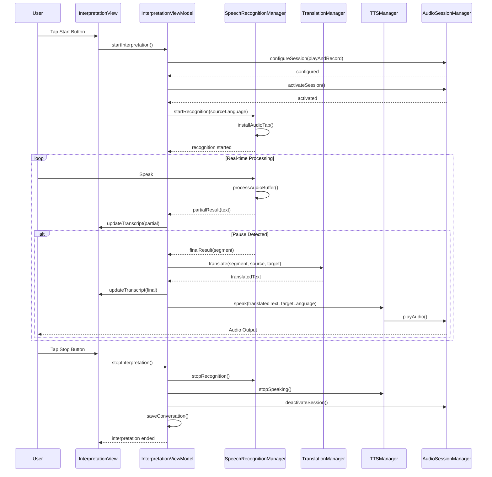
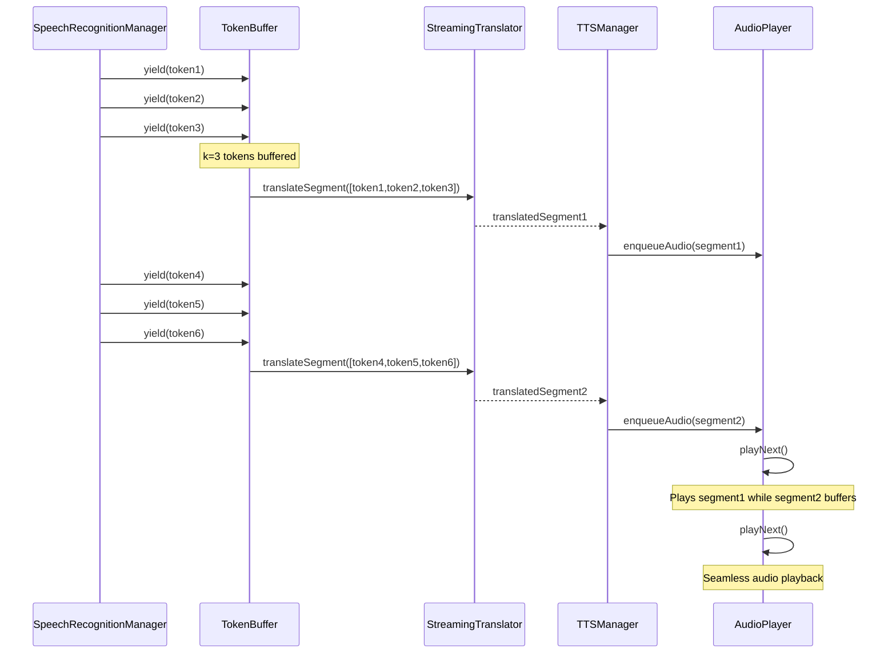
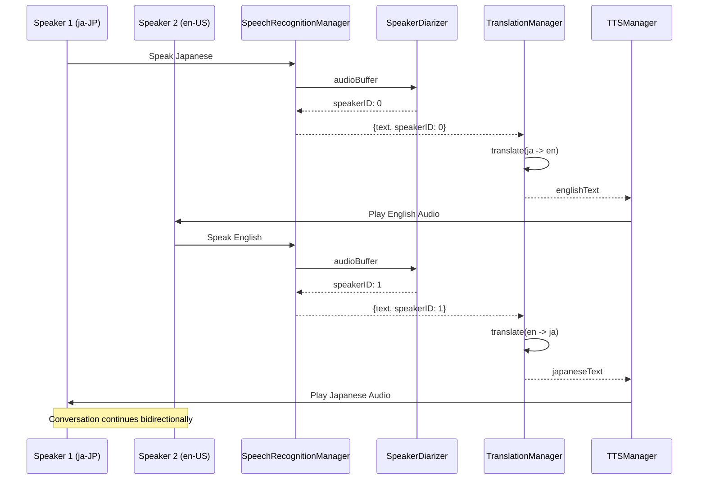
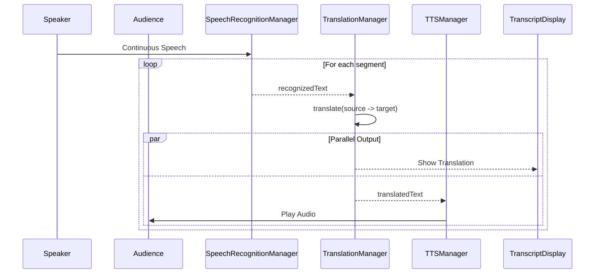
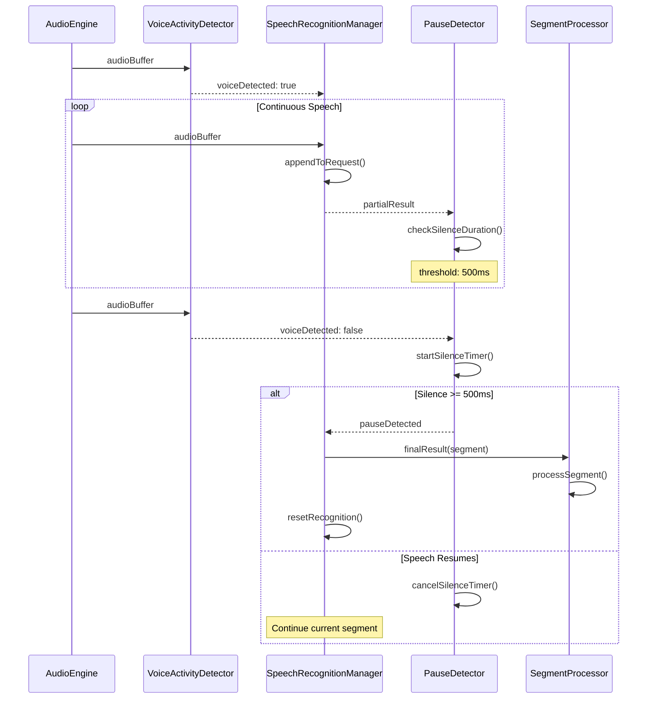
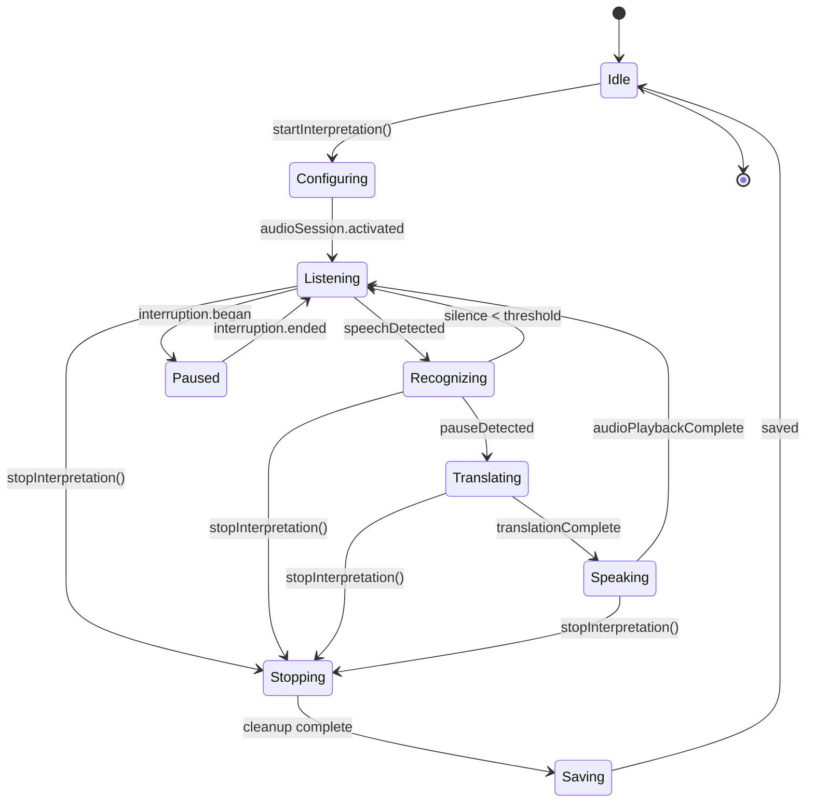
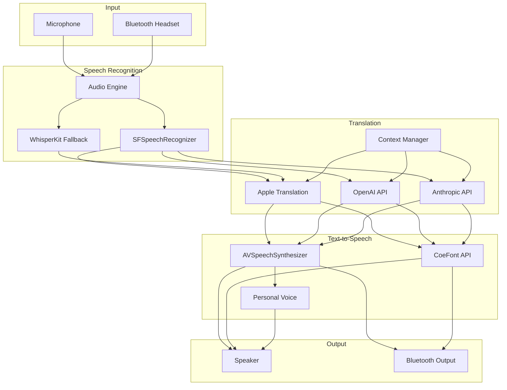

# LiveLingo - Core Interpretation Workflows

## WF-CORE-001: Main Interpretation Loop

Complete end-to-end interpretation pipeline from audio input to audio output.

---

## WF-CORE-002: Streaming Interpretation (Wait-k Strategy)

Low-latency streaming translation using Wait-k algorithm.

---

## WF-CORE-003: Dual Speaker Mode

Two-way interpretation supporting conversations between two speakers.

---

## WF-CORE-004: Single Speaker Mode

One-way interpretation for presentations or announcements.

---

## WF-CORE-005: Pause Detection & Segment Processing

Automatic segmentation based on speech pauses.

---

## Complete Pipeline State Diagram

---

## Data Flow Diagram

---

## Version History

| Version | Date | Changes | Author |
|---------|------|---------|--------|
| 1.0.0 | 2024-12-24 | Initial creation | AI Agent |
