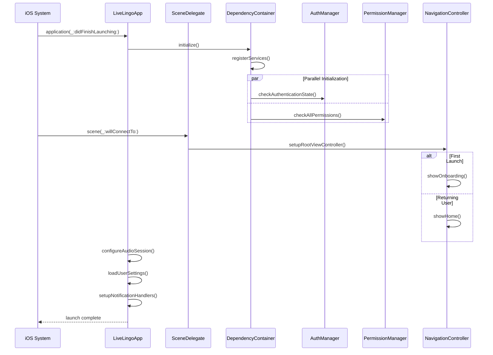
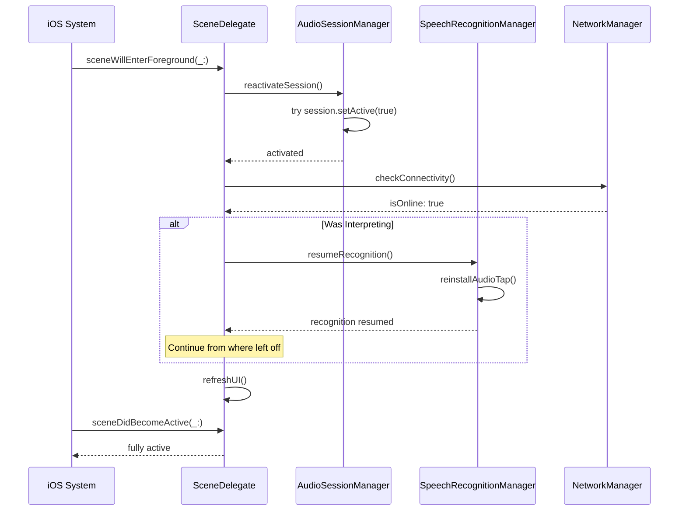
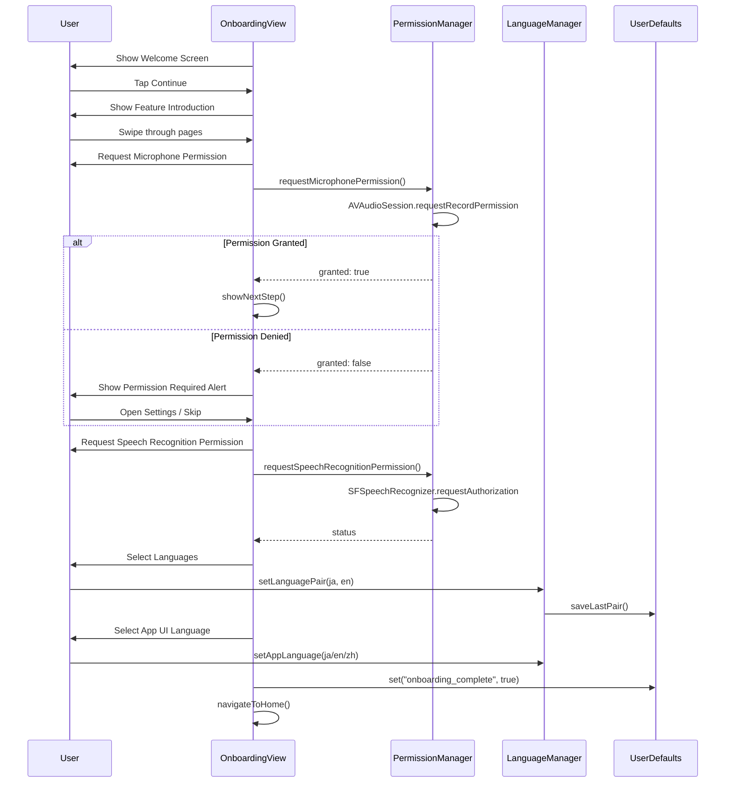
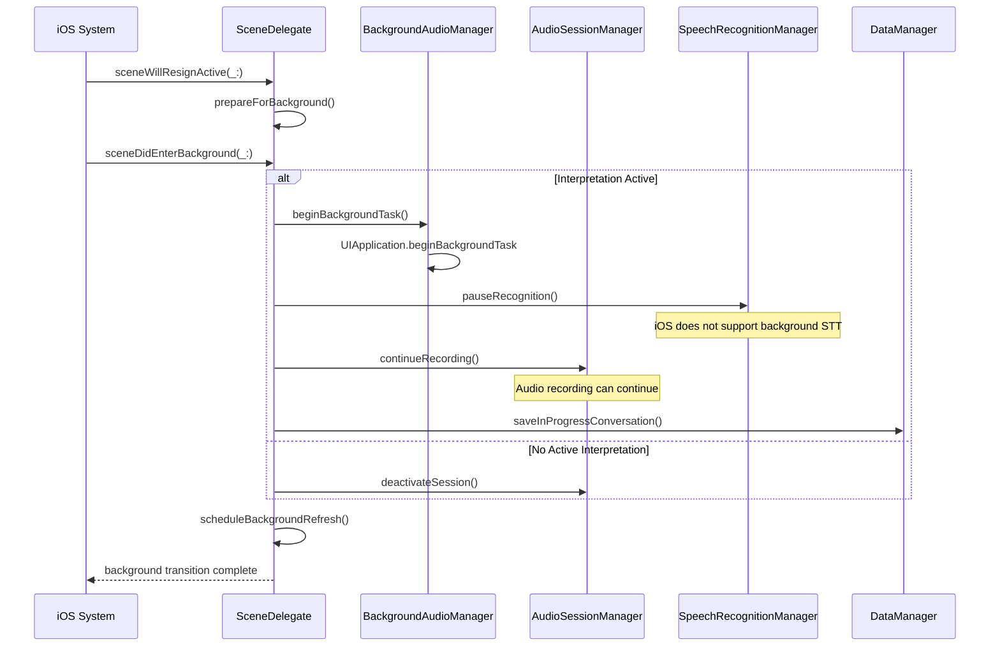
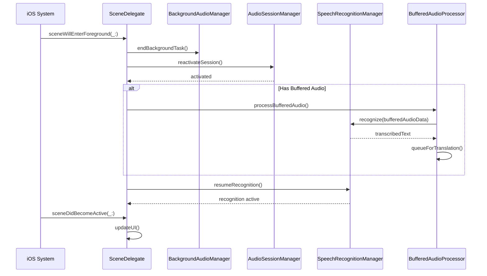
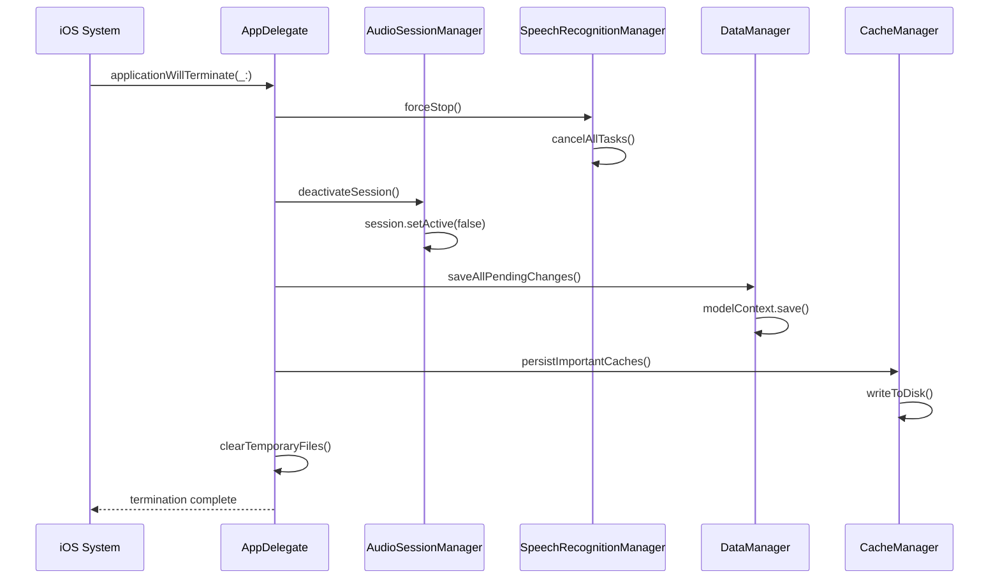
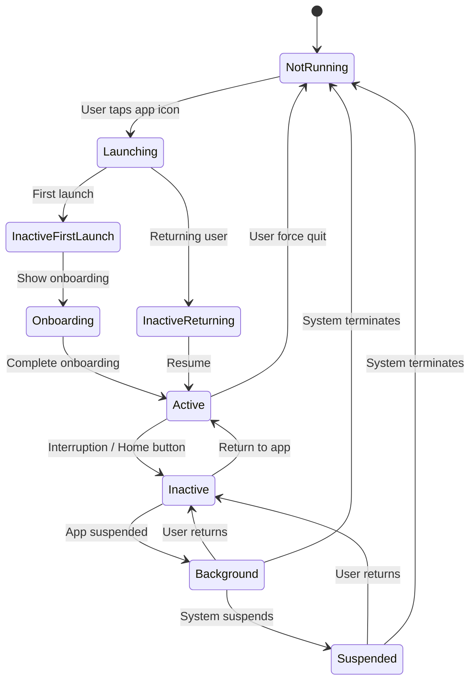
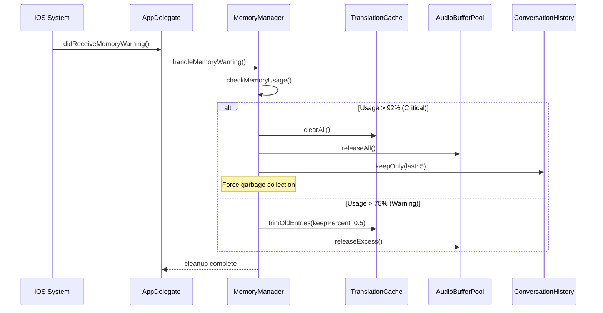

# LiveLingo - App Lifecycle Workflows

## WF-LIFE-001: Cold Start

App launch from terminated state.

---

## WF-LIFE-002: Warm Start (Resume from Background)

App resume from suspended state.

---

## WF-LIFE-003: First Launch (Onboarding)

Initial setup and permission request flow.

---

## WF-LIFE-004: Background Transition

App enters background during active interpretation.

---

## WF-LIFE-005: Foreground Transition

App returns to foreground with pending work.

---

## WF-LIFE-006: App Termination

Graceful shutdown with data persistence.

---

## App State Diagram

---

## Memory Warning Response

---

## Version History

| Version | Date | Changes | Author |
|---------|------|---------|--------|
| 1.0.0 | 2024-12-24 | Initial creation | AI Agent |
