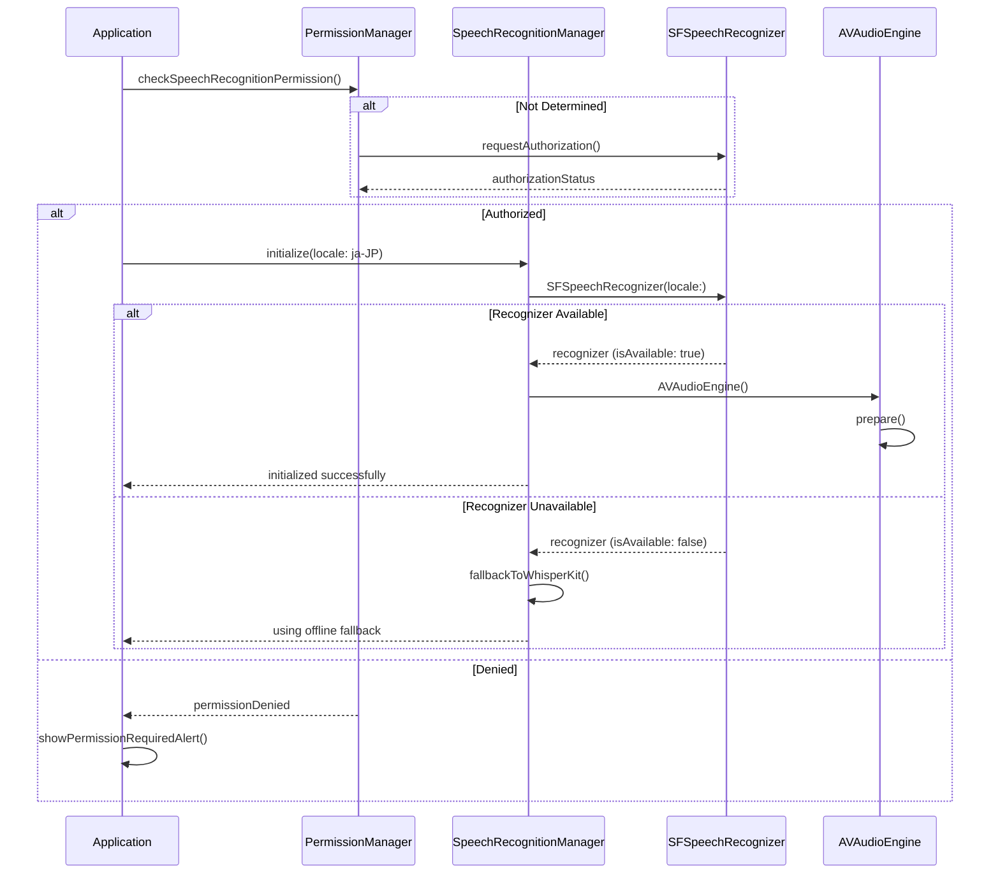
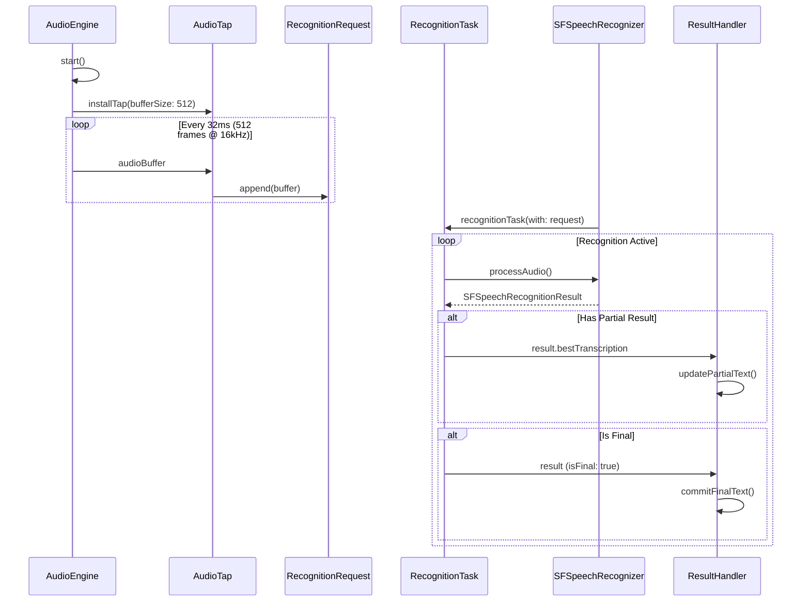
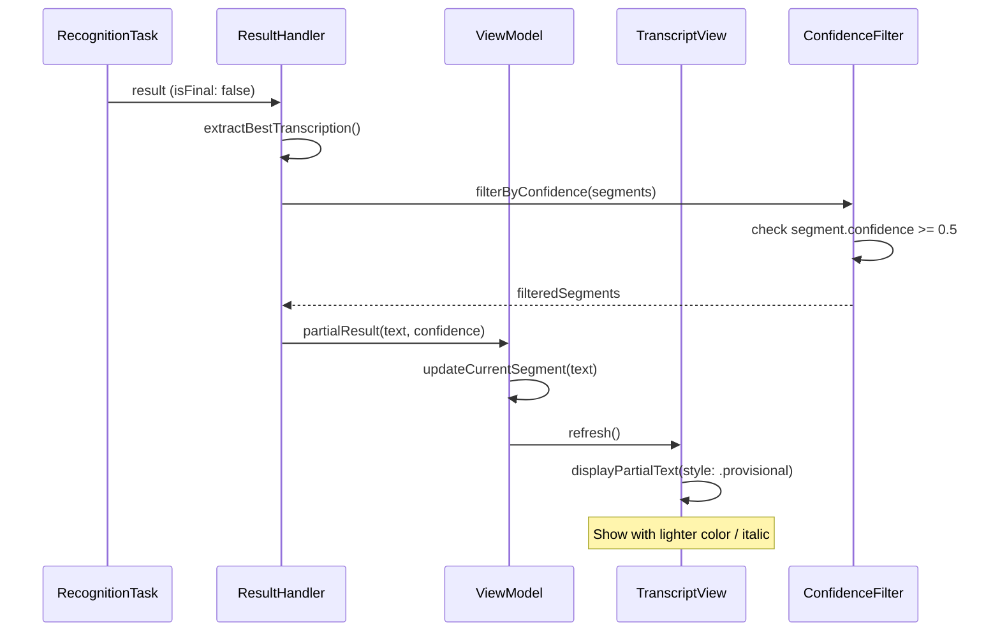
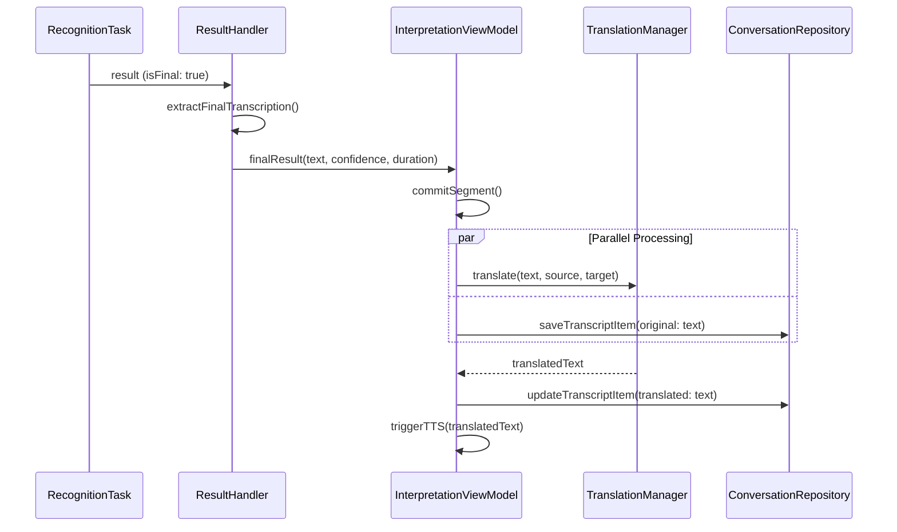
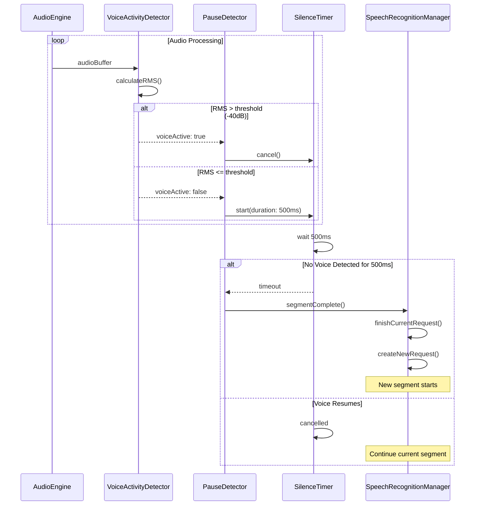
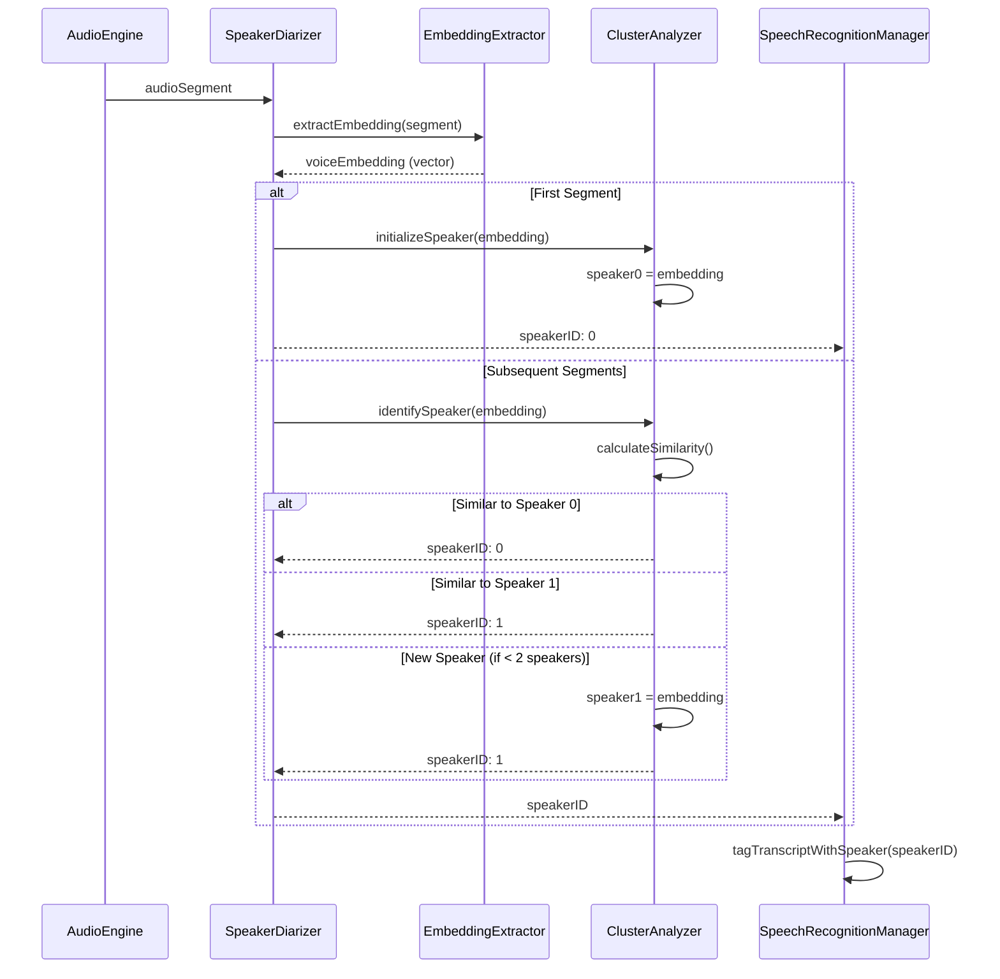
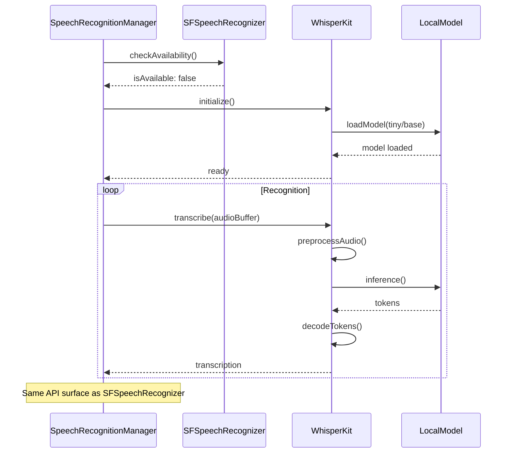
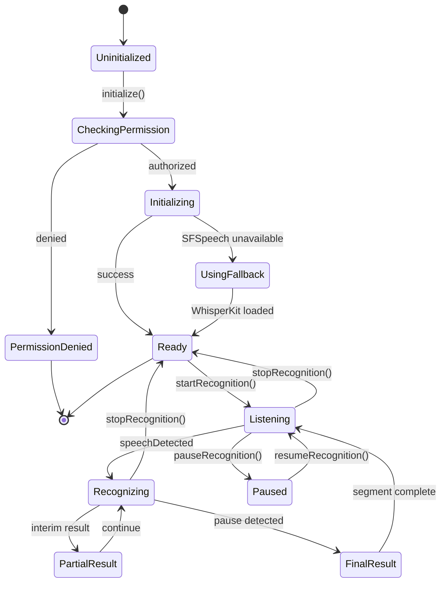

# LiveLingo - Speech Recognition (STT) Workflows

## WF-STT-001: Initialize SFSpeechRecognizer

Setup speech recognition with permission verification.

---

## WF-STT-002: Real-time Recognition

Continuous speech to text conversion.

---

## WF-STT-003: Partial Result Processing

Handle interim transcription results.

---

## WF-STT-004: Final Result Processing

Confirmed transcription handling and forwarding.

---

## WF-STT-005: Pause Detection

Silence-based segment splitting.

---

## WF-STT-006: Speaker Diarization

Dual speaker identification for conversations.

---

## WF-STT-007: WhisperKit Fallback

Offline recognition when SFSpeechRecognizer unavailable.

---

## WF-STT-008: Language Auto-Detection

Automatic language identification from speech.

```mermaid
sequenceDiagram
    participant Audio as AudioEngine
    participant Detector as LanguageDetector
    participant SF1 as SFSpeechRecognizer (ja)
    participant SF2 as SFSpeechRecognizer (en)
    participant SF3 as SFSpeechRecognizer (zh)
    participant STT as SpeechRecognitionManager

    Audio->>Detector: initialAudioBuffer (2 seconds)

    par Parallel Recognition
        Detector->>SF1: recognize(buffer)
        SF1-->>Detector: {confidence: 0.92, text: "..."}
        and
        Detector->>SF2: recognize(buffer)
        SF2-->>Detector: {confidence: 0.45, text: "..."}
        and
        Detector->>SF3: recognize(buffer)
        SF3-->>Detector: {confidence: 0.30, text: "..."}
    end

    Detector->>Detector: selectHighestConfidence()
    Note over Detector: threshold >= 0.8

    alt Confidence >= 0.8
        Detector-->>STT: detectedLanguage: ja-JP
        STT->>STT: setSourceLanguage(ja-JP)
    else Low Confidence
        Detector-->>STT: detectionFailed
        STT->>STT: useDefaultLanguage()
    end
```

---

## STT State Diagram

---

## Version History

| Version | Date | Changes | Author |
|---------|------|---------|--------|
| 1.0.0 | 2024-12-24 | Initial creation | AI Agent |
