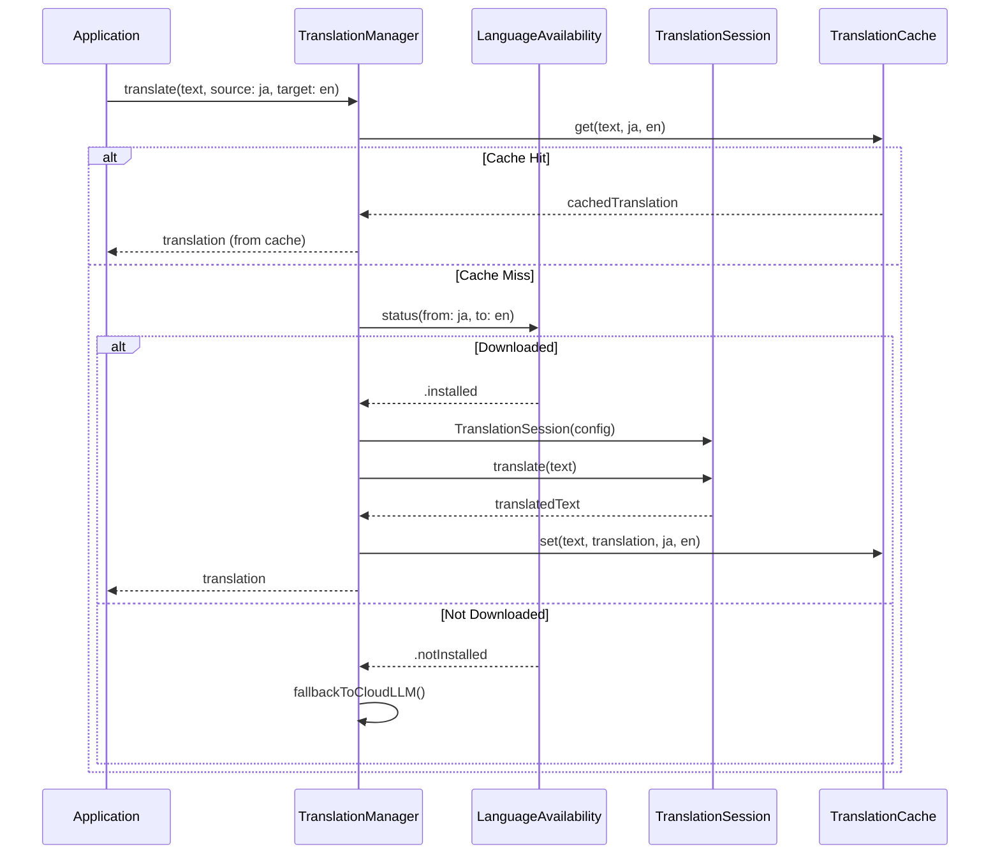
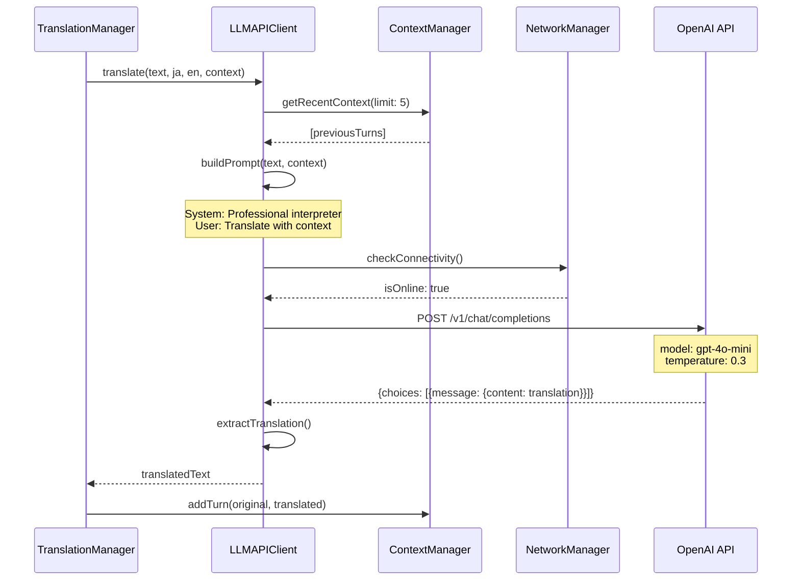
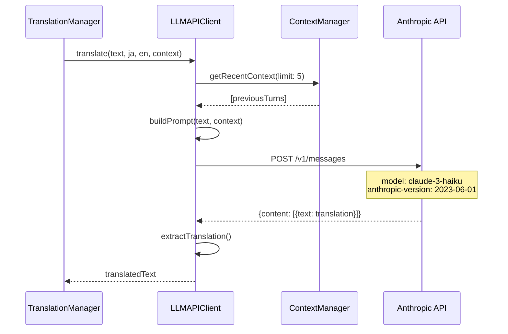
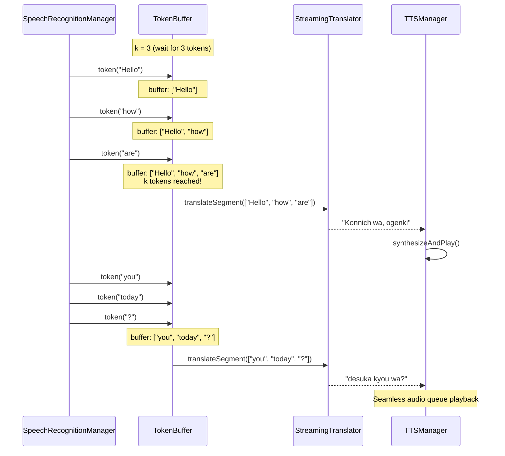
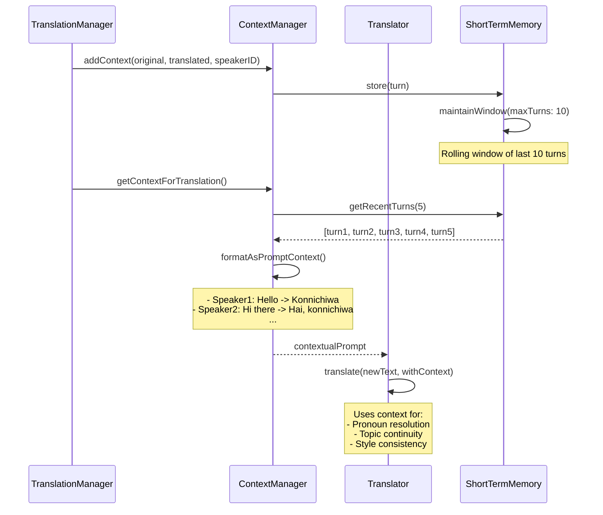
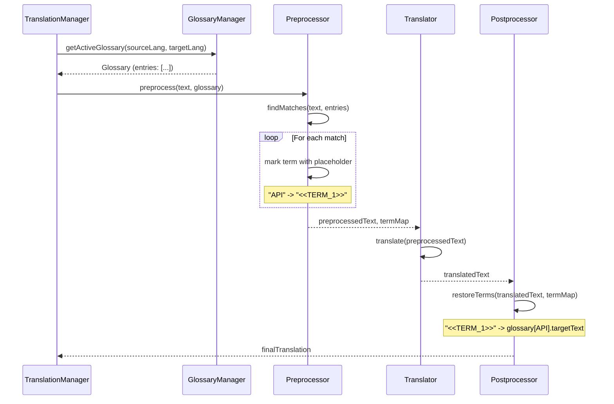
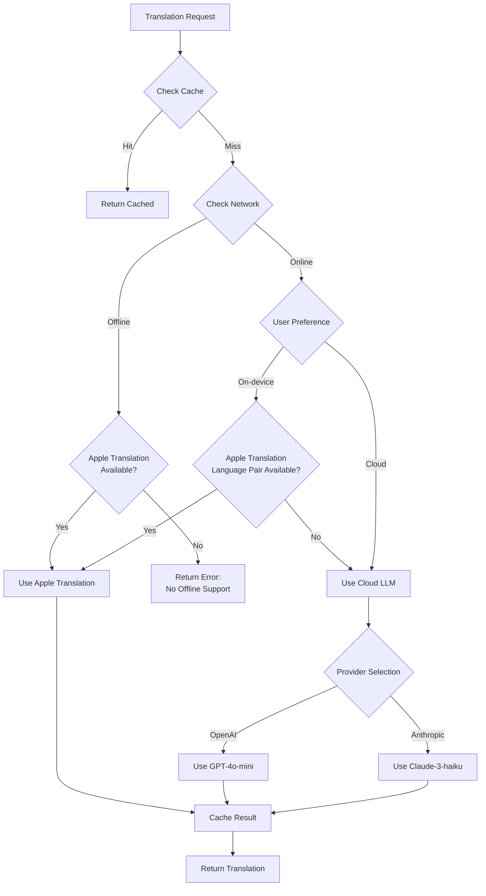
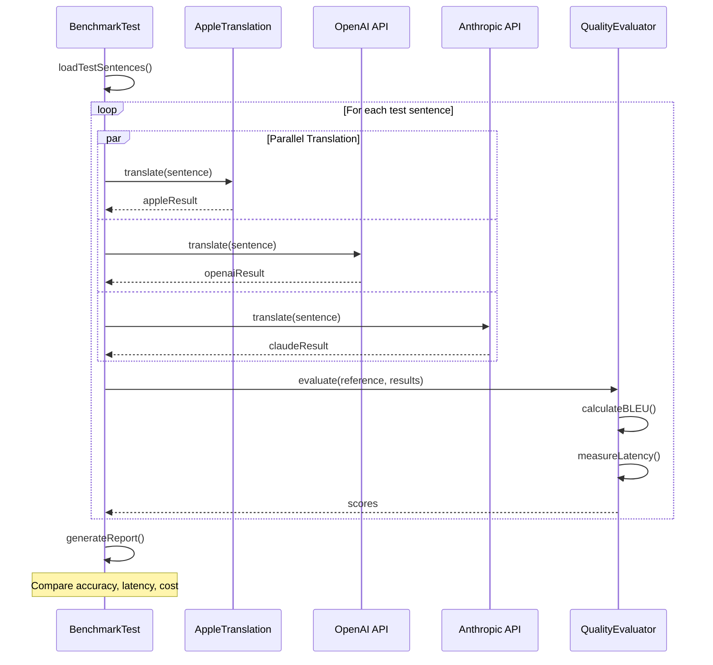
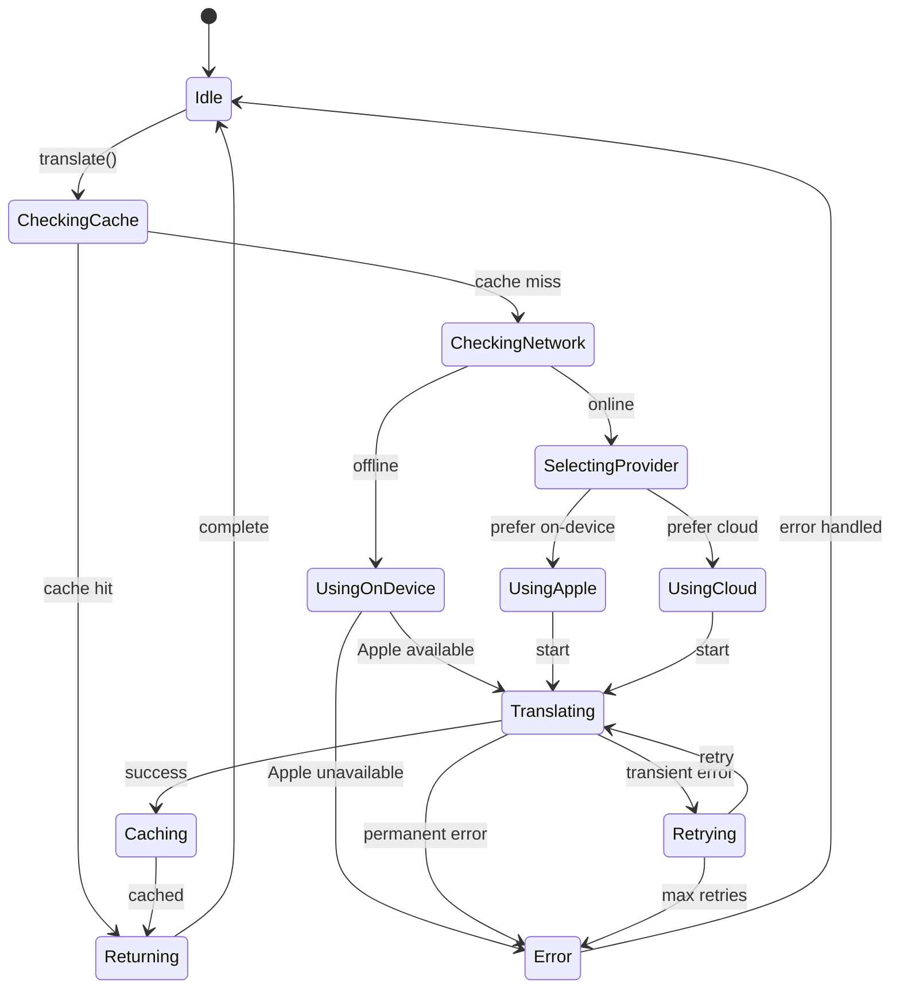

# LiveLingo - Translation Workflows

## WF-TRN-001: Apple Translation Framework

On-device translation using Apple's Translation API.

---

## WF-TRN-002: Cloud LLM Translation (OpenAI)

GPT-based translation with context support.

---

## WF-TRN-003: Cloud LLM Translation (Anthropic)

Claude-based translation as alternative provider.

---

## WF-TRN-004: Wait-k Streaming Translation

Low-latency streaming using Wait-k algorithm.

---

## WF-TRN-005: Context-aware Translation

Multi-turn conversation context management.

---

## WF-TRN-006: Glossary Application

Custom dictionary integration for specialized terms.

---

## Translation Provider Selection

---

## Translation Quality Comparison

---

## Translation State Diagram

---

## Version History

| Version | Date | Changes | Author |
|---------|------|---------|--------|
| 1.0.0 | 2024-12-24 | Initial creation | AI Agent |
