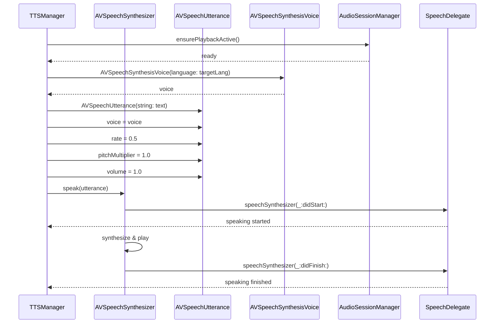
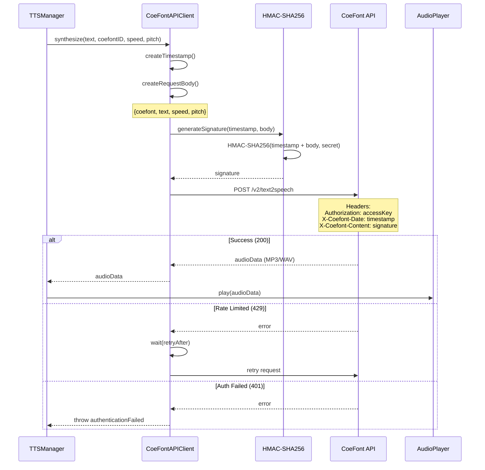
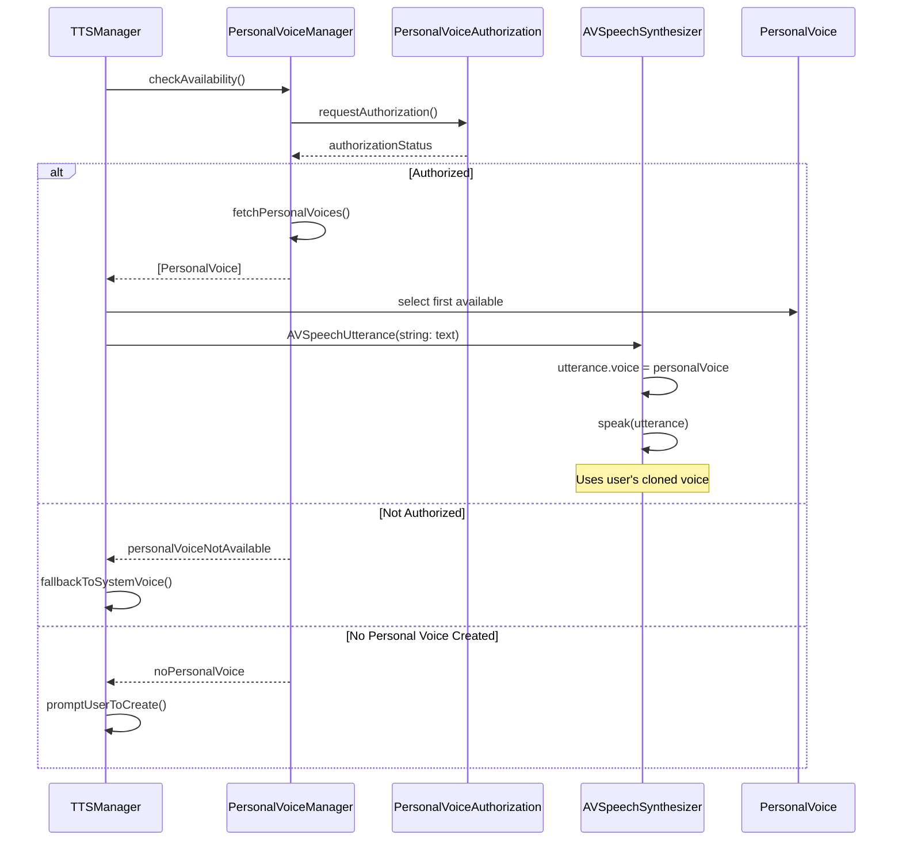
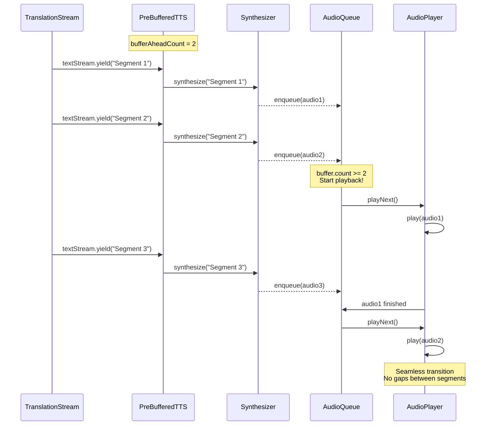
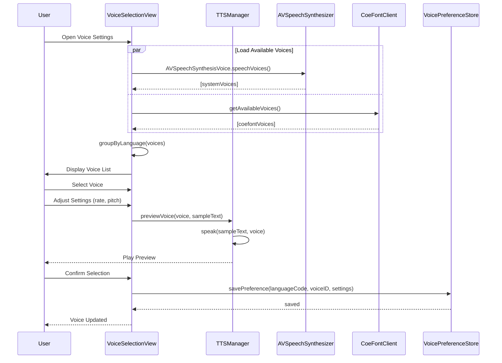
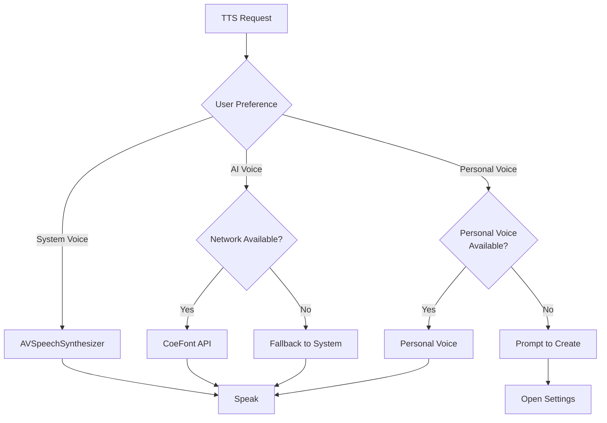
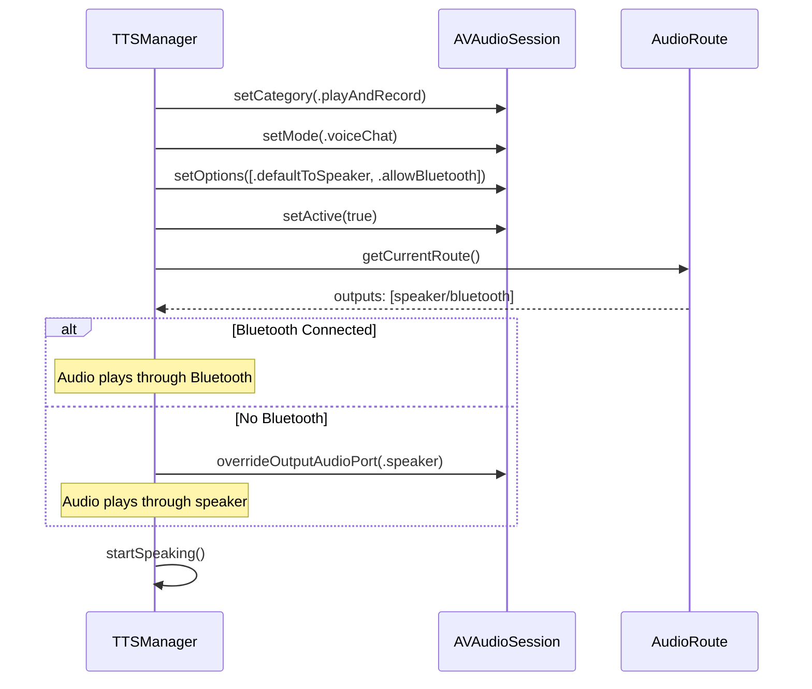
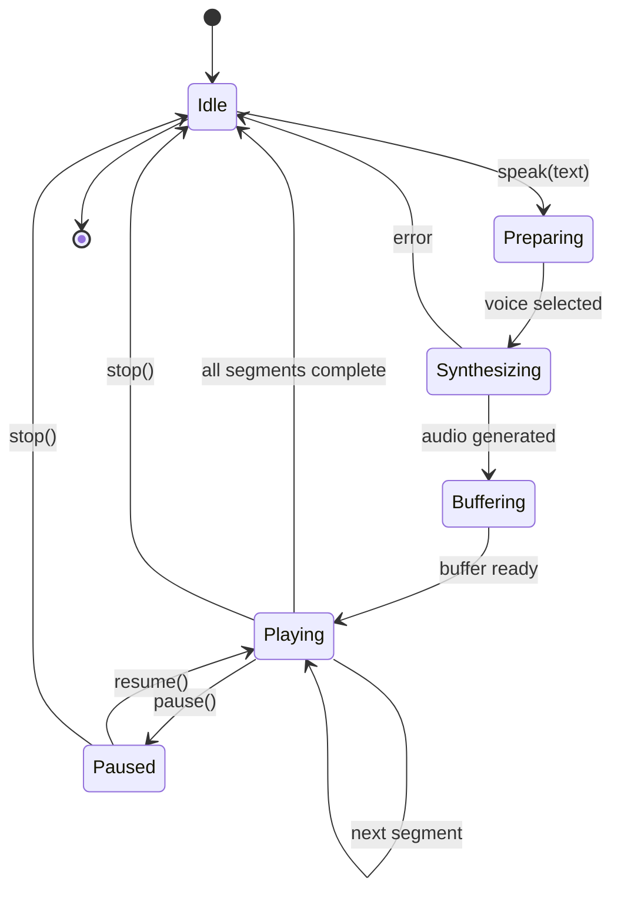
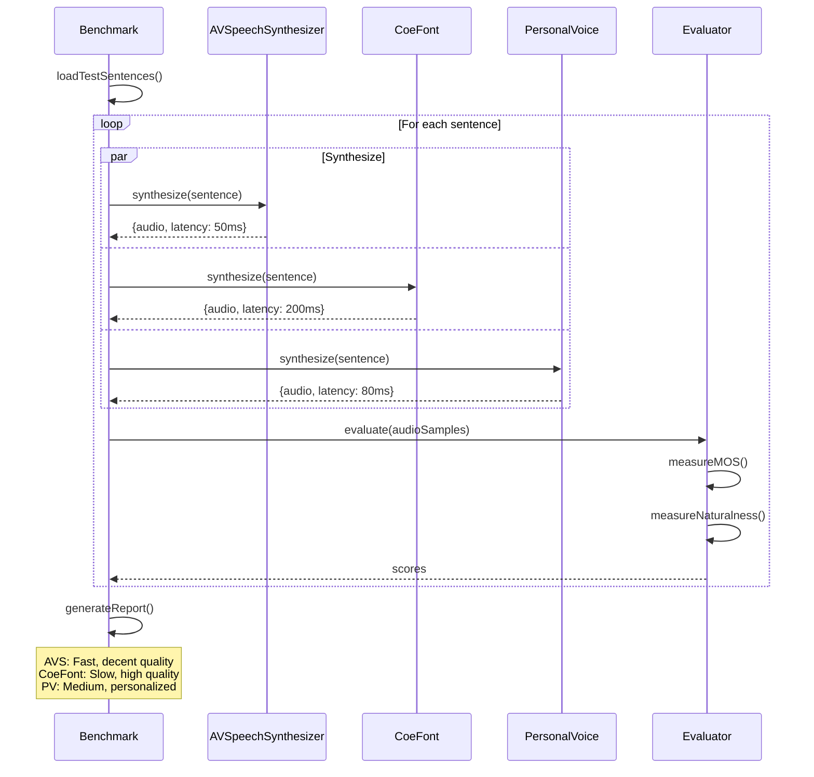

# LiveLingo - Text-to-Speech (TTS) Workflows

## WF-TTS-001: AVSpeechSynthesizer

System voice synthesis using Apple's built-in TTS.

---

## WF-TTS-002: CoeFont API Synthesis

AI voice synthesis using CoeFont cloud API.

---

## WF-TTS-003: Personal Voice (iOS 17+)

User's personal voice synthesis.

---

## WF-TTS-004: Streaming Audio Playback

Pre-buffered audio queue for seamless playback.

---

## WF-TTS-005: Voice Selection

Choose and configure TTS voices.

---

## TTS Provider Selection Flow

---

## Audio Session Configuration for TTS

---

## TTS State Diagram

---

## Voice Quality Comparison

---

## Version History

| Version | Date | Changes | Author |
|---------|------|---------|--------|
| 1.0.0 | 2024-12-24 | Initial creation | AI Agent |
