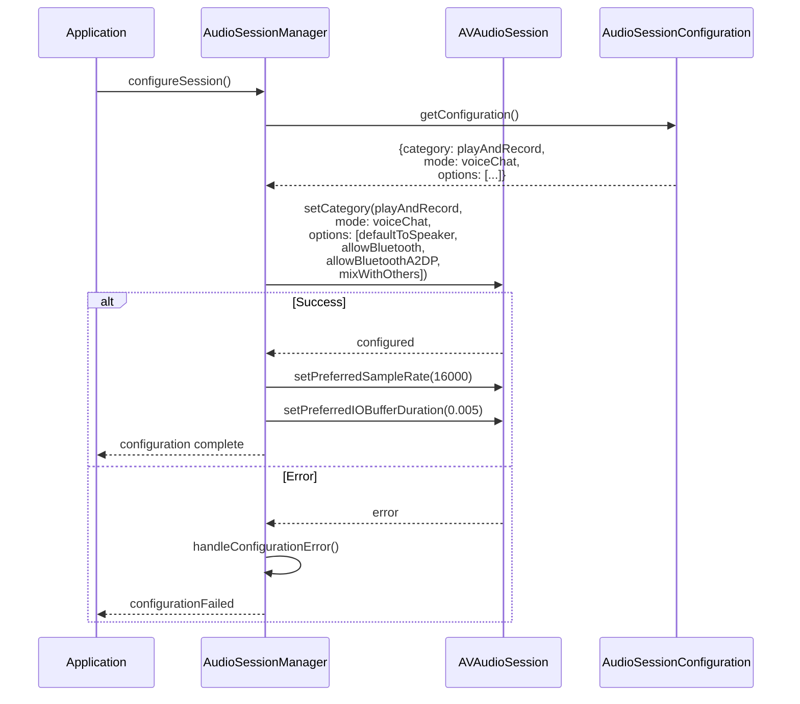
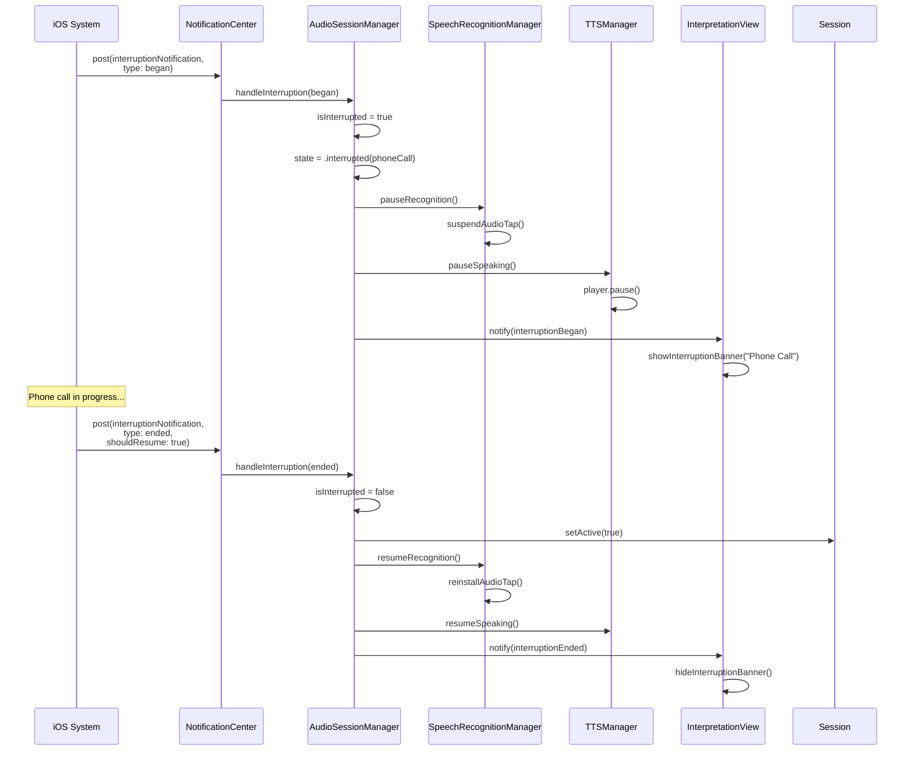
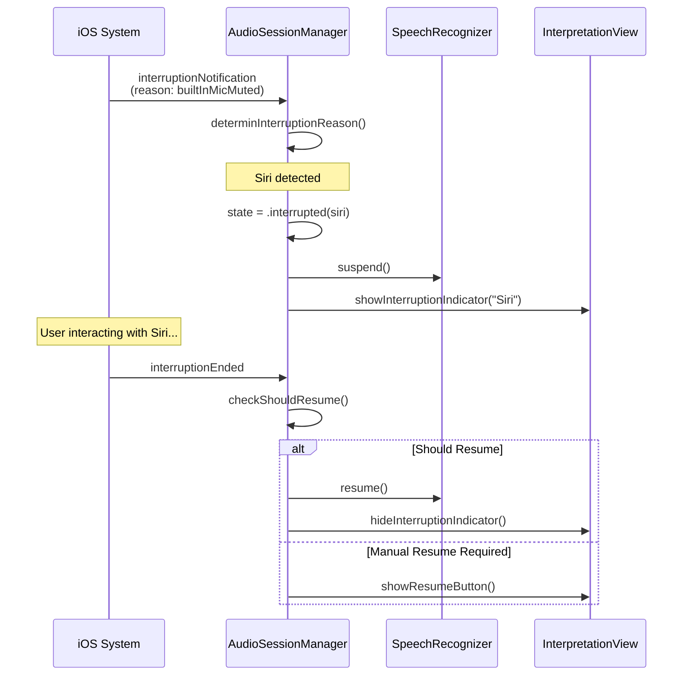
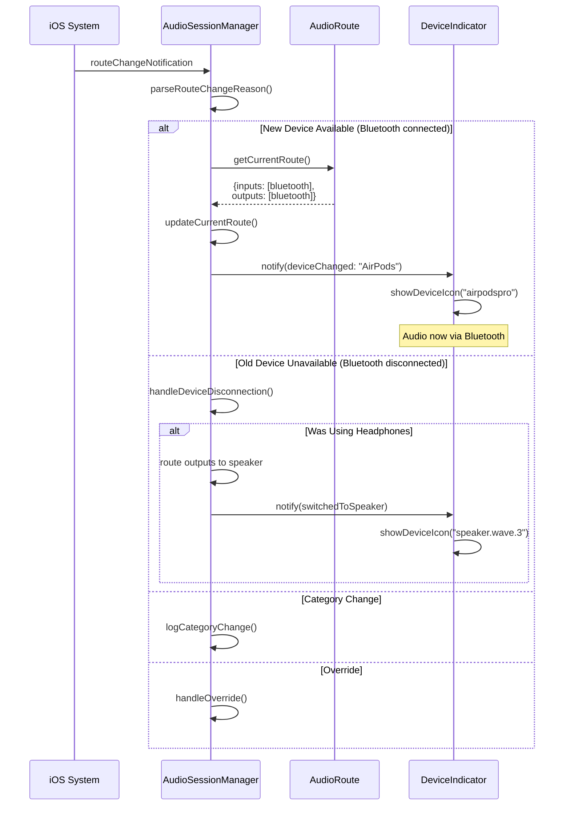
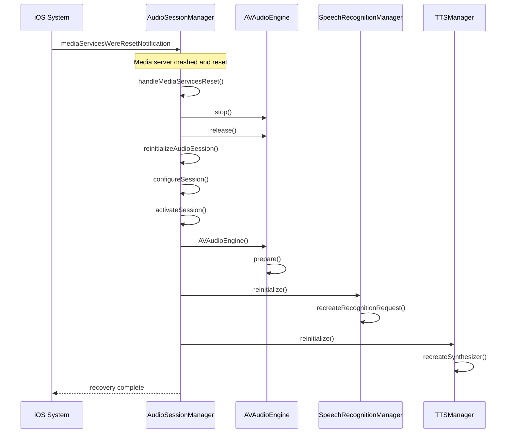
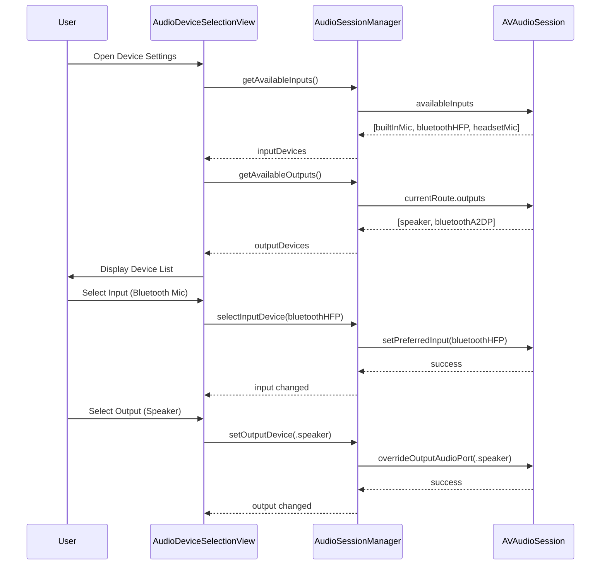
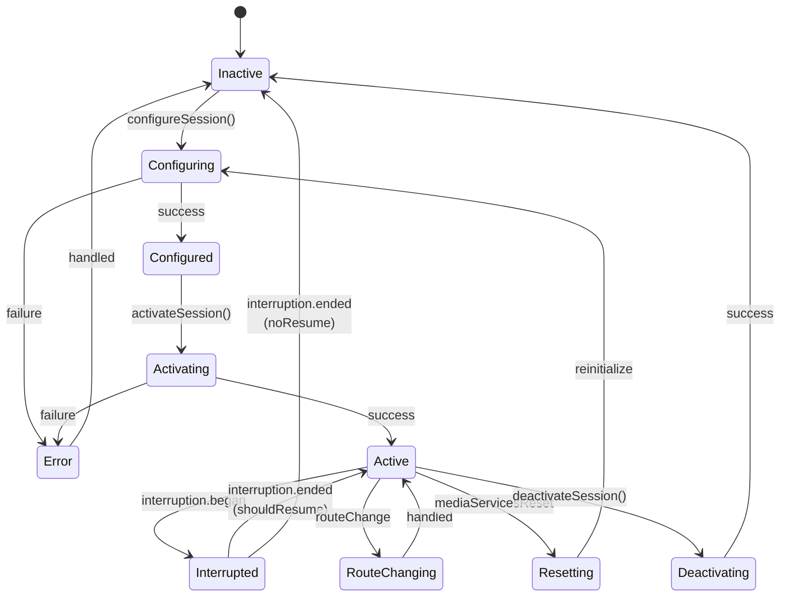
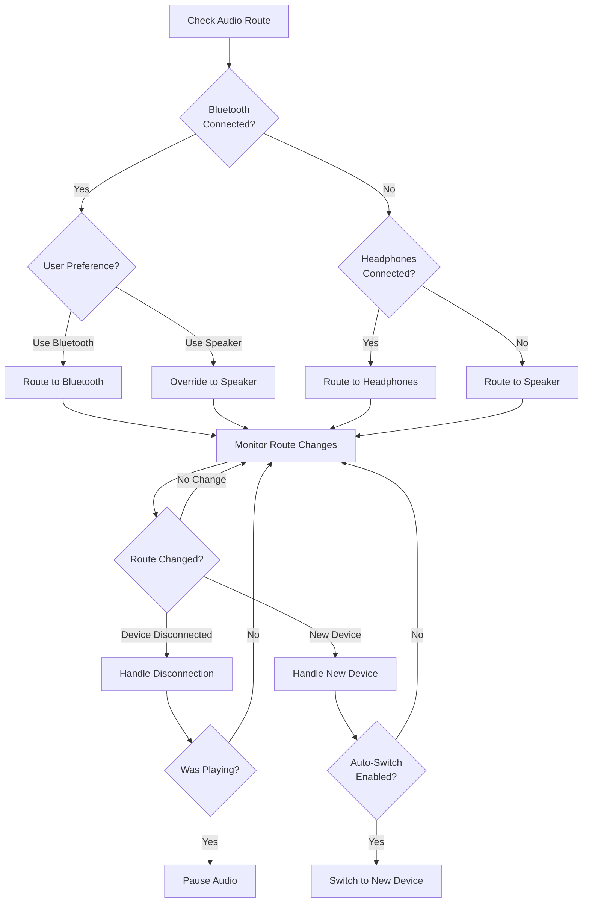
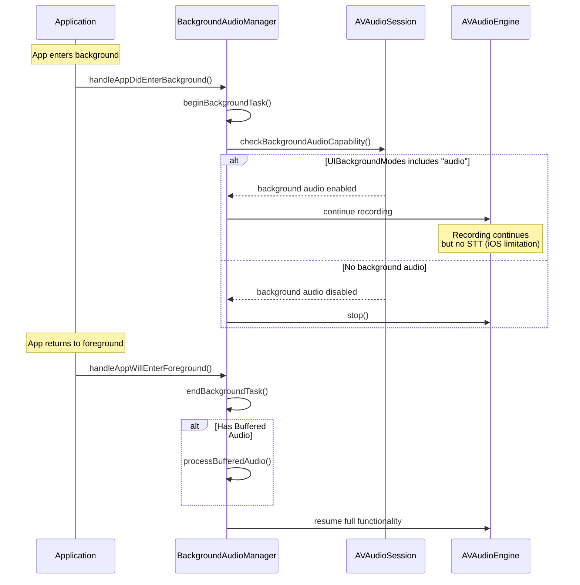

# LiveLingo - Audio Session Management Workflows

## WF-AUD-001: Configure Audio Session

PlayAndRecord session setup for simultaneous input/output.

---

## WF-AUD-002: Handle Phone Call Interruption

Pause and resume interpretation during phone calls.

---

## WF-AUD-003: Handle Siri Interruption

Pause for Siri and resume after.

---

## WF-AUD-004: Handle Route Change

Bluetooth connect/disconnect handling.

---

## WF-AUD-005: Handle Media Server Reset

System audio recovery after media server crash.

---

## WF-AUD-006: Device Selection

Input/output device manual selection.

---

## Audio Session State Diagram

---

## Audio Route Decision Tree

---

## Background Audio Behavior

---

## Version History

| Version | Date | Changes | Author |
|---------|------|---------|--------|
| 1.0.0 | 2024-12-24 | Initial creation | AI Agent |
