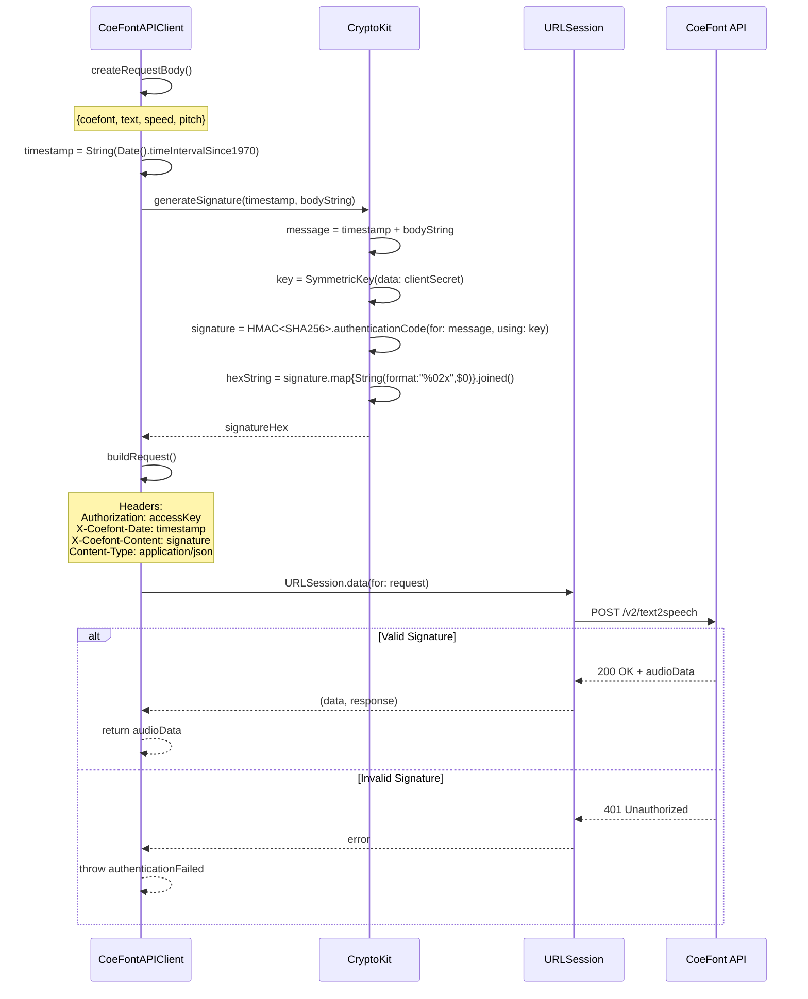
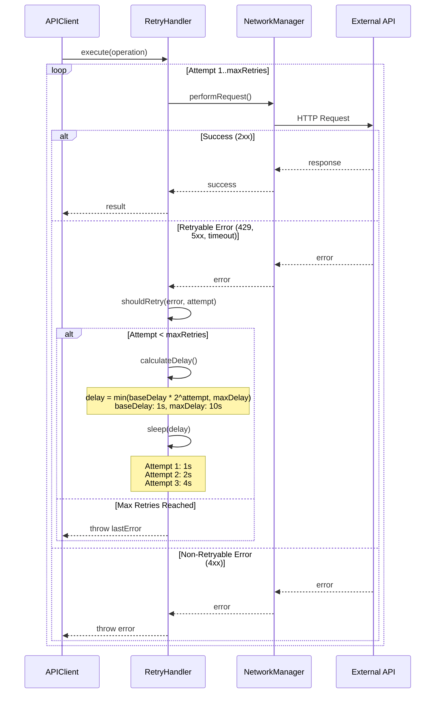
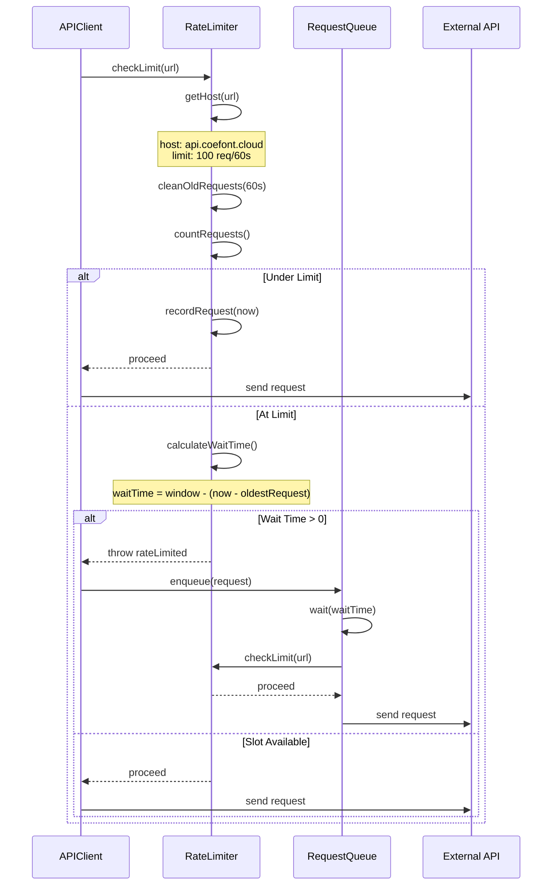
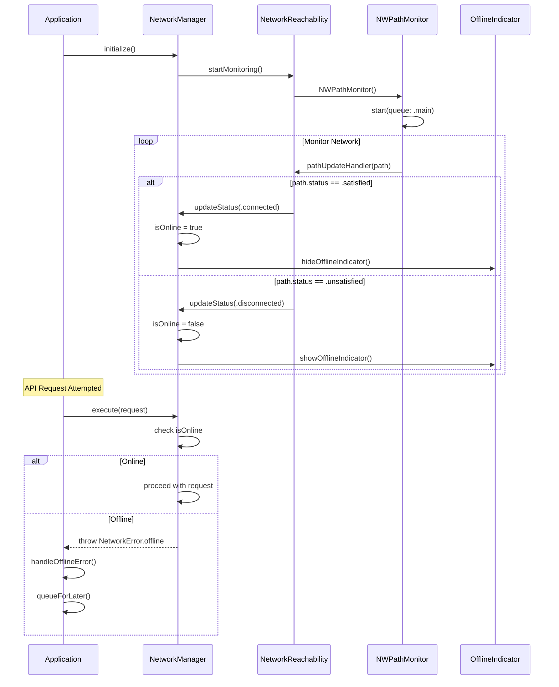
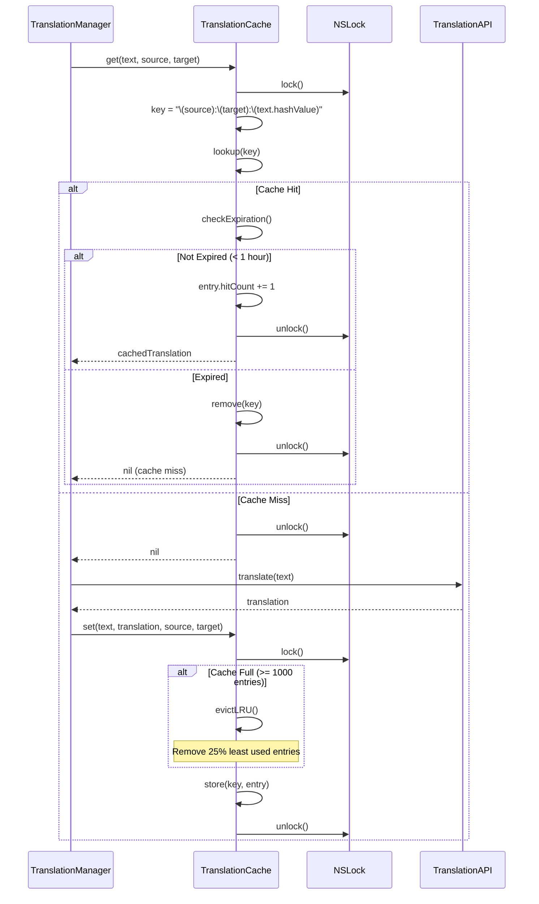
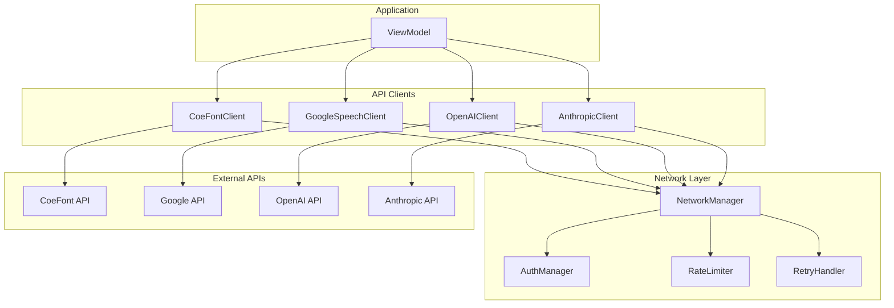
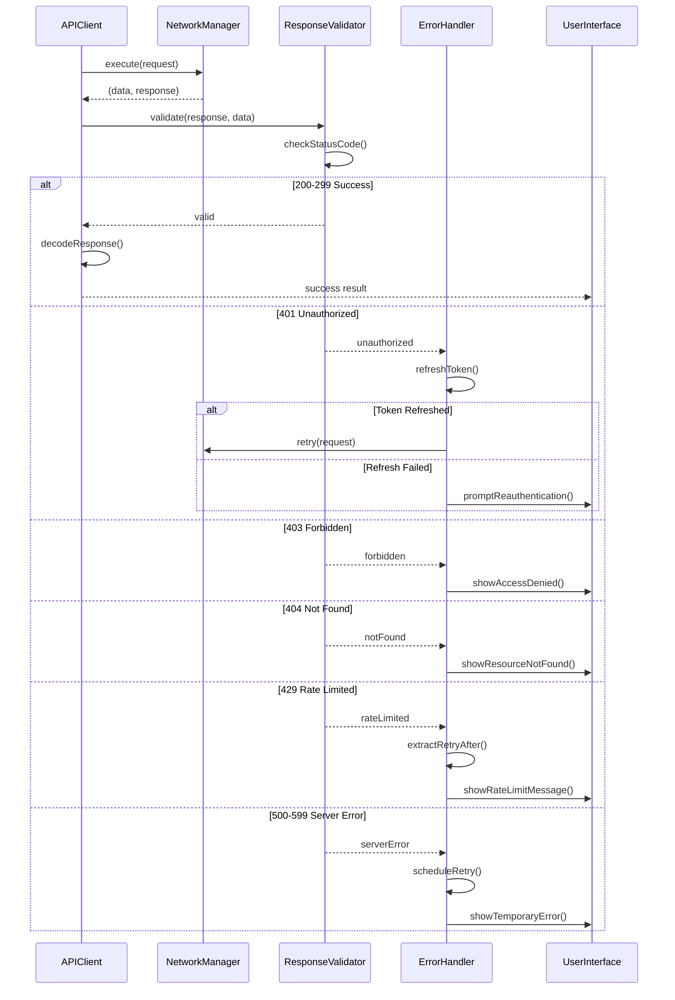
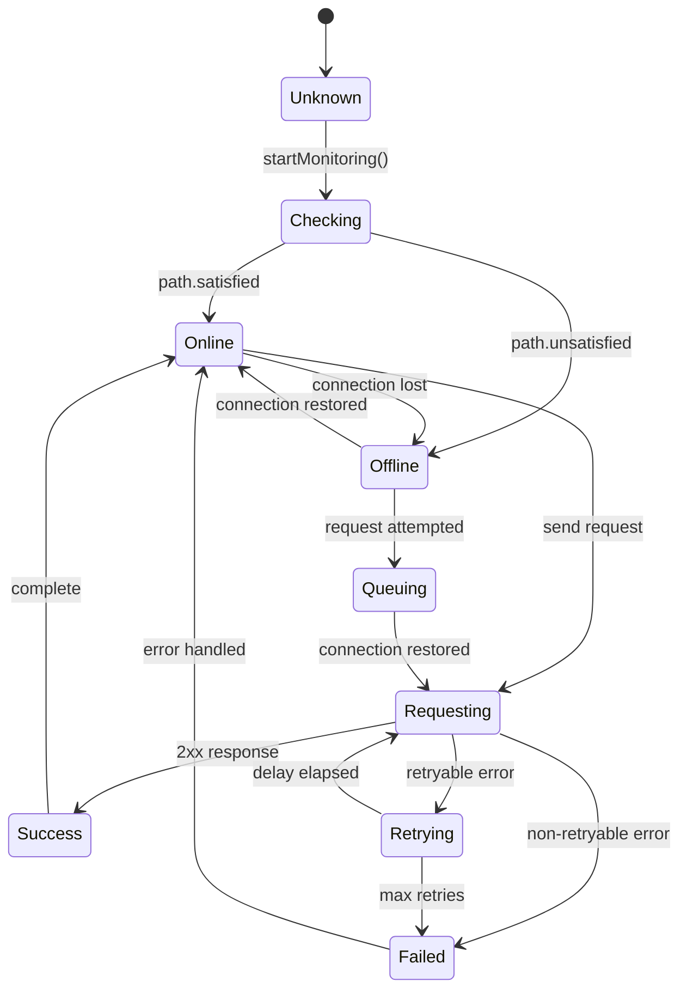

# LiveLingo - API Communication Workflows

## WF-API-001: CoeFont HMAC-SHA256 Authentication

Signed API request with HMAC-SHA256.

---

## WF-API-002: Retry with Exponential Backoff

Failed request retry strategy.

---

## WF-API-003: Rate Limit Handling

Request throttling and queuing.

---

## WF-API-004: Offline Detection

Network state monitoring and handling.

---

## WF-API-005: Response Caching

Translation cache management.

---

## API Client Architecture

---

## Error Response Handling

---

## Network State Diagram

---

## Version History

| Version | Date | Changes | Author |
|---------|------|---------|--------|
| 1.0.0 | 2024-12-24 | Initial creation | AI Agent |
