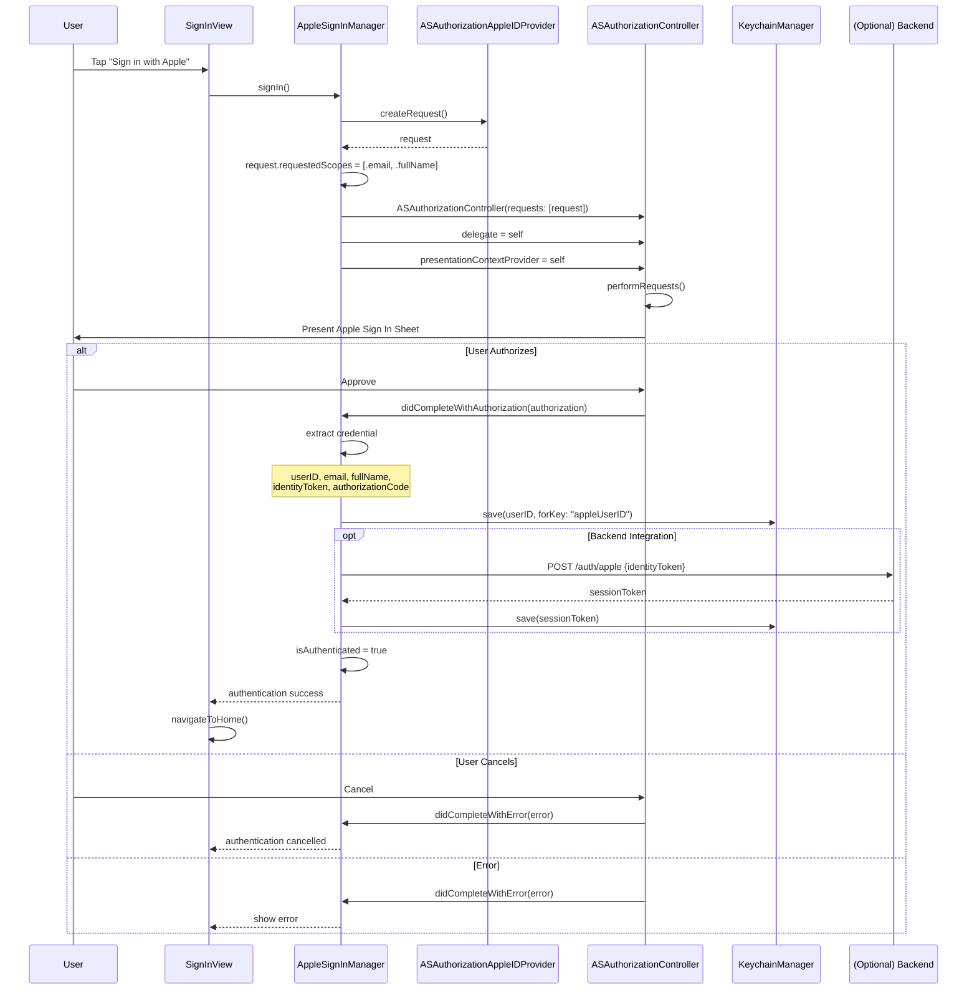
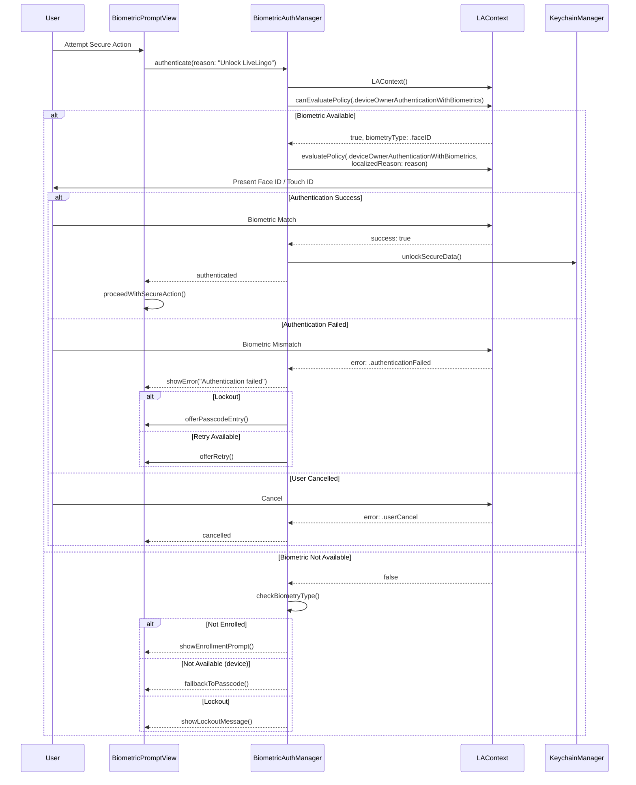
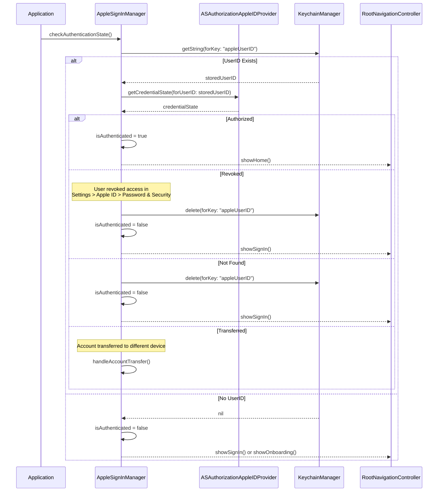
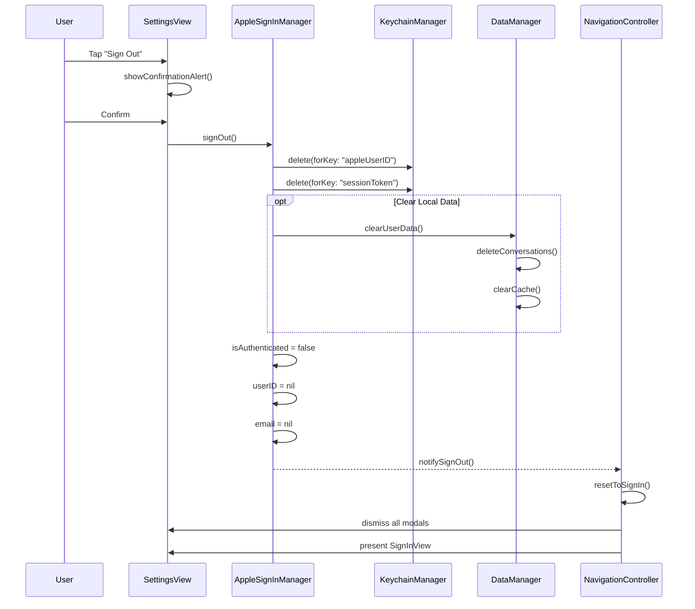
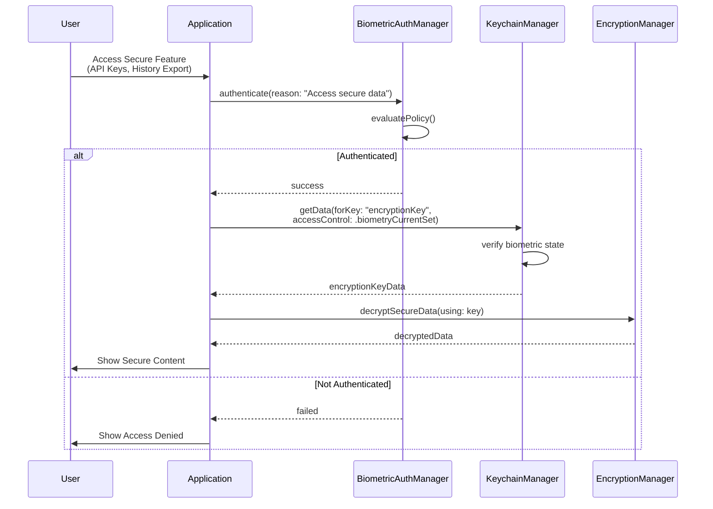
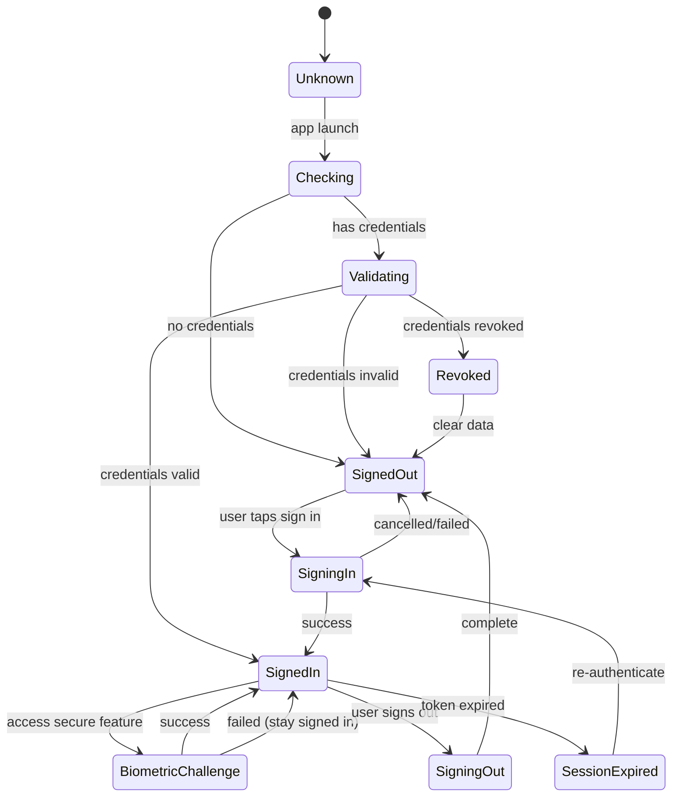
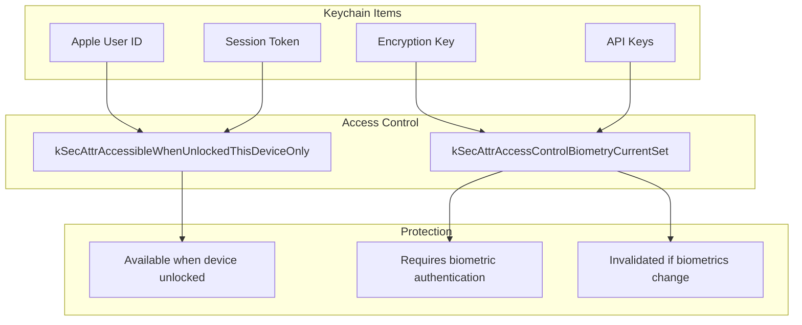

# LiveLingo - Authentication Workflows

## WF-AUTH-001: Sign in with Apple

OAuth-style authentication using Apple ID.

---

## WF-AUTH-002: Biometric Authentication

Face ID / Touch ID authentication.

---

## WF-AUTH-003: Session Validation

Check authentication state on app launch.

---

## WF-AUTH-004: Sign Out

Clear session and credentials.

---

## Secure Data Access with Biometrics

---

## Authentication State Diagram

---

## Keychain Access Control

---

## Version History

| Version | Date | Changes | Author |
|---------|------|---------|--------|
| 1.0.0 | 2024-12-24 | Initial creation | AI Agent |
