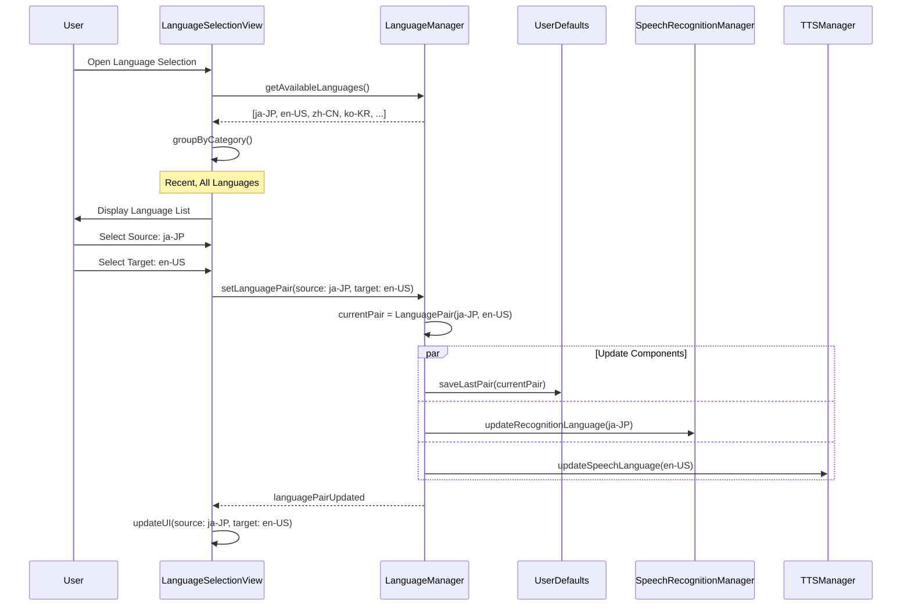
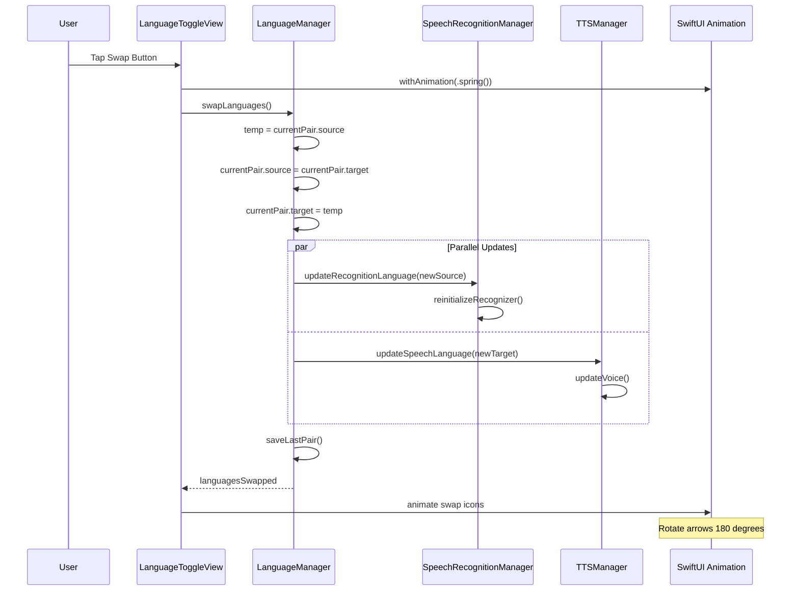
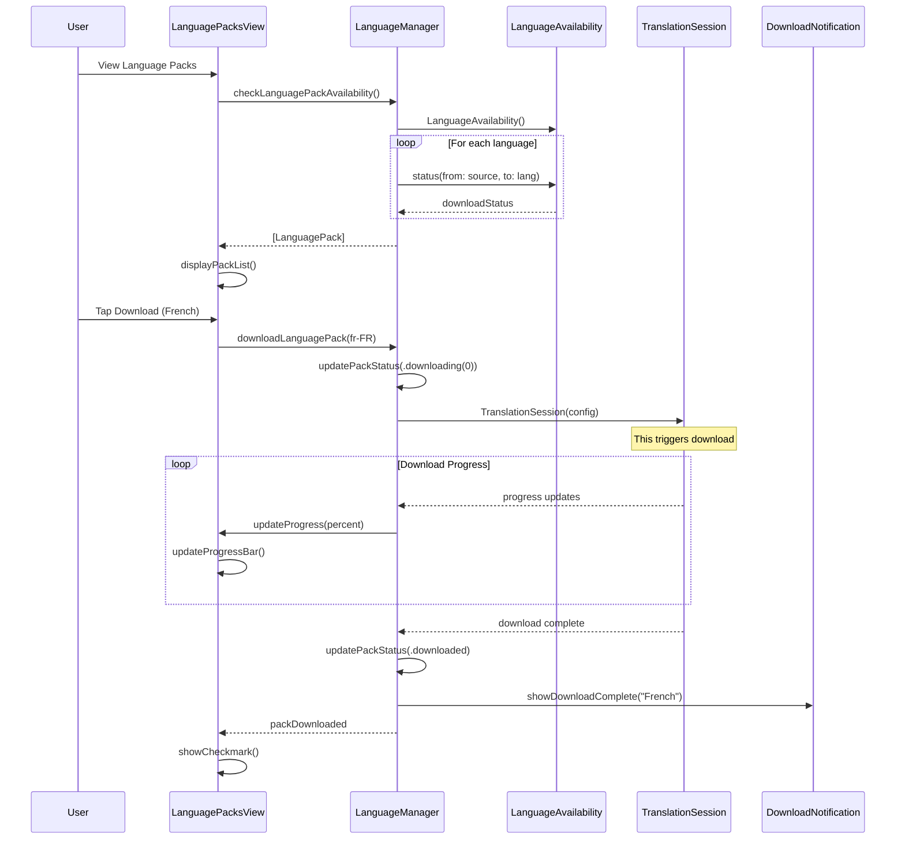
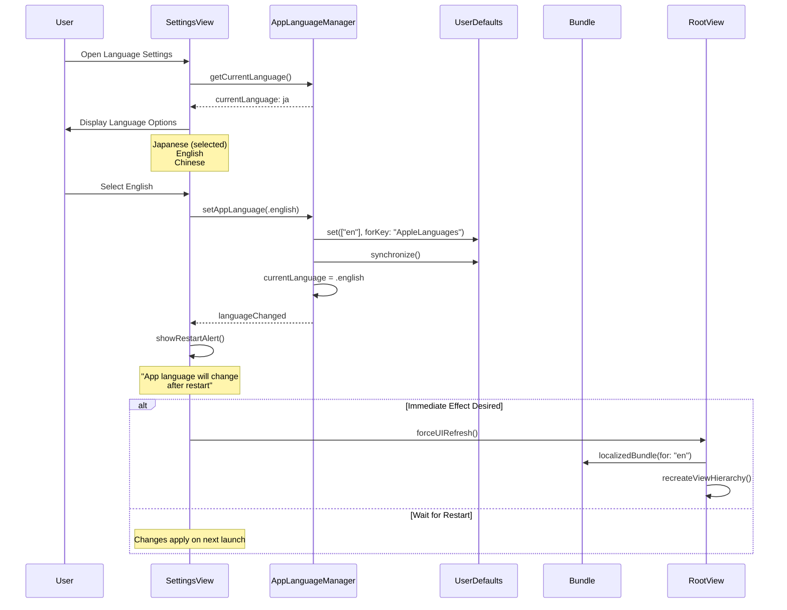
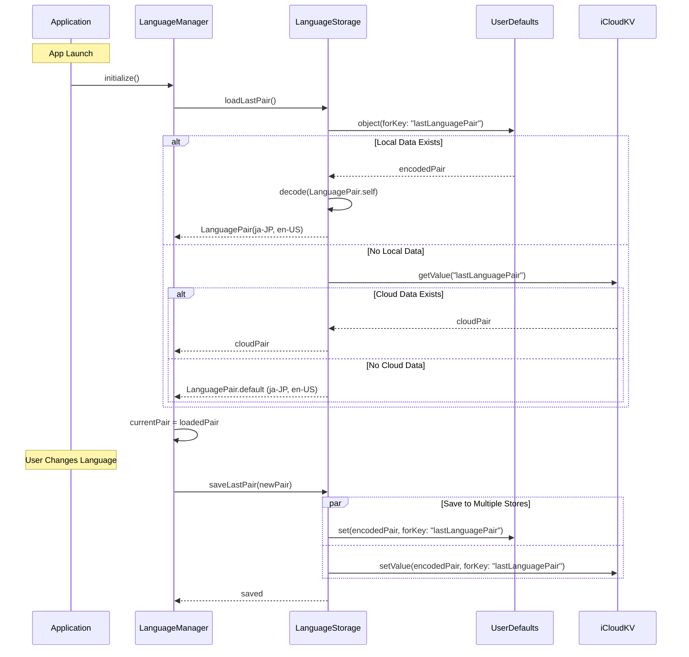
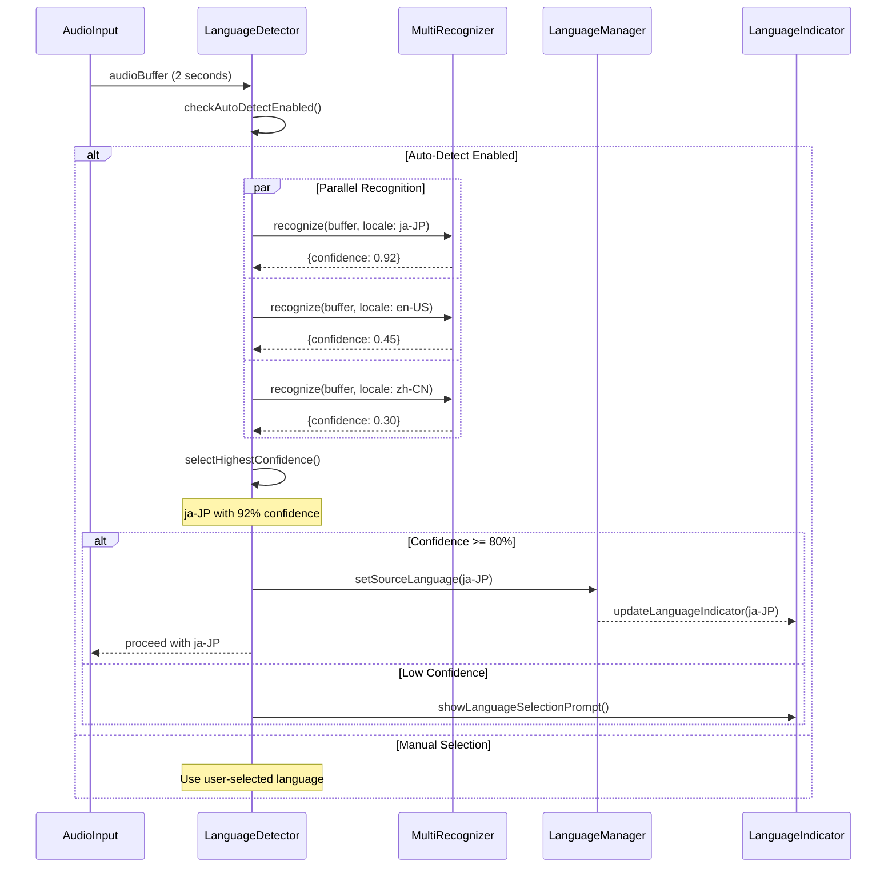
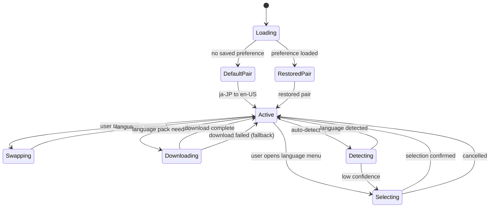

# LiveLingo - Language Management Workflows

## WF-LNG-001: Language Pair Selection

Source and target language setup.



---

## WF-LNG-002: Language Swap

Quick switch between source and target.



---

## WF-LNG-003: Language Pack Download

Offline model installation for translation.



---

## WF-LNG-004: App UI Language Switch

Change UI language (Japanese/English/Chinese).



---

## WF-LNG-005: Language Preference Persistence

Save and restore user language preferences.



---

## Supported Languages Matrix

```mermaid
flowchart TD
    subgraph Phase1[Phase 1 - Launch]
        JA[Japanese ja-JP]
        EN_US[English US en-US]
        EN_GB[English UK en-GB]
        ZH_CN[Chinese Simplified zh-CN]
        ZH_TW[Chinese Traditional zh-TW]
        KO[Korean ko-KR]
    end

    subgraph Phase2[Phase 2 - Post-Launch]
        FR[French fr-FR]
        ES_ES[Spanish Spain es-ES]
        ES_MX[Spanish Mexico es-MX]
        VI[Vietnamese vi-VN]
        PT[Portuguese Brazil pt-BR]
    end

    subgraph Capabilities
        STT[Speech Recognition]
        TRN[Translation]
        TTS[Text-to-Speech]
        OFF[Offline Support]
    end

    JA --> STT
    JA --> TRN
    JA --> TTS
    JA --> OFF

    EN_US --> STT
    EN_US --> TRN
    EN_US --> TTS
    EN_US --> OFF

    ZH_CN --> STT
    ZH_CN --> TRN
    ZH_CN --> TTS

    VI --> STT
    VI --> TRN
    VI --> TTS
    Note over VI: No offline support
```

---

## Language Detection Flow



---

## Language State Diagram



---

## Version History

| Version | Date | Changes | Author |
|---------|------|---------|--------|
| 1.0.0 | 2024-12-24 | Initial creation | AI Agent |
