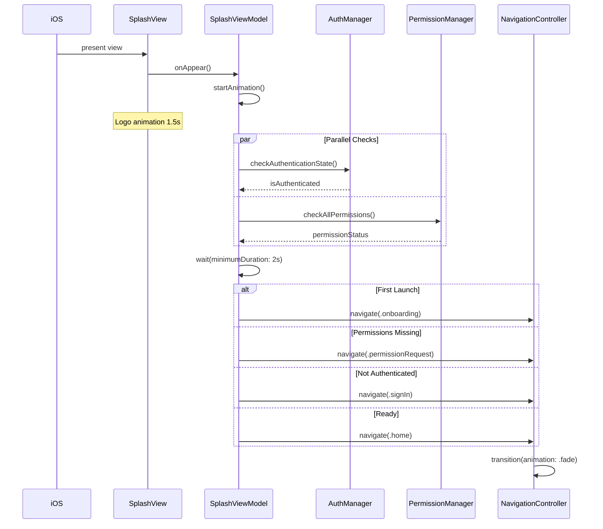
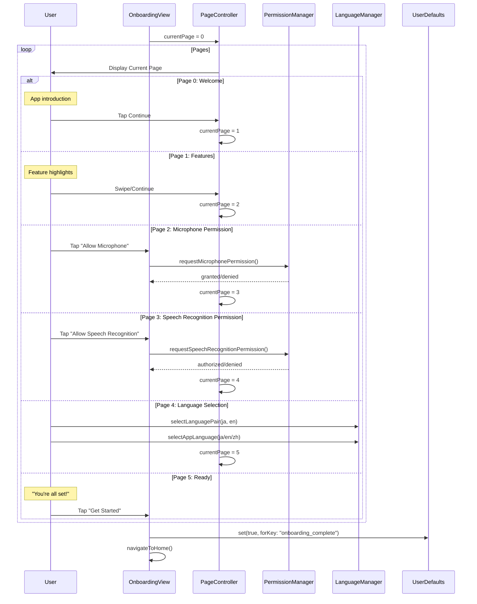
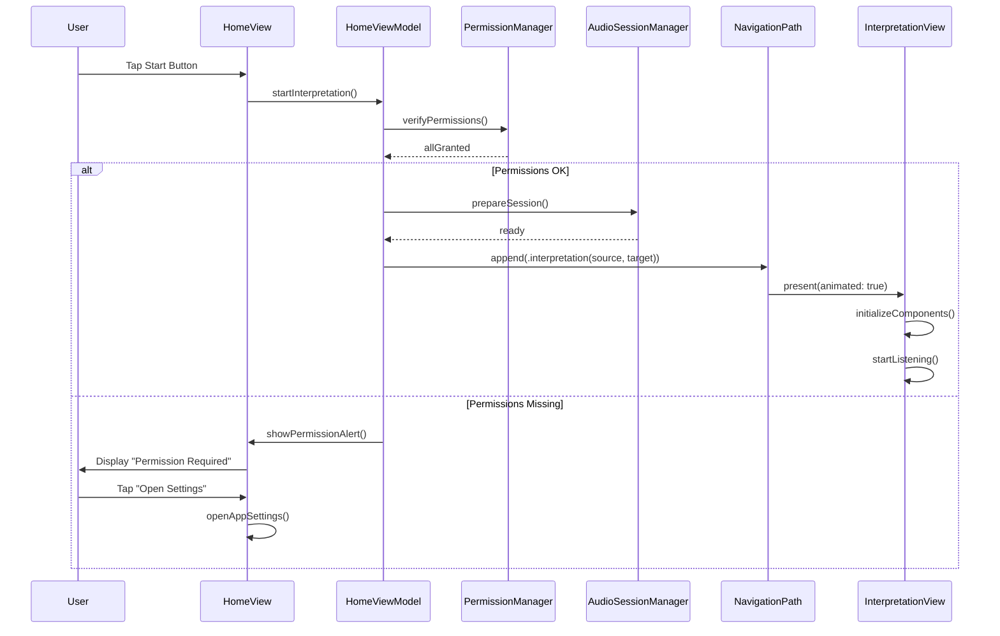
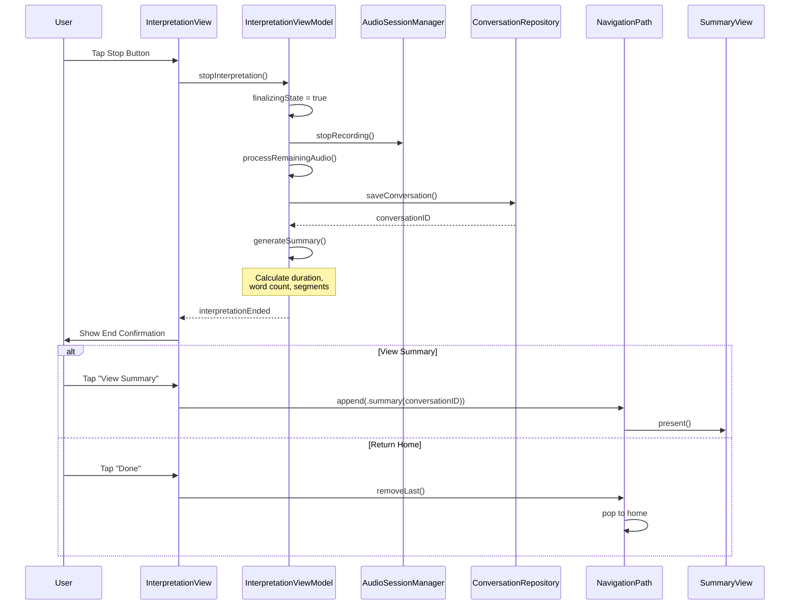
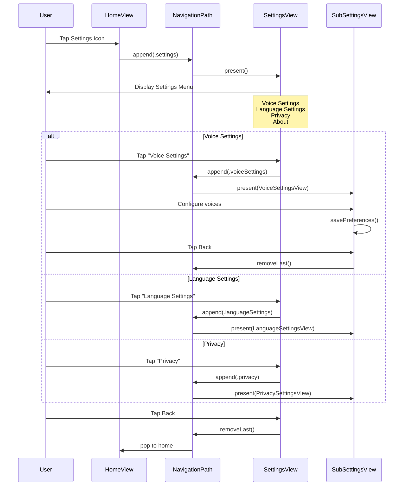
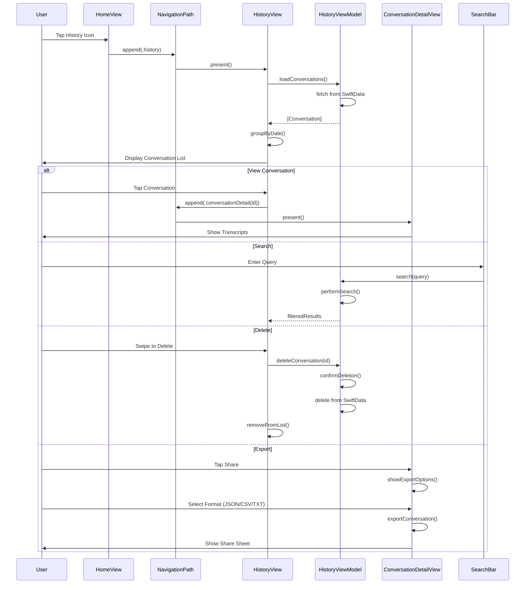
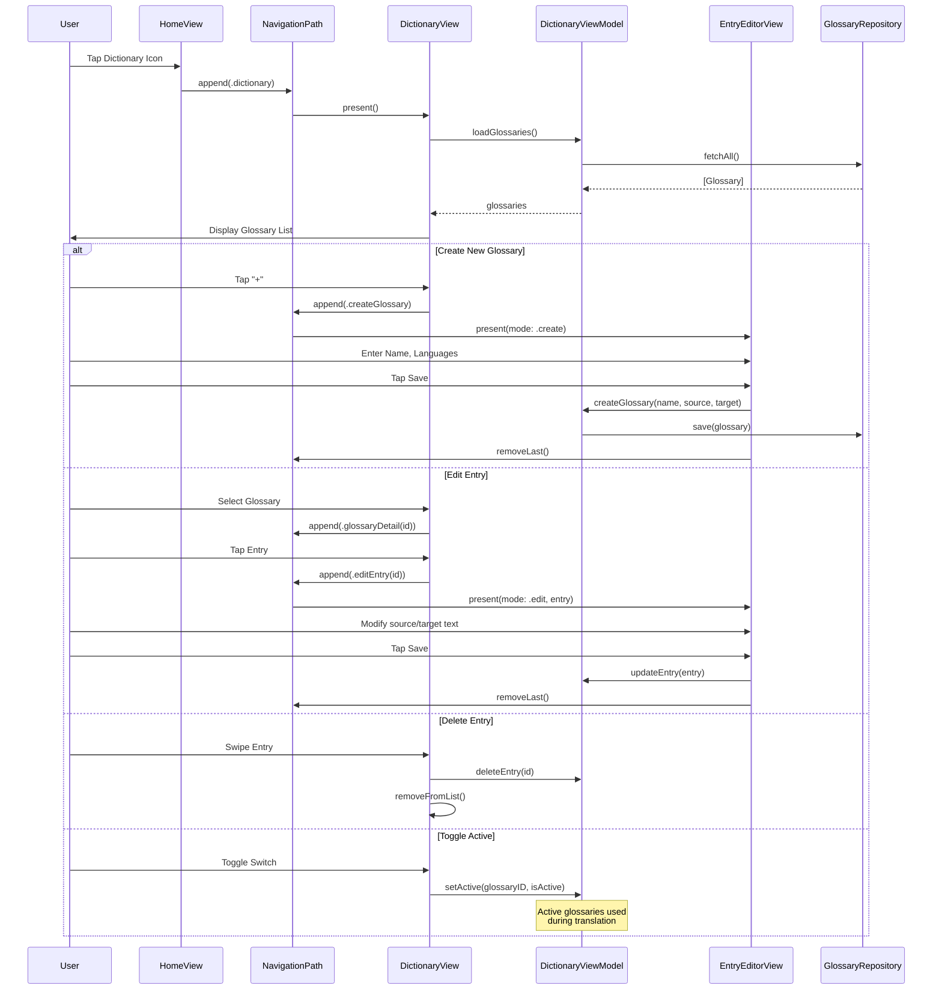
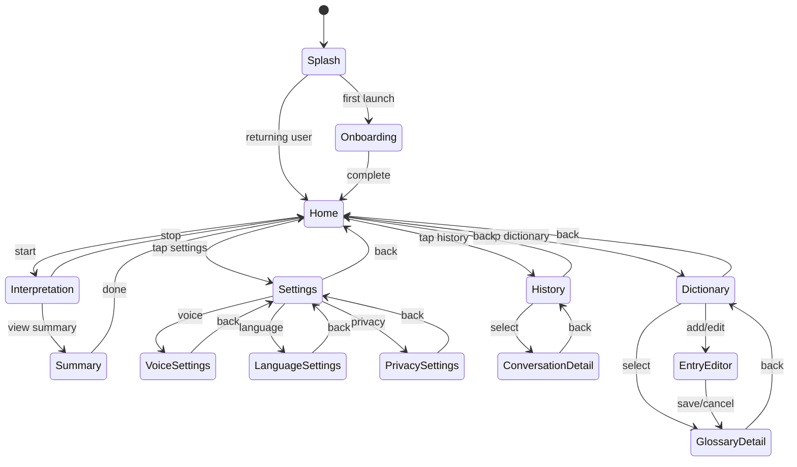
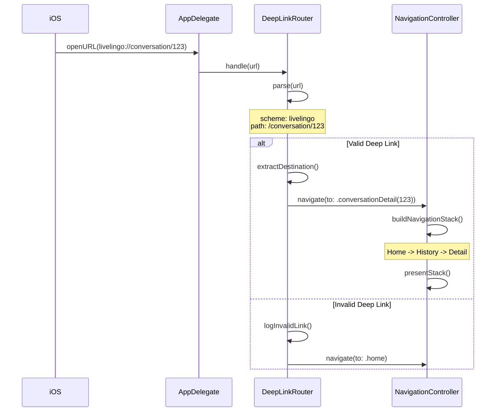

# LiveLingo - UI Navigation Workflows

## WF-NAV-001: Splash to Home

Initial navigation after app launch.

---

## WF-NAV-002: Onboarding Flow

First-time user setup wizard.

---

## WF-NAV-003: Start Interpretation

Home to Interpretation screen transition.

---

## WF-NAV-004: End Interpretation

Interpretation completion and result handling.

---

## WF-NAV-005: Settings Navigation

Access settings and sub-screens.

---

## WF-NAV-006: History Navigation

View and manage past conversations.

---

## WF-NAV-007: Dictionary Management

Custom glossary editing.

---

## Navigation State Diagram

---

## Deep Link Handling

---

## Version History

| Version | Date | Changes | Author |
|---------|------|---------|--------|
| 1.0.0 | 2024-12-24 | Initial creation | AI Agent |
