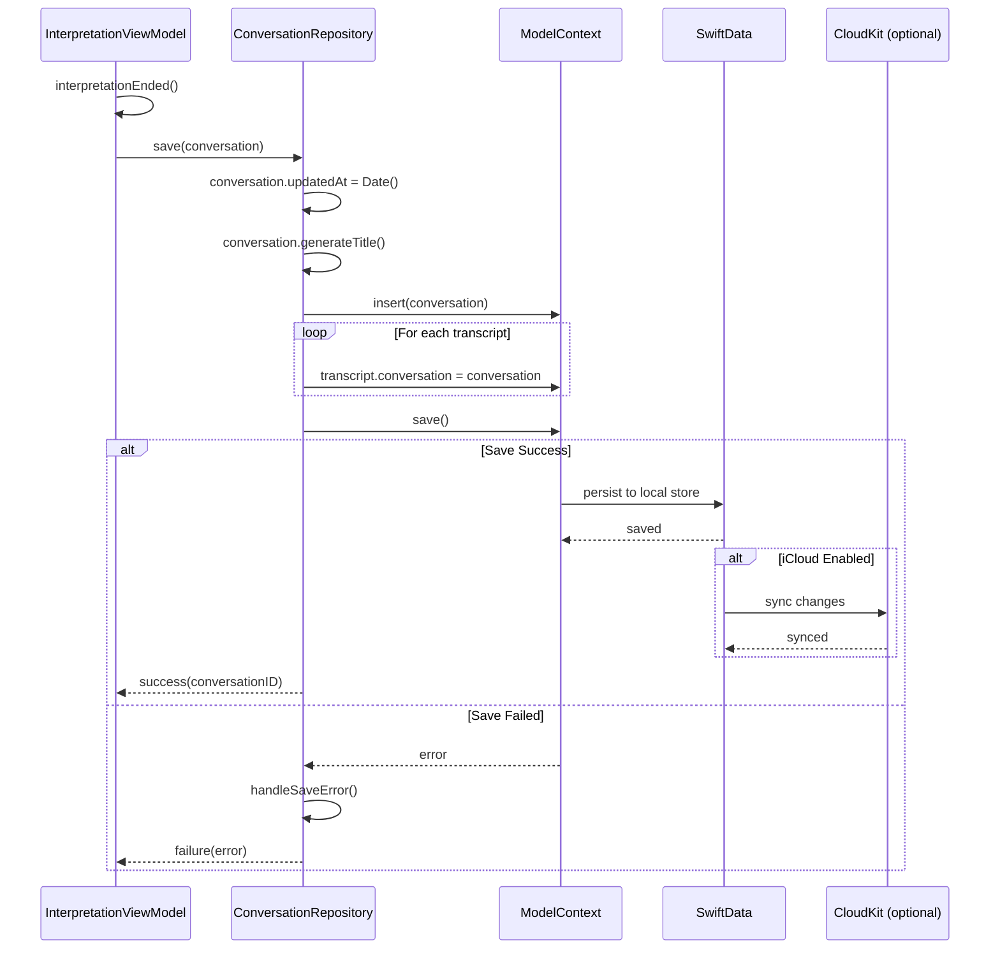
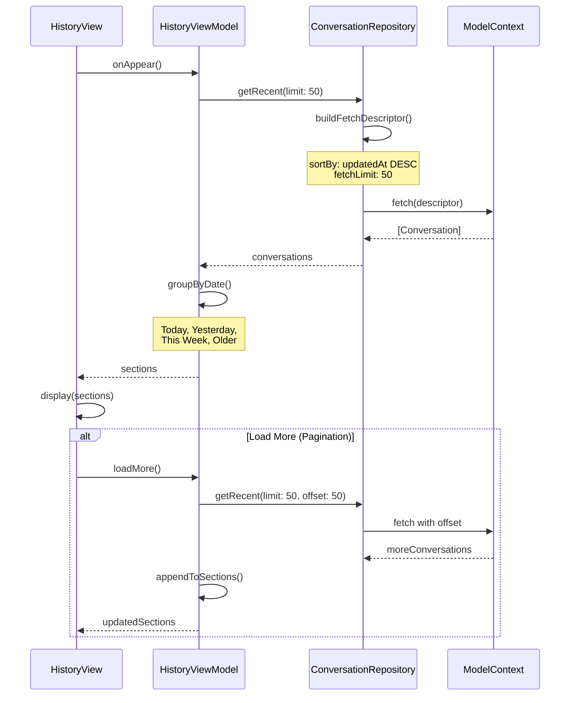
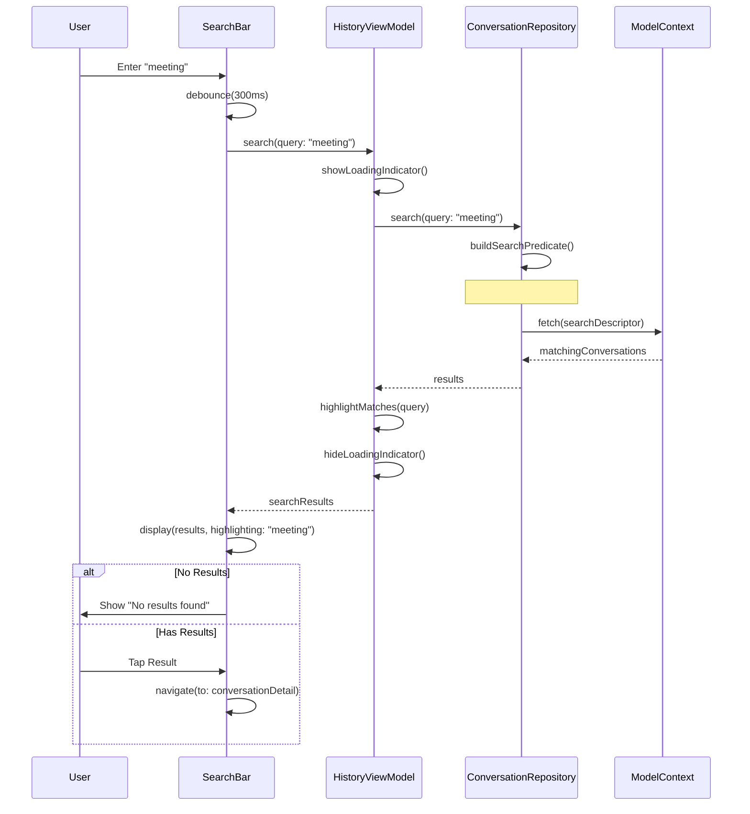
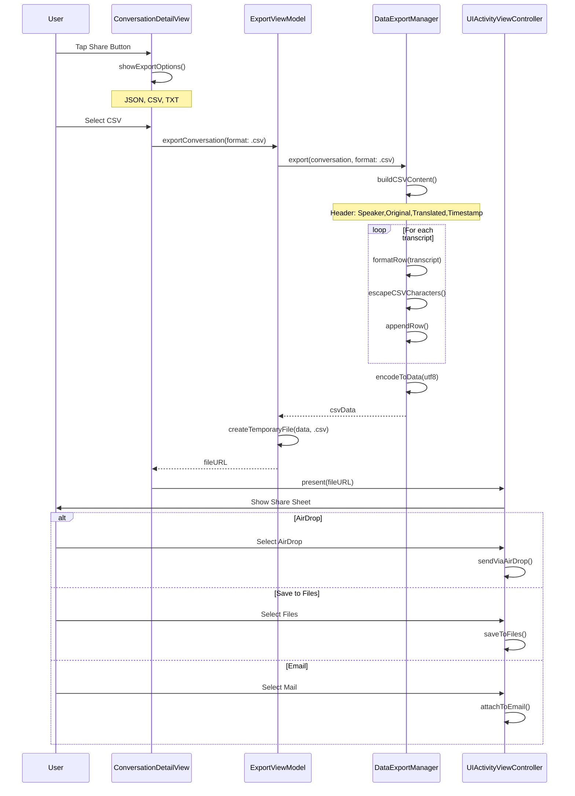
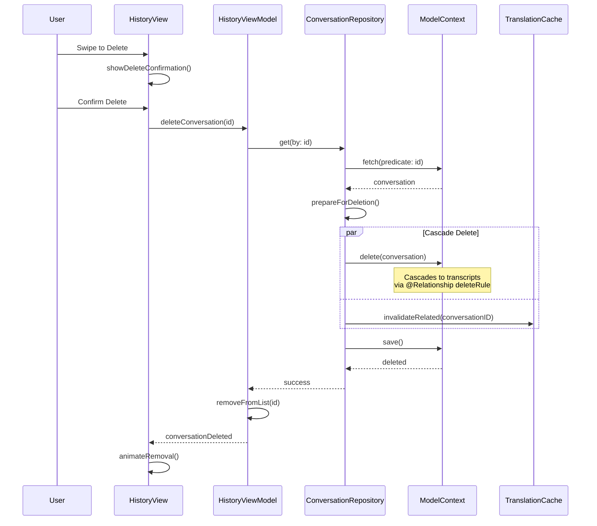
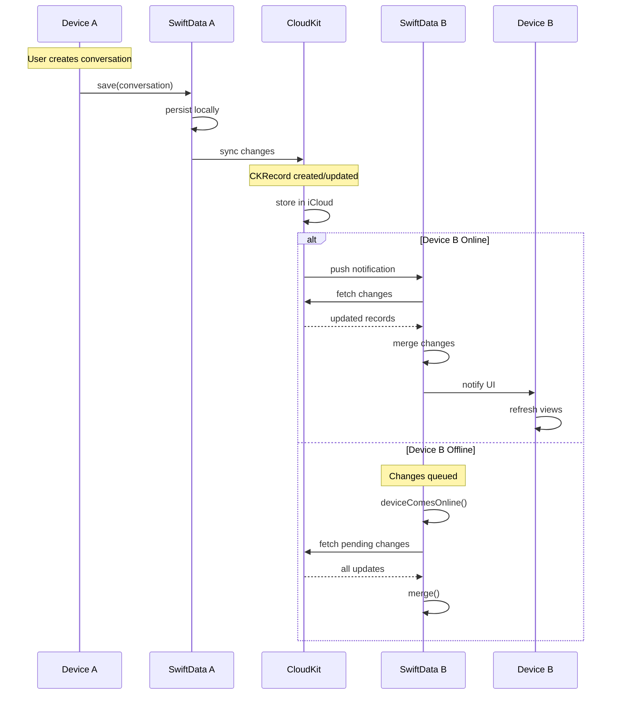
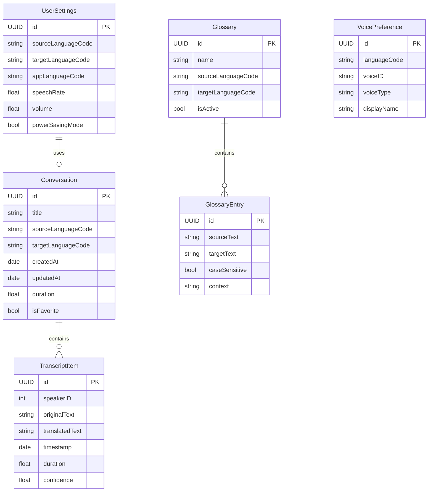
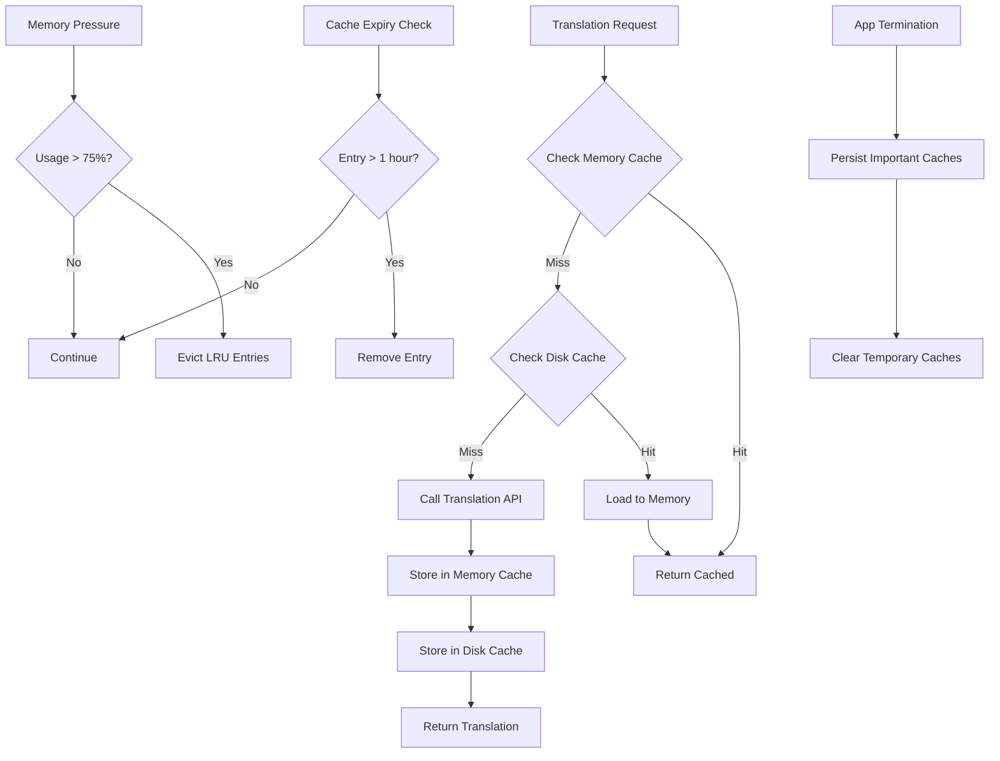
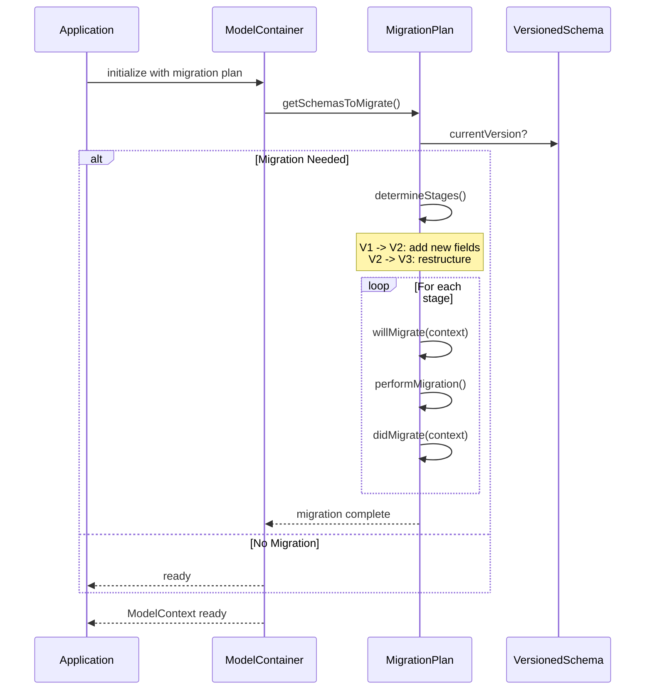

# LiveLingo - Data Persistence Workflows

## WF-DATA-001: Save Conversation

Persist conversation to SwiftData.

---

## WF-DATA-002: Load Conversation History

Fetch saved conversations with filtering.

---

## WF-DATA-003: Search Conversations

Full-text search across transcripts.

---

## WF-DATA-004: Export Conversation

Export to JSON/CSV/TXT formats.

---

## WF-DATA-005: Delete Conversation

Remove conversation from storage.

---

## WF-DATA-006: iCloud Sync

Cross-device synchronization.

---

## Data Model Relationships

---

## Cache Management Flow

---

## Migration Strategy

---

## Version History

| Version | Date | Changes | Author |
|---------|------|---------|--------|
| 1.0.0 | 2024-12-24 | Initial creation | AI Agent |
