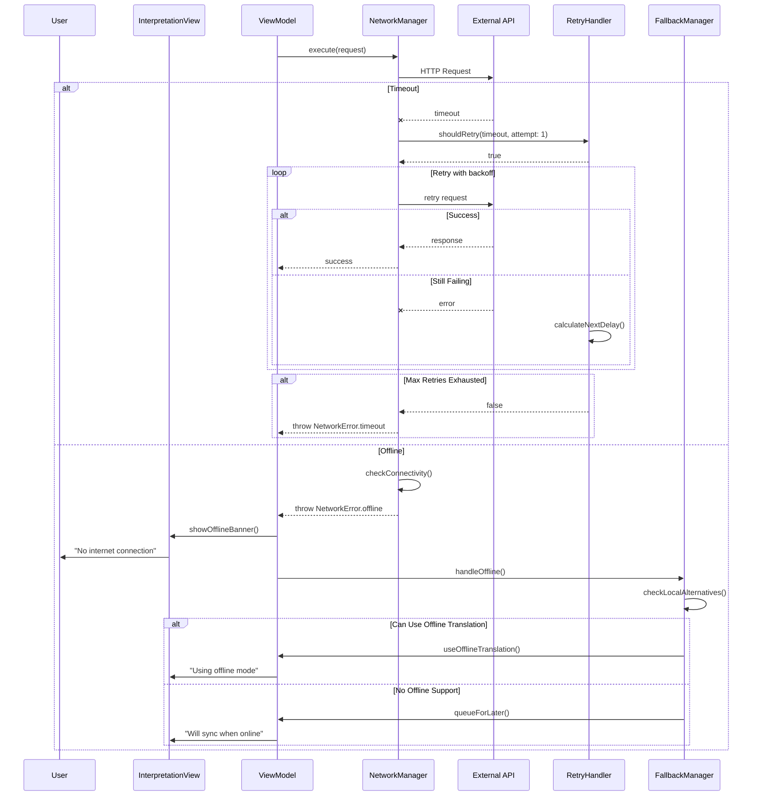
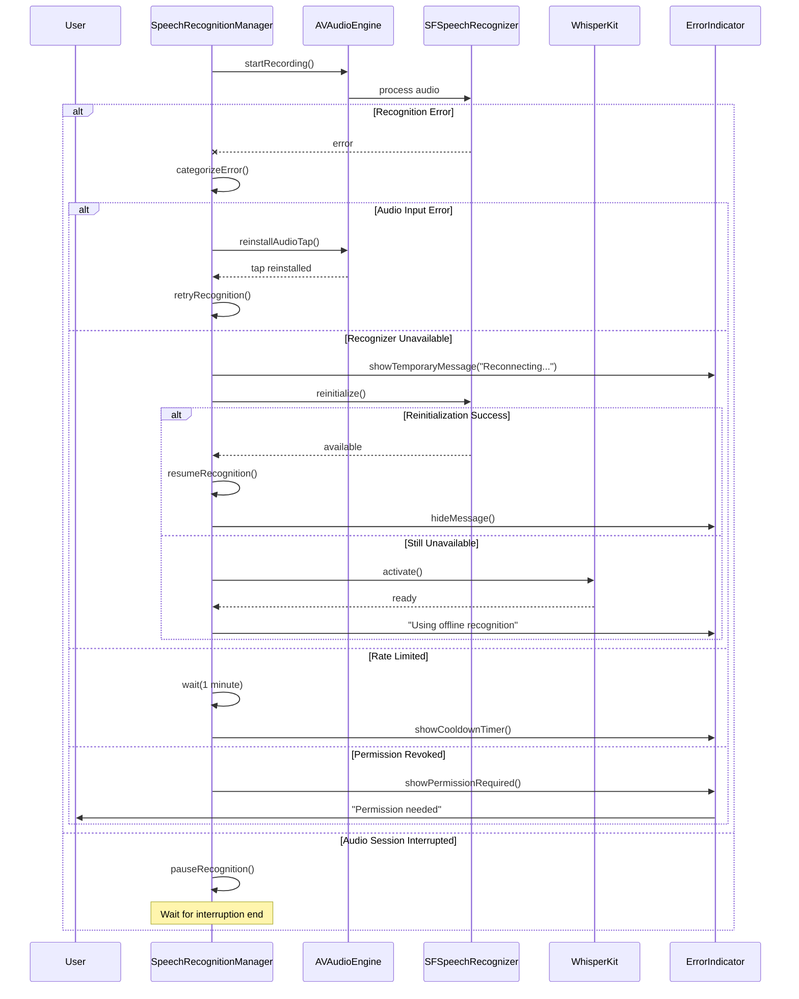
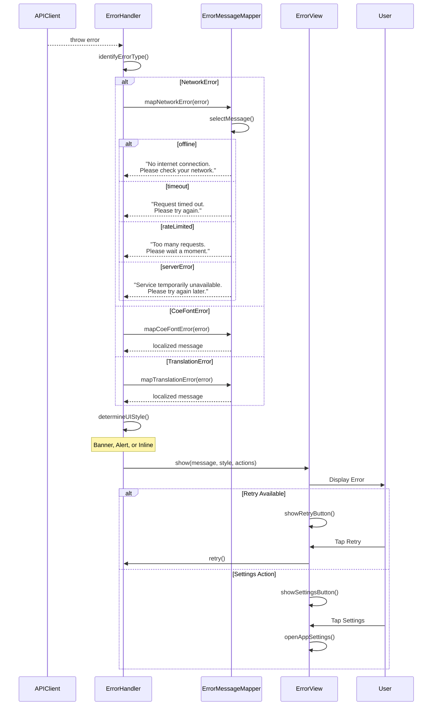
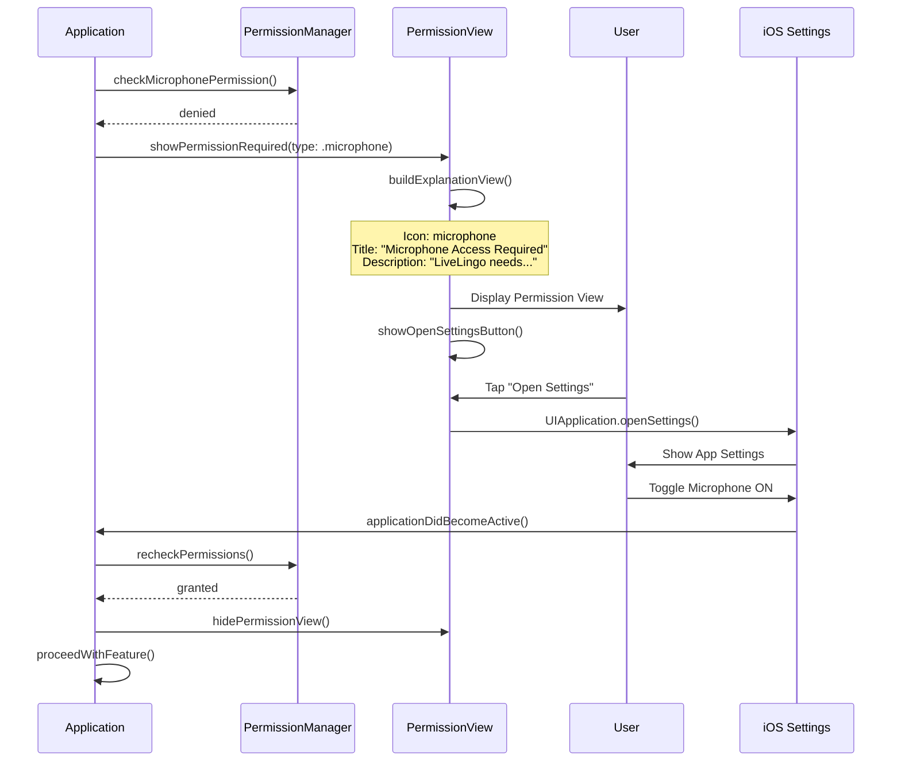
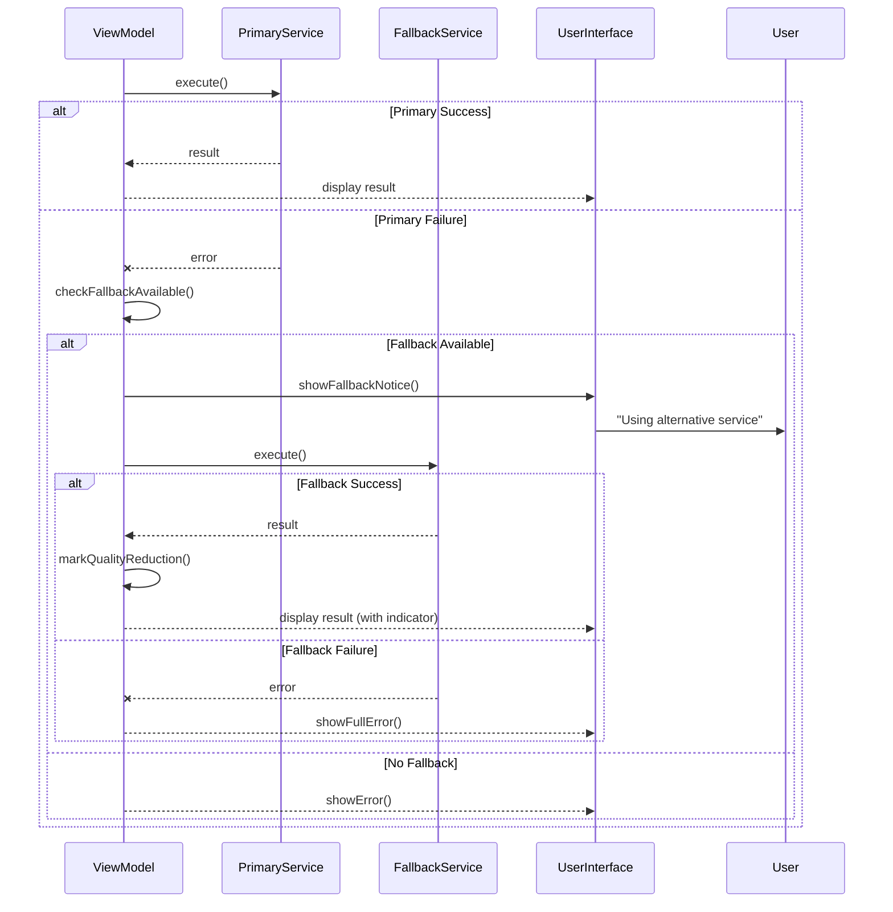
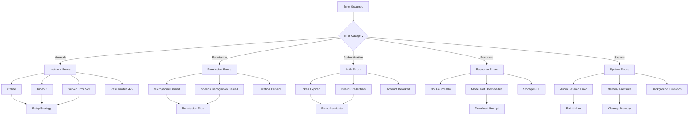
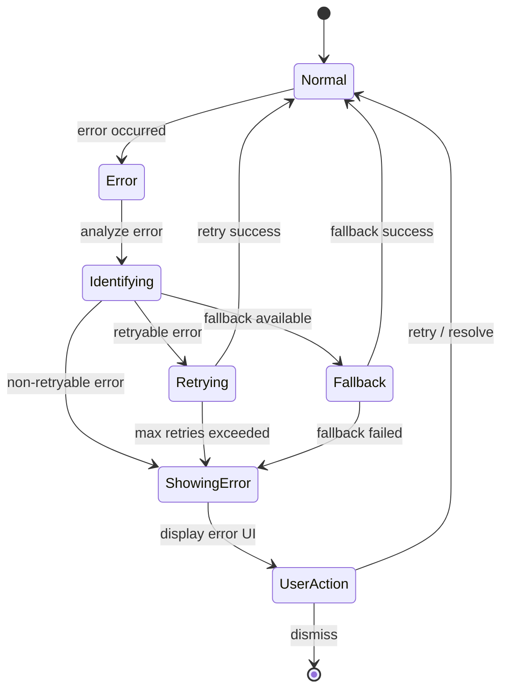
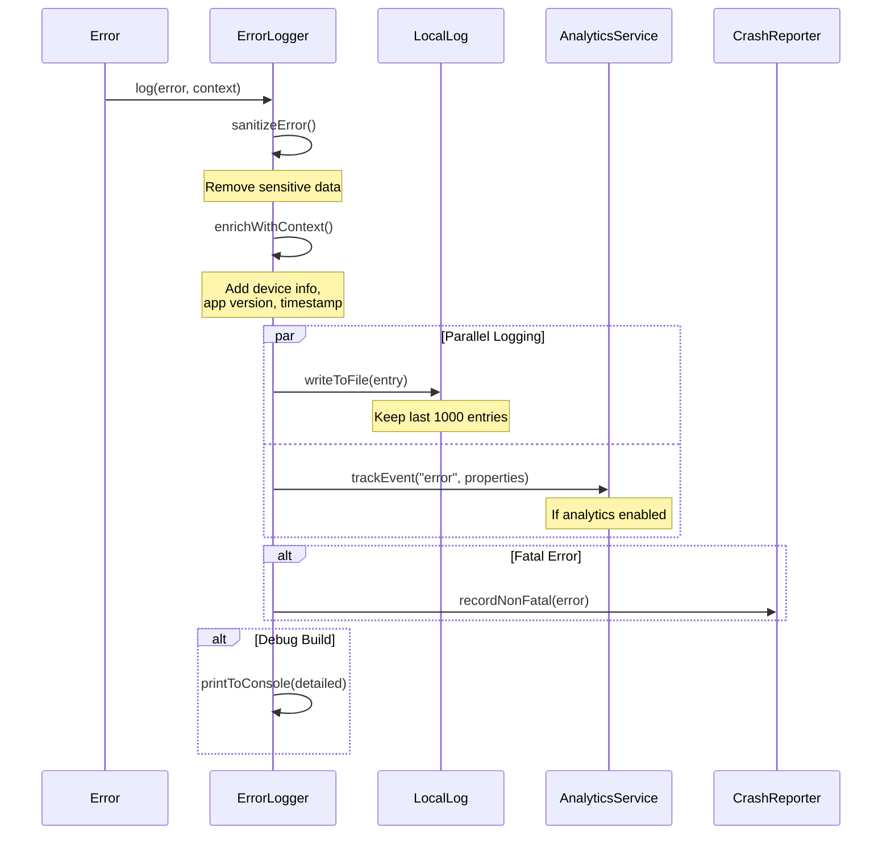

# LiveLingo - Error Handling Workflows

## WF-ERR-001: Network Error Recovery

Offline and timeout handling with retry.

---

## WF-ERR-002: STT Error Recovery

Speech recognition failure handling.

---

## WF-ERR-003: API Error Display

User-friendly error messages.

---

## WF-ERR-004: Permission Denied Handling

Guide user to enable permissions.

---

## WF-ERR-005: Graceful Degradation

Fallback to alternatives when primary service fails.

---

## Error Categorization

---

## Error State Diagram

---

## Error Logging

---

## Version History

| Version | Date | Changes | Author |
|---------|------|---------|--------|
| 1.0.0 | 2024-12-24 | Initial creation | AI Agent |
