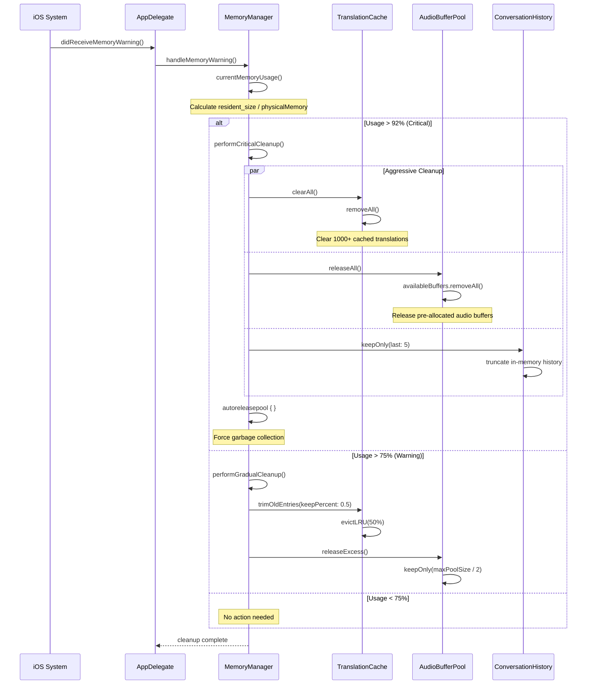
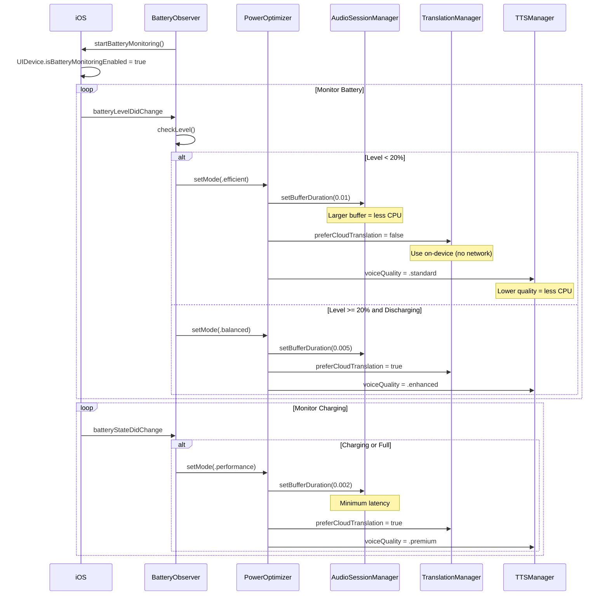
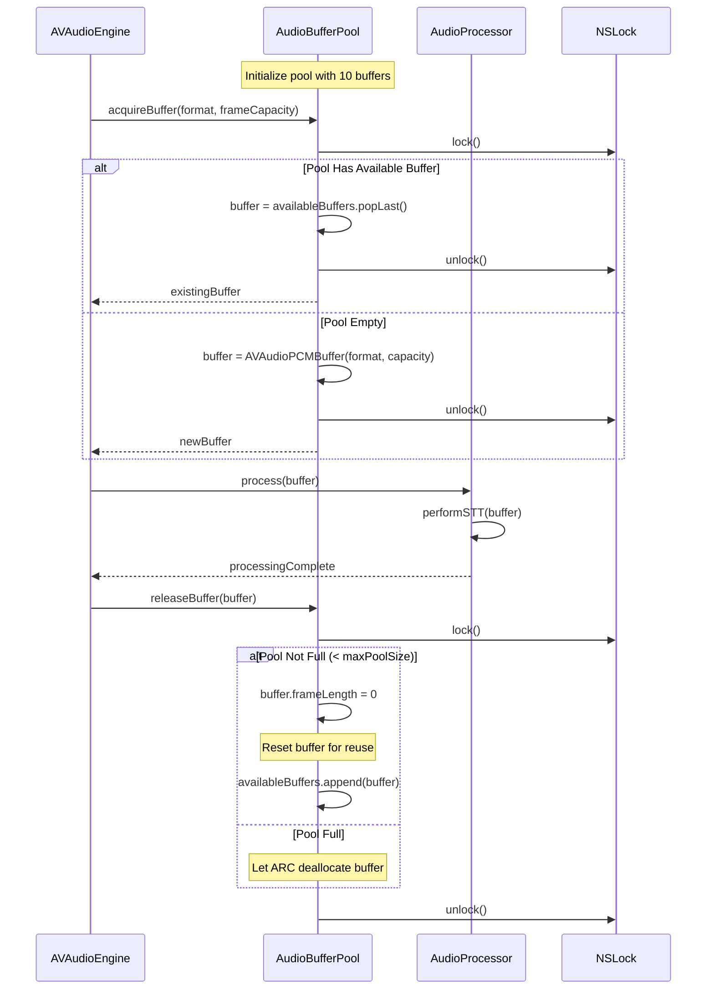
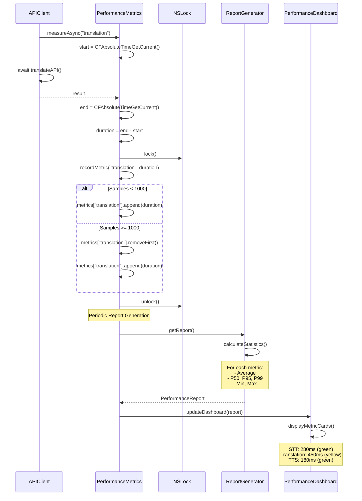
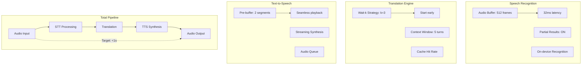
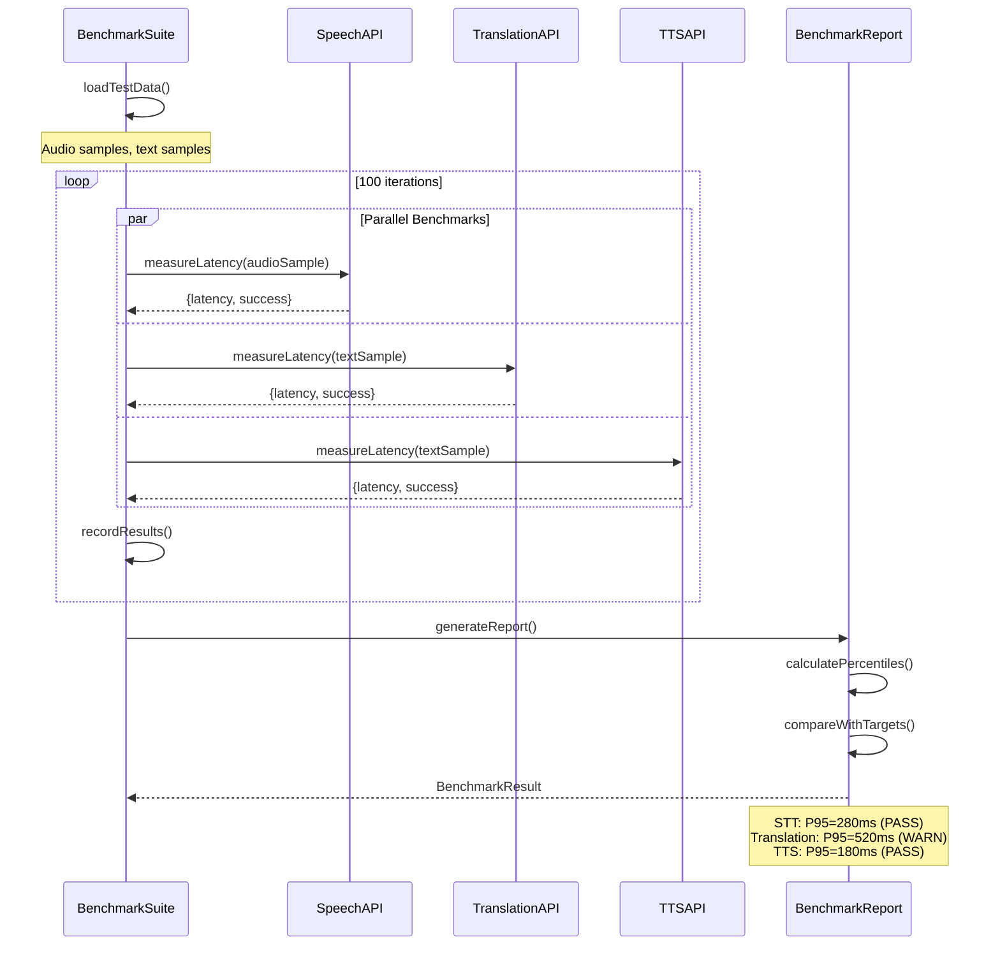
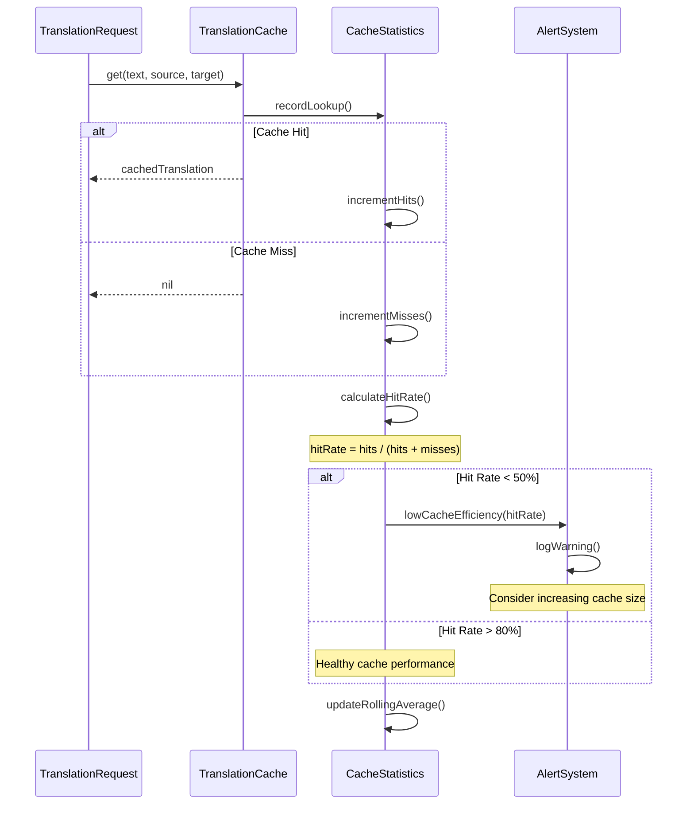
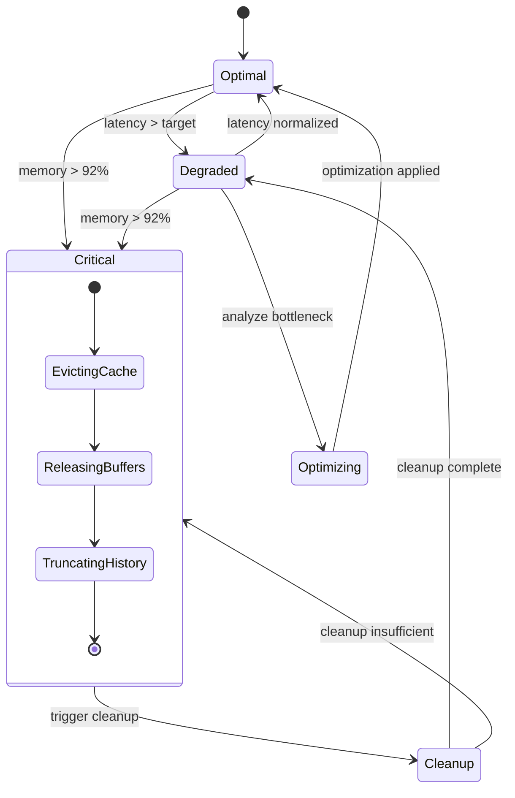

# LiveLingo - Performance Optimization Workflows

## WF-PERF-001: Memory Pressure Response

Cache eviction and cleanup under memory pressure.

---

## WF-PERF-002: Power Mode Switching

Battery-based optimization strategy.

---

## WF-PERF-003: Audio Buffer Pooling

Object reuse for audio processing.

---

## WF-PERF-004: API Latency Monitoring

Performance metrics collection and analysis.

---

## Latency Optimization Flow

---

## Resource Usage Targets

```mermaid
gantt
    title Resource Usage Targets
    dateFormat X
    axisFormat %s

    section Memory
    Idle Target (50MB)     :a1, 0, 50
    Idle Max (100MB)       :a2, 0, 100
    Active Target (150MB)  :a3, 0, 150
    Active Max (200MB)     :a4, 0, 200

    section CPU
    Idle Target (5%)       :b1, 0, 5
    Idle Max (10%)         :b2, 0, 10
    Active Target (40%)    :b3, 0, 40
    Active Max (60%)       :b4, 0, 60

    section Battery
    Target (10%/hour)      :c1, 0, 10
    Max (15%/hour)         :c2, 0, 15
```

---

## Performance Benchmark Workflow

---

## Cache Efficiency Monitoring

---

## Performance State Diagram

---

## Version History

| Version | Date | Changes | Author |
|---------|------|---------|--------|
| 1.0.0 | 2024-12-24 | Initial creation | AI Agent |
