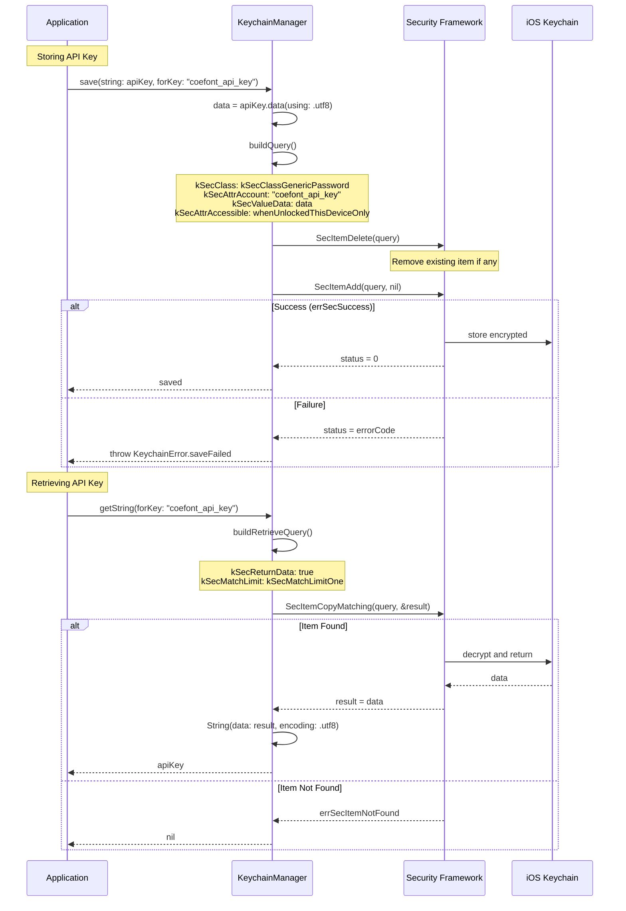
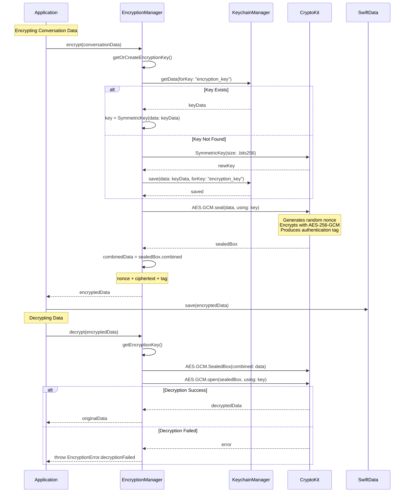
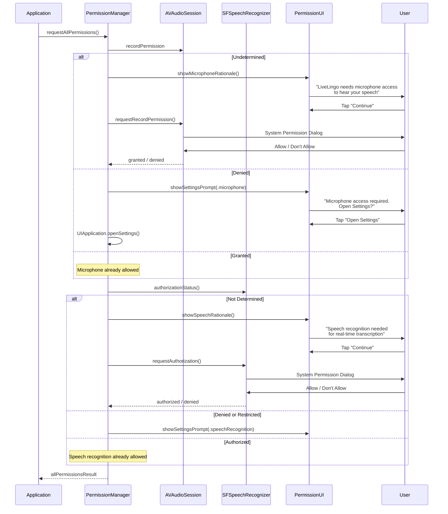
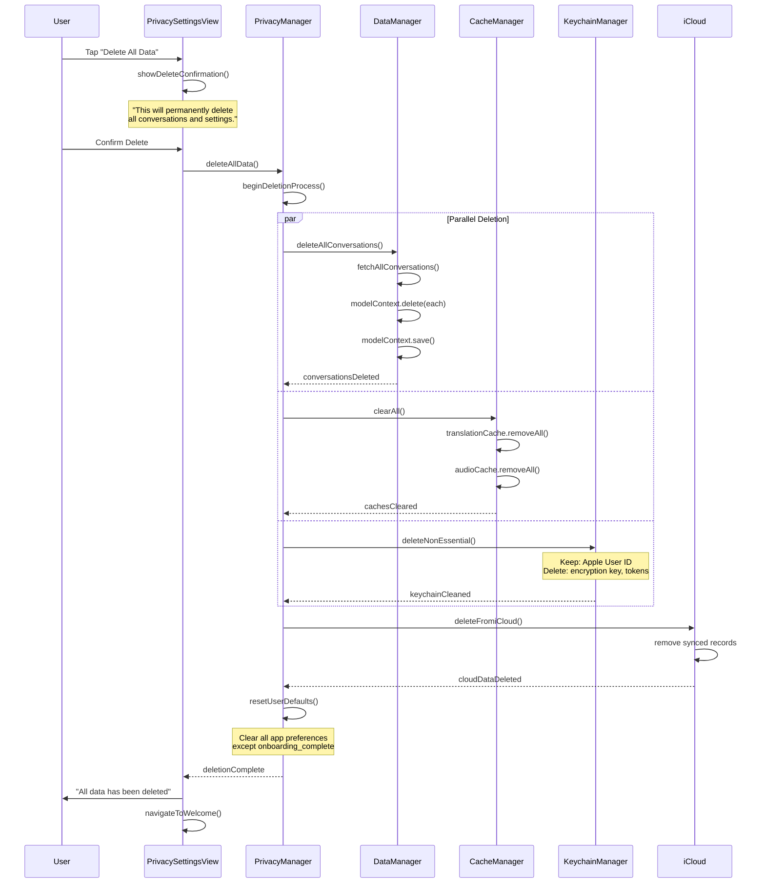
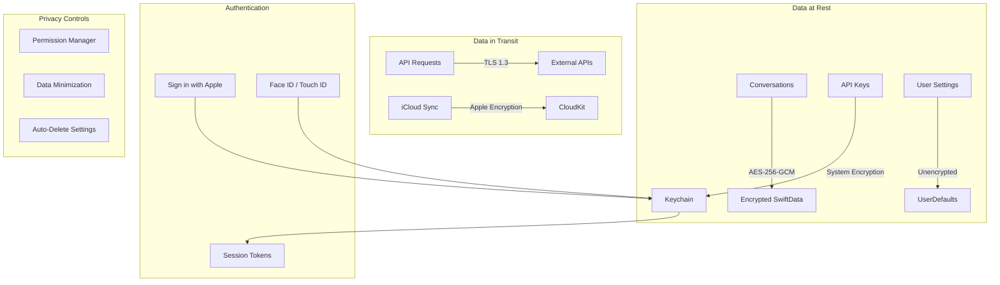
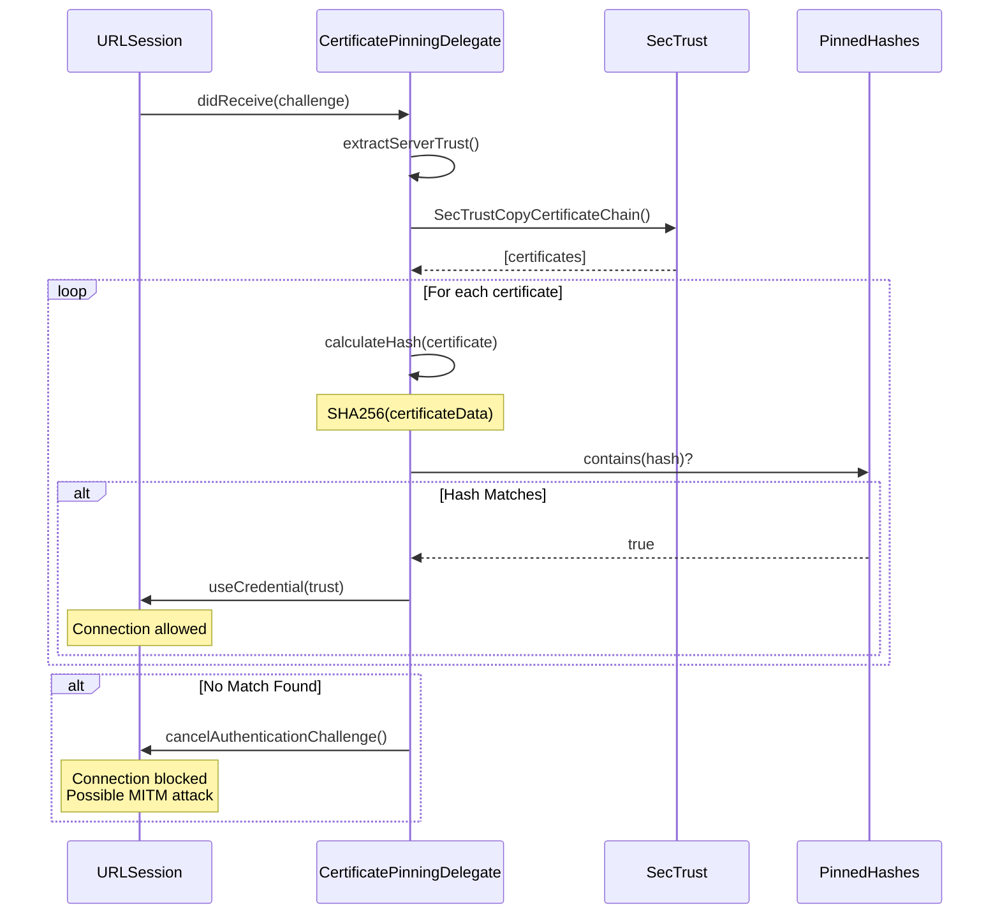
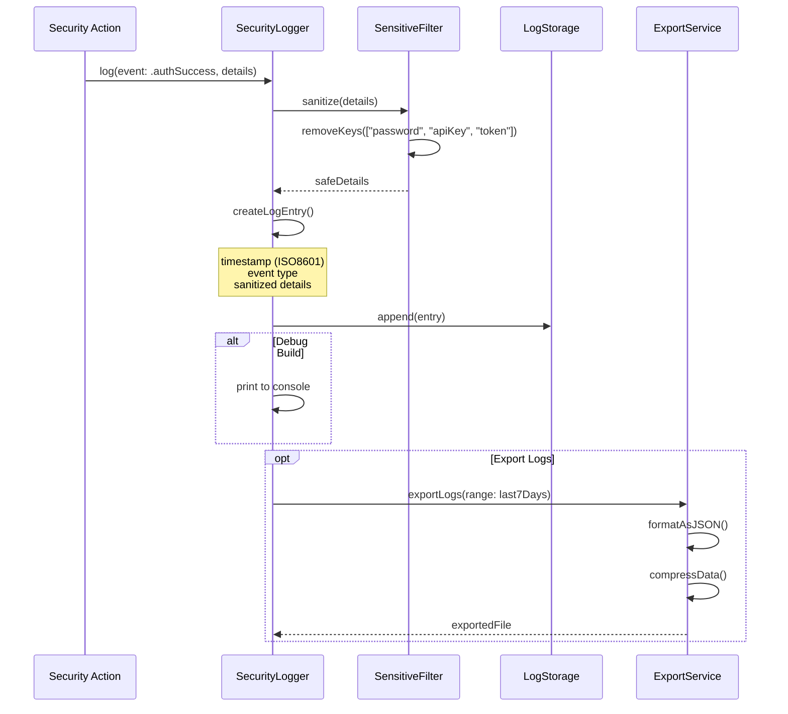
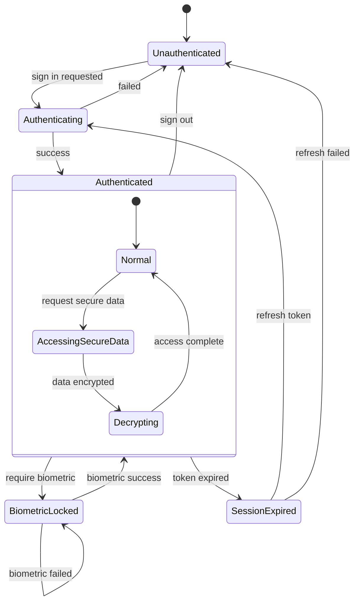
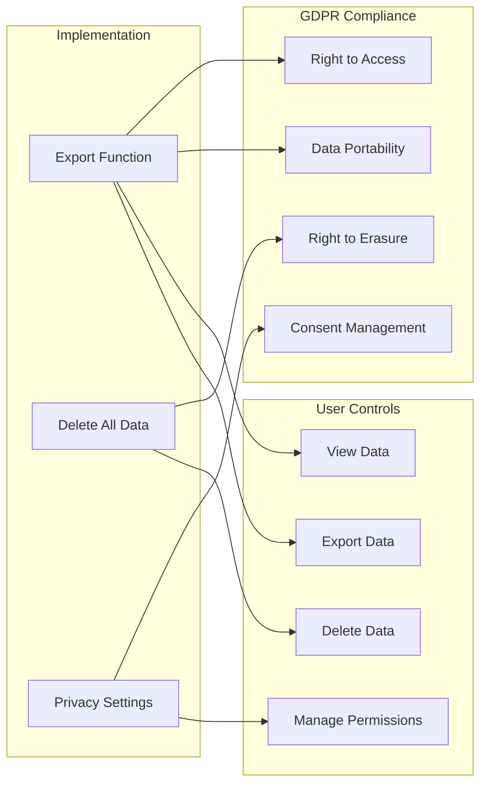

# LiveLingo - Security & Privacy Workflows

## WF-SEC-001: Keychain Access

Secure credential storage and retrieval.

---

## WF-SEC-002: Data Encryption

AES-256-GCM encryption for sensitive data.

---

## WF-SEC-003: Permission Request

Microphone and speech recognition permission flow.

---

## WF-SEC-004: Data Deletion

Privacy-compliant data removal.

---

## Security Architecture

---

## Certificate Pinning Flow

---

## Audit Logging

---

## Security State Diagram

---

## Privacy Compliance Checklist

---

## Version History

| Version | Date | Changes | Author |
|---------|------|---------|--------|
| 1.0.0 | 2024-12-24 | Initial creation | AI Agent |
